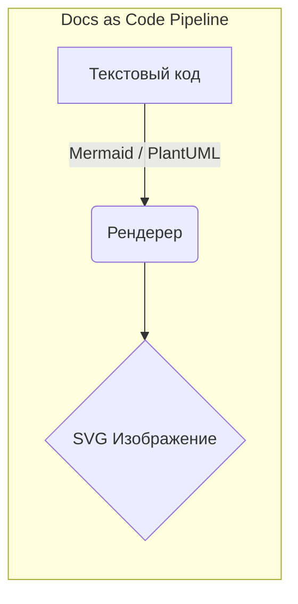

# Diagrams as Code (Диаграммы как код)

**Diagrams as Code** — это парадигма, при которой архитектурные диаграммы создаются не с помощью графических редакторов (Miro, Draw.io, Visio), а описываются в виде простого текста с использованием специализированных языков разметки (Mermaid, PlantUML, Structurizr). Текстовый движок затем автоматически рендерит этот код в картинку.

### Какую боль мы решаем?
1. **Протухание документации**: Красивая схема в Miro, нарисованная год назад, уже не имеет ничего общего с реальностью. Никто не хочет идти в сторонний инструмент и двигать квадратики, когда меняется код.
2. **Отсутствие версионирования**: Графические файлы бинарны или лежат в облаке. Как понять, как выглядела архитектура до вчерашнего релиза? Как провести ревью изменения архитектуры в Pull Request? Никак.
3. **Бесконечное выравнивание пикселей**: Разработчики тратят часы на то, чтобы стрелочка шла ровно, а квадратики были одинакового размера, вместо того чтобы думать о сути архитектуры.

### Как это работает на практике

Архитектор или разработчик пишет декларативный код прямо в Markdown-файле или в специальном файле (`.puml`, `.mmd`). Этот файл хранится в Git вместе с исходным кодом проекта. При просмотре в IDE (VS Code) или на GitHub/GitLab плагин на лету превращает текст в SVG/PNG.



**Пример кода на Mermaid:**
```text
sequenceDiagram
    participant User
    participant Frontend
    participant API
    User->>Frontend: Клик "Купить"
    Frontend->>API: POST /checkout
    API-->>Frontend: 200 OK (Payment URL)
    Frontend-->>User: Редирект на оплату
```

### Примеры (Антипаттерн vs Правильное решение)

**Антипаттерн**: Экспортировать картинку из Figma/Miro в `.png`, назвать её `architecture_v3_final_FINAL.png` и положить в папку `docs/`. При любом изменении нужно искать исходник в Figma, просить доступ, менять, заново экспортировать.

**Правильное решение**: Внедрить пайплайн **Docs-as-Code**. Вся документация пишется в `.md`, диаграммы описываются блоками ````mermaid ````. В CI/CD пайплайне при мердже в `main` генерируется статический сайт (например, через Docusaurus или MkDocs), который всегда актуален.

### Неочевидные нюансы: скрытые трейдоффы

1. **Потеря контроля над лейаутом**: Автоматические движки рендеринга (особенно Graphviz, лежащий в основе PlantUML) иногда располагают элементы совершенно не так, как вы хотели бы. Стрелки могут пересекаться, образуя кашу. Приходится использовать хаки для влияния на позиционирование.
2. **Кривая обучения**: Синтаксис языков разметки нужно учить. Нетехническим стейкхолдерам (проджектам, дизайнерам) тяжело вносить изменения в такие схемы, они предпочитают drag-and-drop интерфейсы.
3. **Ограниченная кастомизация**: Сделать диаграмму "красивой, в корпоративных цветах, с логотипами" через код намного сложнее, чем в графическом редакторе. Но это и есть суть: фокус должен быть на семантике, а не на дизайне квадратиков.
