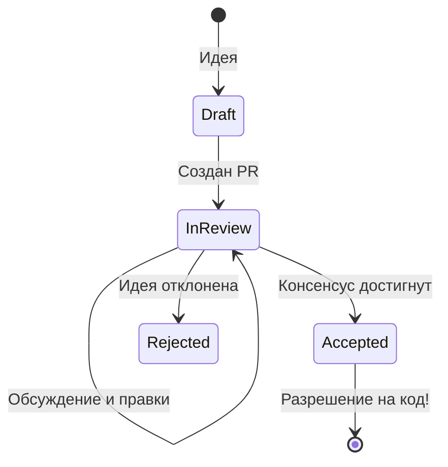

# RFC (Request for Comments) в разработке

**RFC (Request for Comments)** — это формализованный процесс предложения существенных изменений в кодовую базу, архитектуру или процессы ДО того, как будет написана первая строчка кода. Буквально это переводится как "Запрос комментариев": автор пишет технический документ с описанием идеи, а команда его обсуждает, критикует и дорабатывает.

### Какую боль мы решаем?
Самый болезненный сценарий в разработке: инженер в одиночку тратит 3 недели на внедрение сложной фичи (например, переписывает стор с Redux на Effector), создает Pull Request на 5000 строк кода. На ревью коллеги говорят: "Это не решает нашу изначальную проблему, да и ломает обратную совместимость". Итог: выброшенный в корзину код, демотивация автора, потраченное время компании.

RFC предотвращает эту боль, смещая фокус с "написания кода" на "проектирование решения". Дешевле внести 10 правок в текстовый документ, чем переписывать половину приложения.

### Как это работает на практике

Процесс во многом заимствован из опенсорс-мира (Rust, React, Vue имеют свои публичные репозитории RFC).
Внутри компании это выглядит так:
1. Инженер видит проблему или хочет внедрить новый тулинг.
2. Он пишет Markdown-документ (RFC) по шаблону.
3. Создает Pull Request с этим документом в специальный репозиторий (или папку `rfcs/`).
4. Команда (включая лидов и архитекторов) асинхронно читает и оставляет комментарии.
5. После достижения консенсуса PR мерджится. RFC получает статус "Accepted" (Принято).
6. Только после этого начинается написание кода.

### Структура хорошего RFC

- **Summary**: Одно предложение, что мы хотим сделать.
- **Motivation**: Зачем это нужно? Какую проблему решаем?
- **Detailed Design**: Как именно это будет реализовано технически (API, схемы).
- **Drawbacks**: Какие минусы и риски у этого решения? (Самый важный пункт! Если автор пишет "минусов нет", он не продумал решение).
- **Alternatives**: Что еще мы рассматривали и почему отбросили?

### Примеры (Антипаттерн vs Правильное решение)

**Антипаттерн (Cowboy Coding)**: Разработчик на выходных изучил новый фреймворк для тестирования, в понедельник молча переписал на него 100 тестов и скинул PR с сообщением: "Смотрите, как круто работает!".

**Правильное решение**: Разработчик пишет RFC: "Предлагаю мигрировать с Jest на Vitest. Мотивация: сборка тестов ускорится в 3 раза. Риски: придется переписать моки (drawbacks). План: будем мигрировать постепенно (design)". Команда соглашается и помогает с реализацией.

### Неочевидные нюансы: границы применимости

1. **Избыточная бюрократия (Оверхед)**: Требовать RFC на добавление новой кнопки или простого хука — это абсурд. RFC нужен только для **архитектурных сдвигов**, изменений публичного API, внедрения новых инструментов или больших рефакторингов.
2. **RFC vs ADR**: Их часто путают. **RFC** пишется *до* принятия решения, чтобы собрать мнения. **ADR** (Architecture Decision Record) — это фиксация *уже принятого* решения для истории. Успешный RFC может породить ADR.
3. **Паралич обсуждений (Bike-shedding)**: В RFC обсуждения могут скатиться в споры о цвете фломастеров (названиях переменных). Чтобы этого избежать, RFC должен иметь четкие сроки (например, "ждем фидбек 7 дней") и ответственного (спонсора), который примет финальное решение, если команда разделилась.
