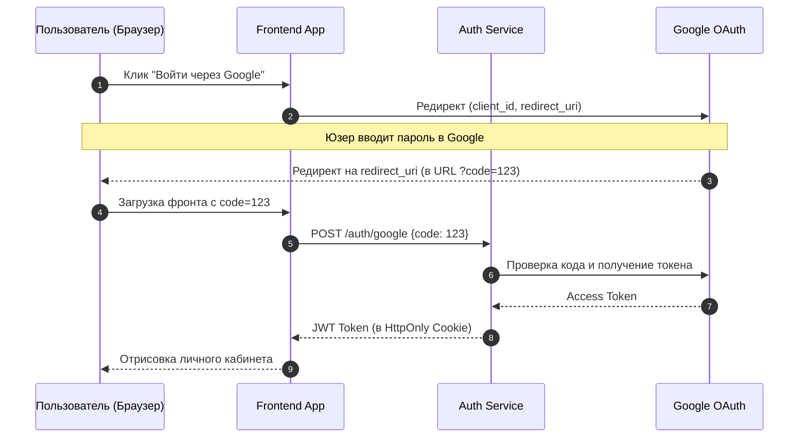

# Sequence Diagram (Диаграмма последовательности)

**Sequence Diagram** — это тип поведенческой диаграммы UML, который показывает, как и в каком порядке компоненты системы взаимодействуют друг с другом во времени. В отличие от структурных диаграмм (вроде C4 Containers), которые показывают "кто с кем вообще связан", диаграмма последовательности показывает "кто кому и что сказал в конкретном бизнес-сценарии".

### Какую боль мы решаем?
Многие фичи во фронтенде требуют многошаговых взаимодействий. Например, процесс авторизации через стороннего провайдера (OAuth 2.0). Если вы попробуете описать это словами, получится каша: "Сначала юзер кликает кнопку, мы редиректим его на Гугл, там он вводит пароль, Гугл редиректит обратно с кодом в URL, мы этот код парсим, шлем на наш бэк...". 
Сложные асинхронные цепочки (оплаты с 3D-Secure, WebSocket-хендшейки, Long Polling) невозможно понять без визуализации времени.

### Как это работает на практике

На диаграмме есть участники (Lifelines — вертикальные линии) и сообщения (Стрелки), которыми они обмениваются сверху вниз.

### Примеры (Антипаттерн vs Правильное решение)

**Антипаттерн**: Рисовать диаграмму последовательности для банального CRUD-запроса (например, "Фронтенд послал GET /users, Бэкенд вернул JSON"). Это избыточно и не несет ценности, так как флоу очевиден.

**Правильное решение**: Рисовать Sequence Diagram для сложных алгоритмов, где есть ветвления, ретраи или взаимодействие трех и более независимых систем (Frontend + Backend + Stripe + Mailchimp).

### Неочевидные нюансы: скрытые трейдоффы

1. **Проблема ветвлений**: Если в вашем бизнес-процессе слишком много условий `if/else` (альтернативных путей), Sequence Diagram превращается в месиво из блоков `alt / opt`. Для сложной логики ветвлений лучше использовать блок-схемы (Activity Diagram / Flowchart).
2. **Детализация данных**: Не пытайтесь уместить весь JSON-payload в текст стрелочки. Диаграмма нужна для понимания концепции. Если нужно описать API, приложите ссылку на Swagger/OpenAPI.
3. **Границы применимости**: Не рисуйте такие диаграммы про запас. Они нужны в двух случаях: во время проектирования сложной фичи (в RFC) и в документации ядра системы для онбординга.
