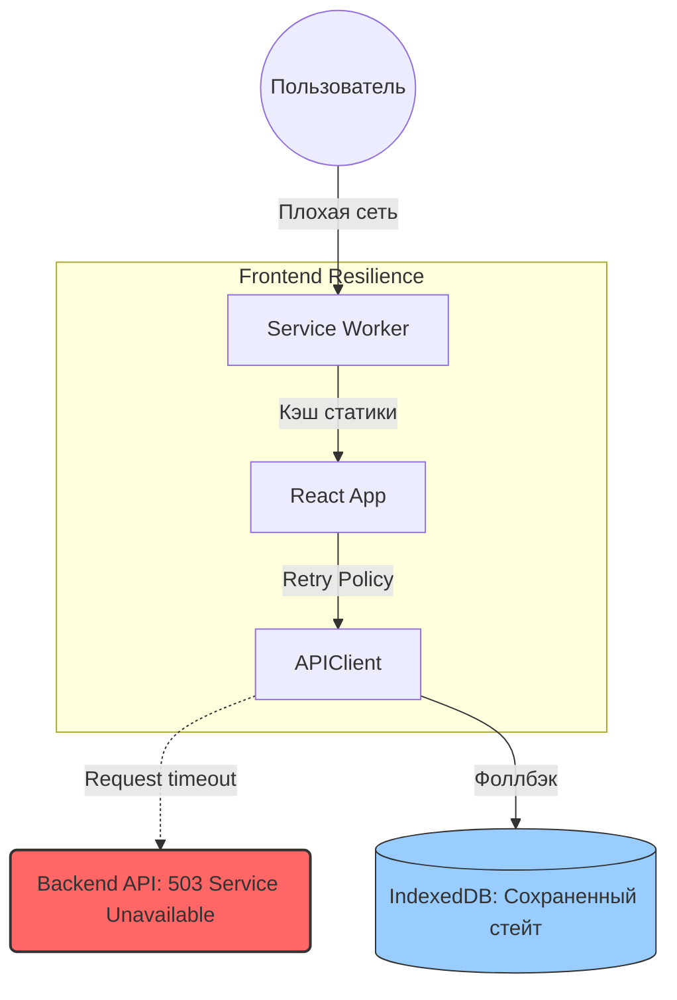

# Availability (Доступность) во Frontend

**Availability (Доступность, отказоустойчивость)** — это метрика, которая показывает процент времени, когда ваша система работает корректно и доступна для пользователей. Обычно измеряется в "девятках" (например, 99.9% означает не более 8.7 часов простоя в год). 

В контексте System Design многие думают, что доступность — это исключительно проблема бэкенда (упала база данных, сгорел сервер). Но фронтенд тоже может "упасть", и наша задача спроектировать его так, чтобы минимизировать влияние сбоев инфраструктуры на пользователя.

### Какую боль мы решаем?
Пользователь открывает ваше приложение в метро, где интернет пропадает каждую минуту. Или AWS S3-бакет с вашими JS-бандлами оказался недоступен. Или API бэкенда начало отдавать 500-е ошибки.
Если фронтенд спроектирован без мысли об Availability:
- Приложение покажет белый экран ("White Screen of Death").
- Пользователь потеряет введенные в форму данные.
- Приложение зависнет, ожидая ответа от мертвого сервера.

### Как это работает на практике

Доступность фронтенда строится на нескольких слоях:

1. **Инфраструктура доставки (CDN)**: Размещение статики в CDN (Cloudflare, AWS CloudFront) на множестве граничных серверов (Edge locations) защищает от падения одного конкретного дата-центра.
2. **Offline First и Service Workers**: Кэширование App Shell (HTML/CSS/JS) позволяет запустить приложение даже без интернета и показать осмысленный UI (например, сохраненные статьи).
3. **Graceful Degradation (Изящная деградация)**: Если упал сервис рекомендаций (микросервис бэкенда), фронтенд не должен падать целиком. Он должен скрыть блок рекомендаций или показать дефолтный список, позволив пользователю совершить покупку.



### Примеры (Антипаттерн vs Правильное решение)

**Антипаттерн (Хрупкий клиент)**: 
```javascript
// Если API упало, приложение крашится
const response = await fetch('/api/user');
const data = await response.json();
setUser(data.name); // Uncaught TypeError: Cannot read property 'name' of undefined
```

**Правильное решение (Graceful Degradation + Fallback)**:
```javascript
// Используем Error Boundary + React Query с ретраями
const { data, isError } = useQuery('user', fetchUser, {
  retry: 3,
  retryDelay: 1000, // Экспоненциальный бэкофф
});

if (isError) {
  return <FallbackUI message="Не удалось загрузить профиль, но вы можете продолжить покупки" />;
}
```

### Неочевидные нюансы: скрытые трейдоффы

1. **Оверхед на консистентность**: Внедрение Offline-режима (Service Worker + IndexedDB) радикально усложняет проект. Вам придется решать проблему синхронизации данных (что делать, если пользователь отредактировал документ офлайн, а другой человек — онлайн?). Это стоит делать только для приложений, где офлайн — киллер-фича.
2. **Агрессивные ретраи (DDoS самого себя)**: Если бэкенд упал от высокой нагрузки, а ваш фронтенд начнет каждую секунду отправлять повторные запросы (retry), вы добьете бэкенд ("Retry Storm"). Всегда используйте **Exponential Backoff + Jitter** (экспоненциальную задержку со случайным разбросом).
3. **Availability vs Freshness (Свежесть данных)**: Чем дольше вы кэшируете ответы API (чтобы повысить доступность), тем более неактуальные данные видит пользователь. Это классический трейдофф CAP-теоремы, применимый к UI.
