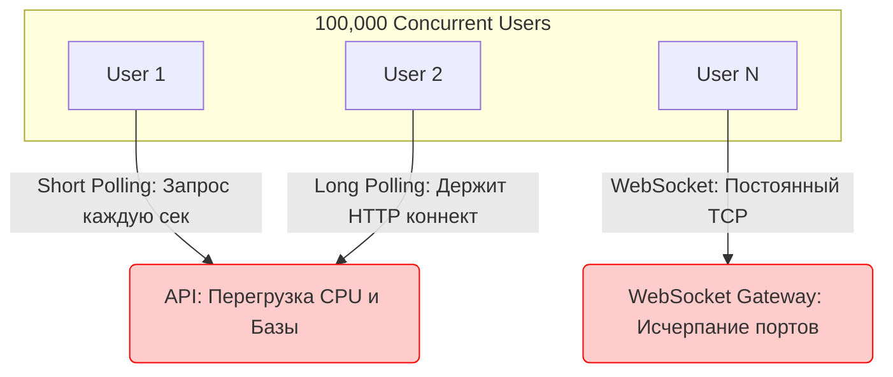

# Concurrent Users (Конкурентные пользователи)

**Concurrent Users (CCU)** — это метрика масштабирования, показывающая количество пользователей, которые *одновременно* взаимодействуют с вашим приложением в одну единицу времени.

В системном дизайне важно различать DAU/MAU (пользователи в день/месяц) и CCU. У вас может быть 1 миллион пользователей в месяц, но если все они заходят равномерно, система не испытывает проблем. Но если это сайт для покупки билетов на концерт Taylor Swift, и все пользователи зашли в одну секунду в 12:00, ваш CCU взлетает до небес, и система может лечь.

### Какую боль мы решаем?
Как фронтенд влияет на нагрузку бэкенда? Напрямую. Неоптимизированный фронтенд может стать причиной падения серверов, генерируя избыточное количество запросов или удерживая слишком много открытых соединений.

Задачи фронтенда в контексте высоких CCU:
1. Минимизировать количество запросов.
2. Не открывать тяжелые постоянные соединения (WebSockets), если можно обойтись легкими.
3. Эффективно обрабатывать отказы бэкенда (чтобы не сделать DDoS при ретраях).

### Как это работает на практике

Архитектурный выбор механизма доставки данных критически влияет на способность системы держать высокий CCU.



### Разбор подходов к Real-time и влияние на CCU

1. **Short Polling (Обычные HTTP-запросы по таймеру)**
   - *Как работает:* Фронт делает `setInterval(fetch, 2000)`.
   - *Влияние на CCU:* Ужасное. 10 000 юзеров генерируют 5 000 RPS на пустом месте (даже если данных нет). Бэкенд сгорит.
2. **WebSockets**
   - *Как работает:* Постоянное двунаправленное TCP-соединение.
   - *Влияние на CCU:* Хорошее, с точки зрения сети (мало оверхеда на заголовки). Но каждое соединение "висит" в памяти бэкенда. Лимит операционной системы — около 65k портов на IP. Для сотен тысяч CCU нужны сложные кластеры балансировщиков.
3. **Server-Sent Events (SSE)**
   - *Как работает:* Однонаправленный HTTP-поток от сервера к клиенту.
   - *Влияние на CCU:* Отлично для чатов, тикеров акций, где клиенту нужно только читать. Легче балансировать, чем WebSockets, так как это стандартный HTTP.

### Примеры кода (Антипаттерн)

**Антипаттерн: DDoS бэкенда на старте**
```javascript
// 100,000 юзеров получают push-уведомление и одновременно открывают App
useEffect(() => {
  // Все 100к разом идут за тяжелым конфигом
  fetch('/api/heavy-config'); 
}, []);
```

**Правильное решение: Jitter (Размытие нагрузки)**
```javascript
useEffect(() => {
  // Добавляем случайную задержку от 0 до 5 секунд
  const jitter = Math.random() * 5000;
  setTimeout(() => {
    fetch('/api/heavy-config');
  }, jitter);
}, []);
```

### Неочевидные нюансы: скрытые трейдоффы

1. **Балансировка WebSockets**: Если вы выбрали WebSockets для чата с высоким CCU, помните, что балансировщик (Nginx/HAProxy) должен поддерживать "Sticky Sessions" или бэкенды должны синхронизироваться через Redis (Pub/Sub). Это сильно усложняет инфраструктуру.
2. **Смертельные объятия (Thundering Herd)**: Если ваш WebSocket сервер перезагрузится, все 100,000 клиентов мгновенно попытаются переподключиться, убив сервер повторно. Фронтенд **обязан** использовать случайный разброс времени (Jitter) при переподключении.
3. **Границы применимости**: Не тащите WebSockets туда, где обновления происходят раз в 10 минут. Если данные нужны редко, используйте стратегию "Stale-while-revalidate" + инвалидация кэша по триггеру (например, пользователь нажал на кнопку "Обновить").
