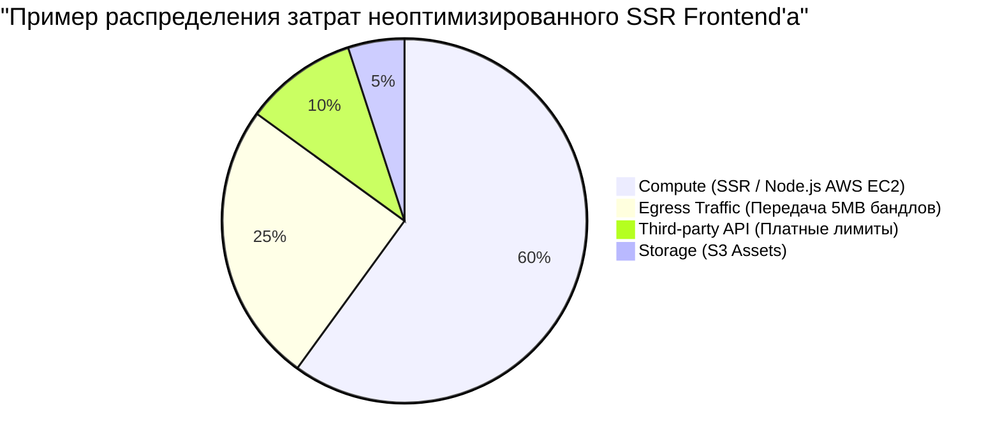

# Cost Optimization (Оптимизация затрат)

**Cost Optimization (Оптимизация затрат)** в системном дизайне — это процесс проектирования архитектуры таким образом, чтобы минимизировать финансовые расходы на инфраструктуру (сервера, трафик, хранилища, сторонние API) без ущерба для бизнеса и производительности.

Часто разработчики забывают, что каждая строчка кода и архитектурное решение имеют свою цену в долларах. Во фронтенде эта проблема особенно актуальна при работе с облаками (AWS, GCP) и Serverless-решениями.

### Какую боль мы решаем?
Бизнес решил запустить новый медиа-портал на Next.js (SSR). Разработчики сделали все красиво: Server-Side Rendering генерирует страницу при каждом запросе. Проект стал популярным, получил 1 миллион заходов в день. И в конце месяца компания получила счет от AWS на $5,000 за Compute-ресурсы (вычисления) и базу данных, которую SSR дергал на каждый хит. 

Плохая архитектура фронтенда может "съесть" всю прибыль продукта.

### Как это работает на практике

Затраты на фронтенд-инфраструктуру делятся на три основные категории:
1. **Bandwidth (Трафик, Egress)**: Передача байтов от серверов пользователю.
2. **Compute (Вычисления)**: Серверный рендеринг (SSR), BFF (Node.js серверы), Serverless Functions.
3. **Storage (Хранение)**: Место на S3 для картинок, видео и ассетов.

### Стратегии оптимизации затрат во Frontend'е

1. **Сдвиг вычислений к клиенту (Compute Shift)**
   - Вычисления на сервере (SSR) стоят денег. Вычисления в браузере пользователя (CSR) **бесплатны** для вас.
   - *Трейдофф:* Если перенести слишком много на клиент, пострадает SEO и метрики производительности (LCP, TTI) на слабых телефонах. Идеальный баланс — SSG (Static Site Generation) или ISR (Incremental Static Regeneration), где генерация происходит один раз, а потом отдается статика из CDN (которая в разы дешевле Compute).
2. **Агрессивное кэширование и CDN**
   - CDN-трафик значительно дешевле трафика напрямую с балансировщика.
   - Настройка правильных заголовков `Cache-Control: max-age=31536000, immutable` для статики (JS/CSS/Изображения) гарантирует, что браузер юзера не будет качать файлы повторно.
3. **Оптимизация ассетов**
   - Отдавая несжатые изображения по 2MB 100,000 пользователям, вы платите за 200 GB трафика (в AWS Egress это может стоить существенных денег). Переход на WebP/AVIF и Gzip/Brotli сжимает этот объем в 4-5 раз.

### Примеры (Антипаттерн vs Правильное решение)

**Антипаттерн (Дорогой SSR)**
Использование Next.js `getServerSideProps` на главной странице e-commerce. При каждом заходе пользователя сервер рендерит HTML и делает запрос в базу. 1000 RPS = 1000 запусков Node.js сервера и 1000 запросов в БД.

**Правильное решение (Дешевый ISR/SSG)**
Использование `getStaticProps` с `revalidate: 60` (ISR). Страница генерируется раз в 60 секунд. При 1000 RPS, за минуту будет сделан 1 запрос в БД, а остальные 59,999 запросов будут обслужены быстро и очень дешево из Edge Cache (CDN).

### Неочевидные нюансы: скрытые трейдоффы

1. **Serverless (Vercel, AWS Lambda)**: Serverless-решения предлагают удобный Developer Experience (DX) и отсутствие настройки серверов. Но на высоких нагрузках Serverless функции становятся **значительно дороже** обычных виртуальных машин (EC2). Оптимизация часто заключается в "переезде" с модных бессерверных решений на старый добрый кластер с Nginx + Node.js.
2. **Third-party APIs**: Использование платных внешних сервисов на фронтенде (например, Google Maps API на каждый рендер компонента или Algolia Search на каждый чих пользователя) может мгновенно сжечь бюджет. Внедряйте дебаунсинг (Debounce) для поисковых инпутов.
3. **Сжатие стоит процессорного времени**: Динамическое сжатие Brotli "на лету" (на Node-сервере) сильно грузит CPU, заставляя покупать более мощные сервера. Статику нужно сжимать **на этапе сборки** (Build Time), чтобы сервер просто отдавал готовые `.js.br` файлы.
