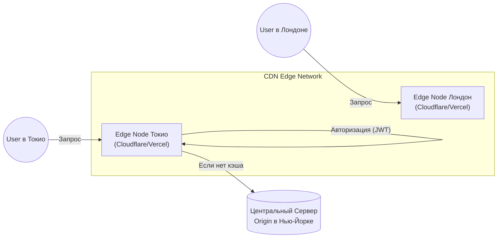

# Edge Strategy (Стратегия граничных вычислений)

**Edge Computing (Граничные вычисления)** во фронтенде — это архитектурный подход, при котором исполнение кода и рендеринг переносятся с централизованного сервера (Centralized Origin) максимально близко к конечному пользователю, на "граничные" узлы CDN (Edge Nodes).

### Какую боль мы решаем?
Традиционный Server-Side Rendering (SSR) работает так: пользователь из Токио заходит на сайт, запрос летит через весь океан к серверам в Нью-Йорке (Origin), там Node.js генерирует HTML, делает запрос в БД и отправляет результат обратно в Японию. Этот процесс занимает 600-800мс из-за законов физики (скорость света в оптоволокне). Пользователь видит белый экран и уходит.

**Edge Strategy** позволяет разместить легковесные функции (Edge Workers) прямо на CDN-сервере в Токио. Код выполнится в 5 миллисекундах от пользователя.

### Как это работает на практике

Edge-функции (Cloudflare Workers, Vercel Edge Functions, AWS Lambda@Edge) основаны не на полноценном процессе Node.js, а на **V8 Isolates**. Они запускаются за микросекунды и потребляют минимум памяти.

Где применяется Edge:
1. **Edge Middleware**: Роутинг, проверка JWT-токенов, редиректы. Вы не пускаете неавторизованного юзера даже до основного сервера, экономя его ресурсы.
2. **A/B Тестирование**: Подмена версий сайта прямо на CDN без "моргания" UI на клиенте.
3. **Персонализация кэша**: Возврат закешированного HTML с подстановкой имени пользователя "на лету" (Edge Side Includes).

### Примеры (Антипаттерн vs Правильное решение)

**Антипаттерн (Запрос в БД из Edge)**:
Вы разместили рендеринг страницы на Edge в Токио. Но база данных по-прежнему лежит в Нью-Йорке. Теперь Edge-функция в Токио делает долгий запрос к БД в США. Вы не ускорили процесс, вы просто добавили еще один сетевой хоп (прыжок).

**Правильное решение (Edge-оптимизированная БД)**:
Если вы используете Edge, вам нужна Edge-совместимая глобальная база данных с репликами (PlanetScale, FaunaDB) или глобальный Key-Value кэш (Cloudflare Workers KV, Redis Global), чтобы данные тоже находились в Токио.

### Неочевидные нюансы: скрытые трейдоффы

1. **Ограниченная среда исполнения (No Node.js)**: Поскольку V8 Isolates — это не Node.js, у вас **нет доступа к модулям вроде `fs`, `path` или `crypto`**. Огромное количество NPM-пакетов просто не заработают на Edge. Приходится использовать специальные web-совместимые пакеты.
2. **Лимиты исполнения**: Edge-функции жестко лимитированы. Например, в Cloudflare Workers бесплатный лимит процессорного времени на выполнение скрипта — 10-50 миллисекунд. Вы не сможете запустить там тяжелую обработку изображений.
3. **Оверхед на отладку**: Дебажить код, который распределен по 200 дата-центрам по всему миру, значительно сложнее, чем локальный Node-сервер. Требуется продвинутая система распределенной трассировки и логирования (Datadog, Sentry).
