# Latency Budget (Бюджет задержки)

**Latency Budget (Бюджет задержки)** — это концепция из SRE (Site Reliability Engineering), которая применяется при проектировании производительных систем. Суть проста: у вас есть жесткий лимит времени (например, 200 миллисекунд), за который приложение должно отреагировать на действие пользователя. Этот "бюджет" распределяется между всеми участниками процесса: сетью, фронтендом, бэкендом, базой данных.

### Какую боль мы решаем?
Часто команды работают изолированно (Siloed Teams). Бэкендеры оптимизируют свой API и говорят: "Мы отдаем JSON за 150мс, мы молодцы". Фронтендеры пишут сложный рендер: "Мы рисуем DOM за 100мс". А в реальности пользователь ждет полсекунды (150мс + 100мс + 200мс на сеть = 450мс) и уходит к конкурентам.

Без единого бюджета никто не берет ответственность за **итоговую** задержку (End-to-End Latency).

### Как это работает на практике

На этапе сбора нефункциональных требований (NFR) команда договаривается: *"Время до первой отрисовки (LCP) должно быть не более 1000мс на мобильной 3G-сети"*. 

Дальше этот бюджет (1000мс) декомпозируется:
- **Сеть (DNS, TCP, TLS handshakes)**: 300мс
- **Запрос статики (CDN)**: 100мс
- **Время работы бэкенда (DB + API)**: 300мс
- **Парсинг JS и рендер компонентов (React/Vue)**: 300мс

Если бэкенд вылез за свои 300мс, он "съел" часть бюджета фронтенда.

```mermaid
gantt
    title Распределение Latency Budget (Бюджет: 500ms)
    dateFormat  s
    axisFormat  %Lms
    
    section Сеть
    DNS Lookup       :a1, 0, 50ms
    TCP Handshake    :a2, after a1, 50ms
    TLS Negotiation  :a3, after a2, 50ms
    
    section Бэкенд
    API Gateway + Auth :a4, after a3, 50ms
    Database Query     :a5, after a4, 150ms
    
    section Фронтенд
    JSON Parsing       :a6, after a5, 50ms
    React Virtual DOM  :a7, after a6, 50ms
    Browser Paint      :a8, after a7, 50ms
```

### Примеры (Антипаттерн vs Правильное решение)

**Антипаттерн (Waterfall Requests / Каскадные запросы)**:
Фронтенд загружается, делает запрос за профилем юзера (100мс). Ждет ответ. Видит его ID, делает запрос за корзиной (100мс). Ждет. Запрашивает цены товаров (100мс). 
*Итог: фронтенд в одиночку сжег 300мс бюджета из-за плохой архитектуры сети (вотерфолл), хотя сервер отвечал быстро.*

**Правильное решение (BFF / GraphQL / Aggregation)**:
Фронтенд делает **один запрос** к Backend-For-Frontend (BFF). BFF внутри датацентра (где сетевая задержка 1мс) собирает профиль, корзину и цены параллельно, и отдает один толстый JSON на клиент. Мы сэкономили два сетевых хопа через интернет.

### Неочевидные нюансы: скрытые трейдоффы

1. **Перцентили (Percentiles)**: Никогда не меряйте Latency Budget по среднему значению (Average). Среднее скрывает проблемы. Используйте **p95** или **p99**. Если бюджет 500мс (p95), это значит, что у 95% пользователей страница должна загрузиться быстрее 500мс.
2. **Восприятие задержки (Perceived Latency)**: Настоящее время ответа (Objective Latency) можно замаскировать. Скелетоны, оптимистичные UI-обновления (Optimistic Updates) и анимации "едят" время, не нарушая ожиданий пользователя. В хорошем дизайне *Perceived Latency* важнее физического бюджета.
3. **Бюджет размера бандла**: Latency Budget напрямую конвертируется в Performance Budget (бюджет размера JS). На медленном 3G парсинг 1MB JS займет 2 секунды. Вы просто не впишетесь ни в какой бюджет, если не разделите код (Code Splitting).
