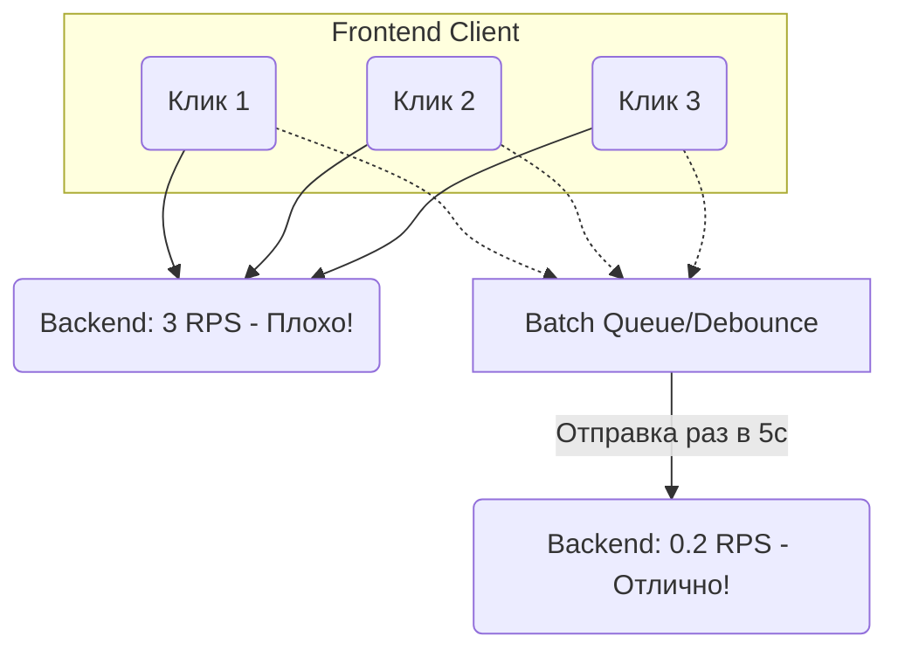

# RPS (Requests Per Second)

**RPS (Requests Per Second — запросы в секунду)** — базовая метрика нагрузки, показывающая, какое количество сетевых запросов обрабатывает система (или генерирует клиент) каждую секунду. В других экосистемах это может называться QPS (Queries Per Second) или TPS (Transactions Per Second).

### Какую боль мы решаем?
Многие фронтендеры считают, что RPS — это проблема бэкендеров. «Пусть админы купят сервера помощнее!». Но именно архитектура фронтенда определяет, какой множитель будет применен к трафику пользователей.
Один пользователь (DAU), зашедший на плохо спроектированный SPA-сайт, может сгенерировать 50-100 API-запросов (RPS) за пару секунд. Если у вас 10 000 таких пользователей одновременно, ваш фронтенд устроит классический DDoS бэкенда (500,000 RPS).

Задача системного дизайна на клиенте — **минимизировать RPS, идущий к серверам (Origin)**, перекладывая его на кэши, CDN и агрегацию.

### Как это работает на практике

Как фронтенд управляет RPS:
1. **Caching (Кэширование)**: Если данные редко меняются, фронтенд не должен дергать API. Механизмы вроде React Query / SWR со стратегией `stale-while-revalidate` радикально снижают RPS.
2. **Debouncing / Throttling (Дебаунс)**: Инпут поиска (Live Search) без дебаунса генерирует запрос на каждое нажатие клавиши (до 5-10 RPS от одного человека). 
3. **Batching (Пакетирование)**: Сбор нескольких мелких запросов в один большой (например, сбор метрик или логов на клиенте и отправка их пачкой раз в 5 секунд).



### Примеры кода (Антипаттерн vs Правильное решение)

**Антипаттерн: N+1 проблема на фронтенде**
У нас есть список из 100 постов. Для рендера аватарки каждого автора компонент делает отдельный fetch.
```javascript
// Внутри компонента <PostItem>
useEffect(() => {
  // Вызывается 100 раз при рендере списка. 100 RPS на ровном месте.
  fetch(`/api/users/${post.authorId}`).then(...)
}, [post]);
```

**Правильное решение: Batching / GraphQL (Data Loader)**
Фронт запрашивает всех нужных авторов одним запросом.
```javascript
// Один запрос на фронте:
fetch(`/api/users?ids=${uniqueAuthorIds.join(',')}`); 
// Итог: 1 RPS вместо 100
```

### Неочевидные нюансы: скрытые трейдоффы

1. **RPS vs Latency**: Если мы используем Batching (накапливаем запросы, чтобы отправить разом), мы снижаем RPS (спасаем бэкенд), но искусственно увеличиваем **Latency** (задержку) для конкретного действия юзера, так как ждем заполнения батча. Это компромисс.
2. **Cache Stampede (Шторм кэша)**: Когда срок жизни кэша истекает (TTL = 0), тысячи клиентов могут одновременно обнаружить это и кинуться делать запросы к бэкенду, создавая огромный спайк RPS. Решение: Jitter (случайный разброс времени протухания кэша на клиентах) или кэширование на уровне Edge/CDN.
3. **Границы применимости**: Измерять RPS для статики (JS/CSS файлов) бессмысленно, если они лежат на нормальном CDN. CDN типа Cloudflare переварит миллионы RPS. Ваша цель — снизить RPS к **динамическому API и базе данных**.
