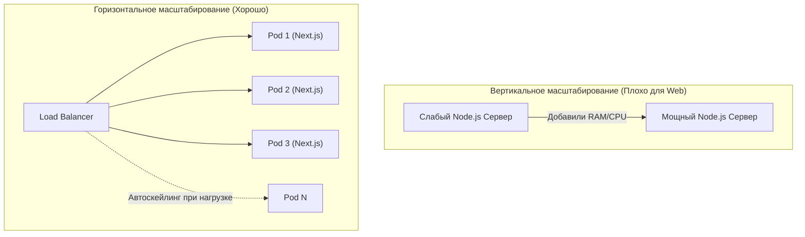

# Scalability (Масштабируемость)

**Scalability (Масштабируемость)** — это способность системы (фронтенда, бэкенда или базы данных) справляться с растущей нагрузкой (увеличением трафика, данных или сложности кодовой базы) без существенного падения производительности и без необходимости переписывать всю систему с нуля.

Во фронтенде масштабируемость имеет **два измерения**:
1. **Инфраструктурная масштабируемость**: Как сайт выдержит скачок трафика со 100 до 1,000,000 пользователей (Black Friday)?
2. **Архитектурная масштабируемость (Scale of Organization)**: Как проект выживет, если над кодом вместо 2 разработчиков начнут работать 50 человек из 5 разных команд?

### Какую боль мы решаем?
Классическая проблема: проект написан как монолитное SPA (Single Page Application). Пришел трафик — сервер с Node.js (SSR) упал, так как не смог отрендерить 10,000 страниц в секунду. 
Пришли новые разработчики — сборка Webpack стала занимать 15 минут, а слияния (Merge Conflicts) в `store.js` происходят каждый день. Продукт остановился.

### Как это работает на практике

#### 1. Инфраструктурное масштабирование
Разделяют два пути:
- **Вертикальное (Scale Up)**: Купить сервер помощнее (больше RAM, мощнее CPU). Работает для рендеринга на Node.js, но быстро упирается в физический потолок.
- **Горизонтальное (Scale Out)**: Добавить больше серверов. Для фронтенда это идеальный путь. Мы упаковываем SSR-приложение в Docker-контейнер и с помощью Kubernetes поднимаем 10, 50, 100 инстансов в зависимости от нагрузки.

#### 2. Масштабирование разработки
Когда растет кодовая база, мы внедряем архитектурные паттерны:
- **Feature-Sliced Design (FSD)**: Разделение кода по бизнес-доменам, а не по типу файлов (не `components/`, `reducers/`, а `features/Cart/`, `features/Auth/`).
- **Microfrontends (Микрофронтенды)**: Разбиение огромного SPA на независимые мини-приложения, каждое из которых деплоится отдельной командой (через Module Federation или iFrames).

### Примеры (Антипаттерн vs Правильное решение)

**Антипаттерн (Не масштабируется инфраструктурно):**
Хранение пользовательских сессий (JWT или корзины) в оперативной памяти (RAM) одного инстанса Node.js. Как только вы добавите второй сервер (Scale Out), пользователь, попавший на него балансировщиком, "разлогинится", так как его сессии там нет. 
*(Нарушение принципа Stateless).*

**Правильное решение (Stateless Frontend Backend):**
Все Node.js / BFF серверы должны быть **Stateless** (без состояния). Сессии хранятся в распределенном кэше (Redis), к которому обращаются все инстансы. Это позволяет безопасно убивать и поднимать новые сервера под нагрузкой.

### Неочевидные нюансы: скрытые трейдоффы

1. **Боль микрофронтендов**: Разделение проекта на микрофронтенды ради масштабирования разработки несет колоссальный оверхед (Microfrontends Tax). Вы решаете проблему конфликтов в Git, но получаете ад управления зависимостями, сложный CI/CD и падение производительности в браузере (загрузка нескольких копий React). Это нужно только для BigTech-компаний (от 100 фронтендеров).
2. **Холодные старты (Cold Starts)**: Горизонтальное масштабирование через Serverless (AWS Lambda) имеет задержку на "разогрев" нового инстанса. Первый пользователь, попавший на только что созданный Pod при автоскейлинге, получит задержку в 1-3 секунды.
3. **Границы применимости**: Заранее закладывать микрофронтенды или сложный Kubernetes в MVP (Minimum Viable Product) — это овер-инжиниринг, который убьет стартап до его релиза (Premature Optimization). Архитектура должна расти вместе с бизнесом.
