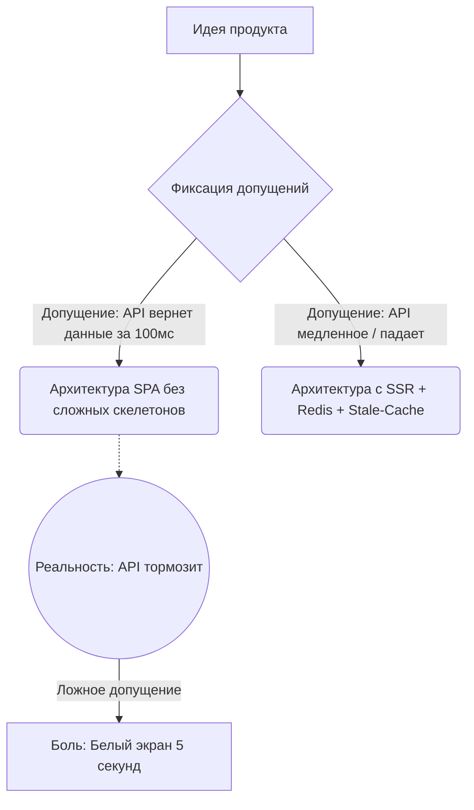

# Допущения (Assumptions)

**Допущения (Assumptions)** — это факты или условия, которые мы считаем истинными на момент проектирования системы, но которые **не доказаны** или находятся вне нашего контроля. 

Проектирование любой сложной системы похоже на строительство дома. Вы не можете знать заранее уровень грунтовых вод под каждым метром земли, поэтому вы *допускаете*, что почва стандартная, и закладываете типовой фундамент. Во фронтенд-архитектуре происходит то же самое.

### Какую боль мы решаем?
Одна из главных причин провала IT-проектов — это **неосознанные допущения**. 
Разработчик проектирует тяжелое SPA-приложение с 3D-графикой (WebGL), *подразумевая* (допуская), что им будут пользоваться с мощных макбуков по Wi-Fi. После релиза выясняется, что целевая аудитория продукта — складские рабочие, у которых в руках старые Android-планшеты с 3G-интернетом. Продукт проваливается, потому что фундаментальное допущение архитектора оказалось ложным.

### Как это работает на практике

На этапе сбора требований (в процессе System Design Interview или при написании RFC) архитектор **обязан** явно выписать все допущения в отдельный список и согласовать их с бизнесом.

Категории допущений:
1. **Пользовательские**: Какими девайсами пользуются? Какая у них скорость сети?
2. **Технические**: Сможет ли бэкенд отдавать нужный JSON быстрее 200мс? Будет ли готово API к моменту старта разработки фронта?
3. **Бизнес-допущения**: Ожидаем ли мы резкий рост трафика (x100) в ближайший год?

### Примеры (Антипаттерн vs Правильное решение)

**Антипаттерн: Держать допущения в голове**
"Я не стал писать сервис-воркер и оффлайн-режим, потому что ну камон, мы же делаем десктопную админку, у них всегда есть интернет в офисе." (Через месяц админку отдают выездным менеджерам, и она ломается в полях).

**Правильное решение: Документ System Design**
В начале вашего архитектурного документа должен быть блок:
> **Assumptions (Допущения):**
> 1. Большинство (90%) пользователей заходят с десктопных устройств на ОС Windows (на базе аналитики старого сайта).
> 2. Бэкенд-команда предоставит GraphQL API до 1 октября.
> 3. Приложению не требуется индексация поисковиками (SEO не нужно), так как это закрытый портал B2B. *Следовательно, мы выбираем Client-Side Rendering (CSR).*

### Неочевидные нюансы: скрытые трейдоффы

1. **Допущения — это риски**: Каждое записанное допущение — это потенциальный риск. Если допущение №3 (про SEO) окажется ложным через полгода (бизнес решит открыть часть портала для гугла), архитектуру CSR придется мучительно переделывать на SSR (Next.js).
2. **Разрушение замков из песка**: Если вы строите сложную микрофронтенд-архитектуру на *допущении*, что в проекте скоро будет работать 100 человек, а инвестиции не приходят и вас остается трое — ваша архитектура вас же и задушит.
3. **Верификация**: Хороший инженер старается как можно быстрее превратить "допущение" в "факт". Запросить аналитику у маркетологов, сделать нагрузочное тестирование бэкенда. Чем меньше допущений, тем крепче дизайн.
