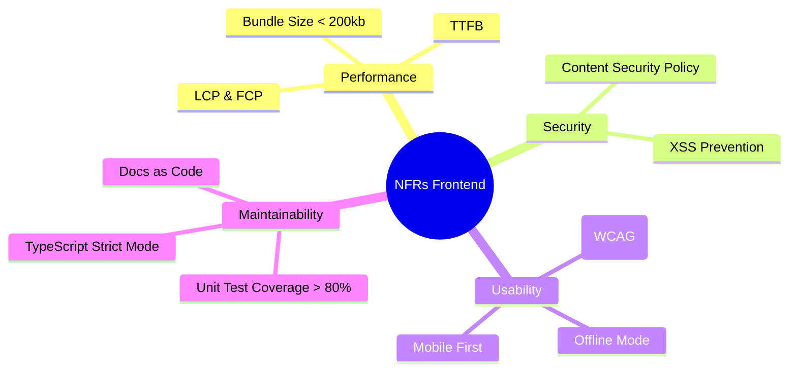

# Нефункциональные требования (NFRs)

**Нефункциональные требования (Non-Functional Requirements, NFRs)** — это требования, которые описывают **как** система должна работать, в отличие от функциональных требований, которые описывают, **что** система должна делать.

Если функциональное требование (FR) звучит как *"Пользователь должен иметь возможность положить товар в корзину"*, то нефункциональное требование уточняет: *"Добавление в корзину должно происходить быстрее 200 миллисекунд даже при пиковой нагрузке в Черную Пятницу"*.

### Какую боль мы решаем?
Бизнес (Product Owners) почти всегда мыслит только функциональными требованиями (фичами). Разработчики пилят фичи. В итоге получается приложение, которое "умеет всё", но грузится 15 секунд, не работает на iPhone 6, недоступно для слепых пользователей (нет a11y), а при попытке перевести его на арабский язык (RTL) весь интерфейс ломается.

Именно NFRs формируют **основу архитектуры**. Вы не выбираете между Next.js, Vite или Astro на основе того, какие там будут кнопочки. Вы выбираете их на основе требований к SEO, времени загрузки и инфраструктуре.

### Как это работает на практике

Архитектор фронтенда должен "вытащить" из бизнеса (или определить сам на основе допущений) следующие метрики (часто их называют *"ilities"*):

1. **Performance (Производительность)**: Core Web Vitals (LCP < 2.5s, CLS < 0.1), размер бандла.
2. **Scalability (Масштабируемость)**: Поддержка до 100,000 Concurrent Users.
3. **Accessibility (Доступность - a11y)**: Соответствие WCAG 2.1 AA (контрастность, screen readers).
4. **Internationalization (i18n)**: Поддержка 10 языков, включая RTL (арабский, иврит), разные форматы дат и валют.
5. **Security (Безопасность)**: Защита от XSS, CSP-заголовки, хранение JWT-токенов в HttpOnly cookie.
6. **Maintainability (Поддерживаемость)**: Покрытие тестами не ниже 80%, использование строгой типизации (TypeScript).

### Примеры (Антипаттерн vs Правильное решение)

**Антипаттерн: Расплывчатые NFR**
- "Приложение должно быть быстрым." *(Быстрым на каком девайсе? На какой сети? Какая метрика измеряет "быстроту"?)*
- "Код должен быть качественным." *(Что такое качество? Кто его измеряет?)*

**Правильное решение: Измеримые (SMART) NFR**
- "Метрика LCP (Largest Contentful Paint) на главной странице не должна превышать 2.5 секунды на эмуляции 'Slow 3G / Moto G4' в Lighthouse."
- "Любой текстовый контент в приложении должен быть вынесен в ключи локализации (JSON), хардкод текста в JSX не пройдет CI/CD."

### Неочевидные нюансы: скрытые трейдоффы

1. **NFRs стоят денег и времени**: Выполнение требования WCAG 2.1 AA (Accessibility) может увеличить время разработки UI-компонентов на 30-50%. Бизнес должен понимать, что за "качество" нужно платить ресурсами.
2. **Противоречия между NFR**: Если вы поставили цель "Максимальная безопасность (жесткий CSP)" и одновременно "Простая интеграция сторонних скриптов маркетологов (GTM, Яндекс.Метрика)", они столкнутся лбами. Маркетологам нужен `unsafe-inline` для инъекций кода, а Security это запрещает. Это классический трейдофф, который должен решаться на этапе проектирования.
3. **Continuous Verification**: NFR бесполезны, если они написаны только на бумаге. Они должны быть автоматизированы в CI/CD (Lighthouse CI, SonarQube, ESLint a11y-плагины). То, что не проверяется автоматически — деградирует.
