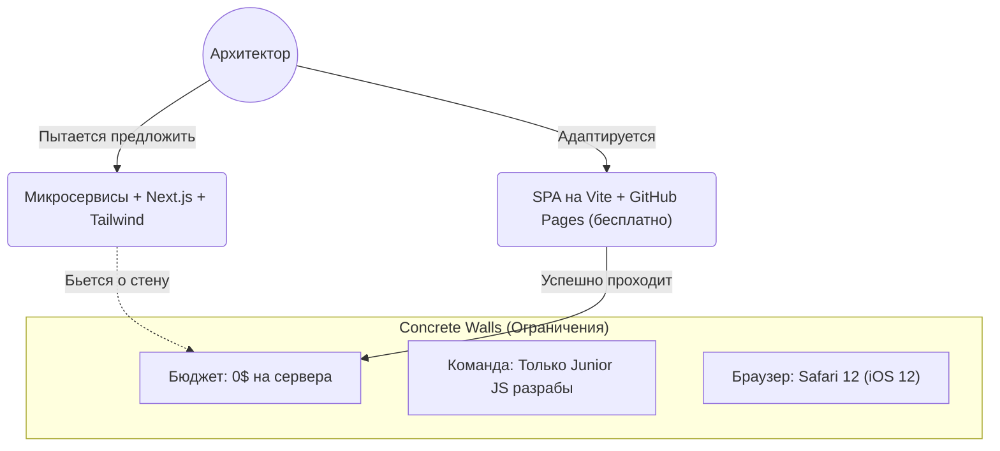

# Ограничения (Constraints)

**Ограничения (Constraints)** в системном дизайне — это жесткие, не подлежащие обсуждению рамки, внутри которых вы обязаны спроектировать и реализовать систему. 

Если архитектурные компромиссы (trade-offs) — это то, чем мы можем жонглировать, а допущения (assumptions) — то, во что мы верим, то **ограничения — это бетонные стены**. Вы не можете их сдвинуть, вы можете только строить архитектуру с их учетом.

### Какую боль мы решаем?
Представьте, что вы спроектировали идеальную архитектуру на базе React 18, Server Components, GraphQL и разворачиваете всё это в Vercel. Приходите на презентацию к клиенту (крупный банк), а безопасник говорит: "Извините, у нас жесткое ограничение: весь код должен крутиться на наших on-premise серверах внутри закрытого контура, никаких внешних облаков. А еще у наших операционистов стоят компьютеры с Windows 7 и браузером IE11. Ваш сайт у них просто не откроется".
Невыявление ограничений *до* начала работы приводит к полному переписыванию проекта.

### Как это работает на практике

Ограничения выявляются на самых первых интервью со стейкхолдерами. Они делятся на несколько типов:

1. **Бизнес-ограничения (Business Constraints)**:
   - *Бюджет:* У нас есть только $1000/месяц на инфраструктуру (забудьте про тяжелый SSR кластер).
   - *Сроки (Time-to-Market):* MVP должен быть готов к выставке через 1.5 месяца (забудьте про микрофронтенды и Clean Architecture, пишем монолит на готовом UI-ките).
2. **Технические ограничения (Technical Constraints)**:
   - *Легаси API:* Бэкенд написан 10 лет назад, отвечает SOAP XML и переписываться не будет. (Значит, фронтенду потребуется BFF-прослойка для маппинга XML в JSON).
   - *Среда исполнения:* Приложение должно работать внутри WebView мобильного приложения (ограничения на работу с LocalStorage, куками, камерой).
3. **Ограничения команды (Team Constraints)**:
   - В компании работают 20 React-разработчиков и ни одного Vue-разработчика. (Выбор Vue для нового проекта недопустим, даже если он лучше подходит под задачу, так как некому будет его поддерживать).

### Примеры (Антипаттерн vs Правильное решение)

**Антипаттерн: Игнорирование ограничений команды**
Архитектор (фанат функционального программирования) внедряет в проект стейт-менеджер Effector или RxJS для сложной реактивности. Но команда состоит из джуниоров, которые только выучили базовый React. Итог: фичи делаются месяцами, багов море, команда демотивирована, потому что не понимает код.

**Правильное решение: Прагматичный выбор**
Архитектор фиксирует ограничение: "Уровень команды — Junior/Middle". Решение: "Мы берем Redux Toolkit. Да, он многословен, но он имеет лучшую документацию, жесткие рамки (сложно отстрелить ногу) и понятен любому новичку на рынке".

### Неочевидные нюансы: скрытые трейдоффы

1. **Технологический стек как ограничение**: В крупных корпорациях часто есть "Tech Radar" (радар технологий). Если вы хотите использовать Svelte, а корпоративный стандарт — React, это жесткое ограничение. Выбор другой технологии потребует многомесячных согласований с комитетом архитекторов (ARB).
2. **Регуляторные ограничения (Legal / Compliance)**: GDPR в Европе, HIPAA в медицине (США), 152-ФЗ в РФ. Эти законы могут диктовать, что фронтенд не имеет права сохранять определенные данные даже в браузере (LocalStorage) или не может отправлять логи с IP-адресами в сторонние сервисы (Sentry).
3. **Ограничения порождают креативность**: Многие жалуются на ограничения, но в инженерии рамки сужают пространство поиска решений. Безграничный выбор (паралич выбора) часто приводит к худшей архитектуре, чем проектирование в жестких условиях.
