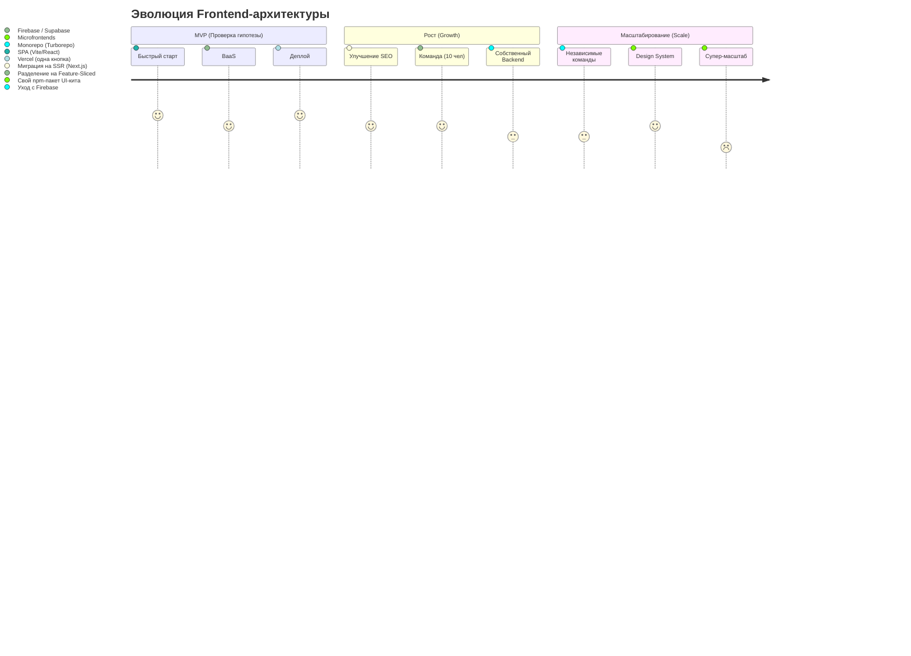

# План эволюции архитектуры (Evolutionary Architecture)

**План эволюции архитектуры** — это осознание того факта, что любая архитектура со временем устаревает и перестает отвечать потребностям растущего бизнеса. Проектировать "идеальную" систему на старте — это антипаттерн (Оверинжиниринг). Настоящий системный дизайн заключается в том, чтобы заложить векторы, по которым система сможет развиваться и трансформироваться *без полного переписывания*.

### Какую боль мы решаем?
Частый сценарий: стартап выживает, получает миллионные инвестиции, нанимает 50 новых разработчиков. И тут выясняется, что их монолитное приложение на старой версии Create React App невозможно ни обновить, ни разделить на части. Код превратился в "Большой комок грязи" (Big Ball of Mud). Компании приходится на год остановить разработку фич и объявить "Рефакторинг 2.0", который, скорее всего, провалится.

План эволюции помогает избежать этой боли, заранее отвечая на вопрос: *"Что мы будем делать, когда эта архитектура перестанет справляться?"*

### Как это работает на практике

Хороший план эволюции описывает этапы жизни проекта. Архитектор должен понимать, где мы сейчас, и какой шаг будет следующим.

### Примеры (Антипаттерн vs Правильное решение)

**Антипаттерн: Микросервисная зависть (Microservice Envy)**
Команда из трех человек решает делать стартап (Pet-проект) сразу на микрофронтендах, разворачивая Kubernetes. 90% времени они тратят на настройку инфраструктуры и маршрутизации, а не на продукт. Продукт умирает до релиза.

**Правильное решение: Прагматичный Монолит (Majestic Monolith)**
Команда начинает с простого монолитного SPA. Но! Они сразу договариваются о жестких границах модулей (например, через ESLint правила, запрещающие кросс-импорты между фичами). Когда приходит время (Growth этап), монолит легко "разрезается" по этим границам и выносится в монорепозиторий.

### Неочевидные нюансы: скрытые трейдоффы

1. **Технический долг как инструмент**: На этапе MVP технический долг — это кредит, который бизнес берет, чтобы быстрее выйти на рынок. Но план эволюции должен явно указывать триггеры, когда этот долг пора отдавать. (Например: *"Когда RPS превысит 100, мы уходим с Polling на WebSockets"*).
2. **Стоимость отчуждения (Cost of Extraction)**: Если вы строите монолит, старайтесь изолировать сторонние зависимости за интерфейсами (Адаптеры). Если вы привяжете весь свой код к специфичному API Firebase, стоимость перехода на собственный бэкенд на этапе Growth будет космической.
3. **Fitness Functions**: В эволюционной архитектуре есть понятие "функции пригодности". Это автоматические скрипты (в CI/CD), которые проверяют, не нарушает ли новый код текущие архитектурные правила. Это гарантирует, что архитектура эволюционирует в нужную сторону, а не деградирует.
