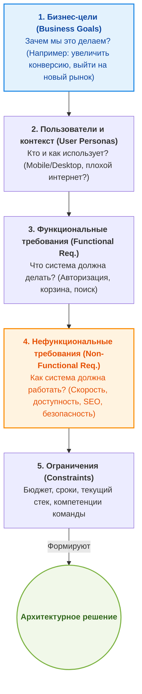

# Сбор требований (Requirements Gathering)

Сбор требований в System Design — это фундамент любой архитектуры. Это этап, на котором мы перестаем думать о React, Zustand или Webpack, и начинаем думать о том, **какую проблему бизнеса мы решаем** и **в каких условиях будет жить продукт**.

## Какую боль мы решаем?
Частая инженерная ошибка — бросаться писать код сразу после получения задачи. Мы выбираем любимый фреймворк, поднимаем инфраструктуру, а через месяц выясняется, что приложение должно работать офлайн для складских работников, или что SEO — критический фактор для бизнеса. Итог: дорогостоящий рефакторинг или переписывание с нуля. Сбор требований спасает от создания «идеальной системы для вымышленных условий».

## 1. Как это работает на практике

Процесс сбора требований можно представить как воронку, которая сужается от абстрактных бизнес-целей до конкретных технических ограничений:



## 2. Разница подходов (Антипаттерн vs Практика)

### ❌ Антипаттерн: System Design без сбора требований
Инженер получает задачу: «Нам нужен клон Trello».
Он сразу думает о технологиях:
```tsx
// "О, я возьму React + Redux Toolkit + WebSockets + Styled Components!"
npx create-react-app trello-clone
```
**Результат:** Выясняется, что Trello-клон нужен для внутренней корпоративной сети без доступа к интернету, где пользователи сидят на старых планшетах (нужен PWA и IndexedDB, а не толстый бандл с кучей тяжелых анимаций).

### ✅ Как надо: Задавать правильные вопросы
Прежде чем писать код, инженер составляет бриф:
- **Load (Нагрузка):** Сколько пользователей? (100 внутренних или 10 млн. публичных?)
- **Network (Сеть):** Какой интернет у клиентов? (3G в метро или стабильный офисный Wi-Fi?)
- **SEO:** Нужно ли индексировать доски? (Если да -> Next.js / SSR. Если нет -> обычный SPA).

## 3. Неочевидные нюансы и трейдоффы

* **Паралич анализа (Analysis Paralysis):** Пытаться собрать 100% требований до начала разработки — это утопия. В Agile-мире требования меняются. Трейдофф заключается в том, чтобы собрать **достаточно** информации для выбора фундамента (например, SSR vs SPA), который потом будет почти невозможно изменить, а мелкие детали оставить на потом.
* **Игнорирование команды (Контекстные ограничения):** Вы можете спроектировать идеальную микрофронтенд-архитектуру на Module Federation, но если у вас в команде 3 джуна, знающих только базовый React, эта архитектура умрет. Компетенции команды — это такое же жесткое требование, как и RPS.
* **Оверхед коммуникации:** Сбор требований требует общения с бизнесом, аналитиками и стейкхолдерами. Инженеры часто избегают этого, предпочитая сразу писать код. Но один час разговора с менеджером может сэкономить месяцы переписывания архитектуры.

## Вывод
Сбор требований во фронтенде — это не написание толстых ТЗ. Это чек-лист критических вопросов, отсекающих заведомо провальные архитектурные решения еще до создания первого файла.
