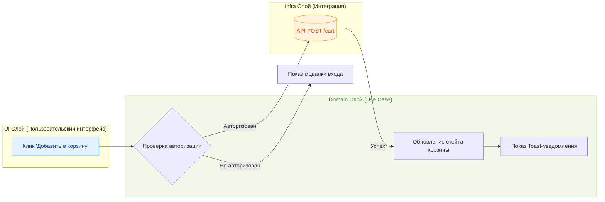

# Функциональные требования

Функциональные требования (Functional Requirements) — это спецификация того, **что** система должна делать. Это прямой перевод бизнес-потребностей в конкретные фичи приложения: регистрация, поиск, добавление в корзину, отображение интерактивных графиков.

## Какую боль мы решаем?
Без четко очерченных функциональных требований команда начинает делать фичи "на вырост" (YAGNI — You Aren't Gonna Need It) или, наоборот, упускает критический функционал. Это приводит к раздутию скоупа (scope creep), постоянной смене приоритетов и бесконечным переделкам. Мы должны четко знать, что именно нужно пользователю, чтобы не писать лишний код.

## 1. Как это работает на практике

Функциональные требования обычно формулируются в виде User Stories или Use Cases. Для фронтенда важно не просто перечислить фичи списком, но и понять их жизненный цикл в интерфейсе и потоки данных.



## 2. Примеры в коде

Функциональные требования напрямую отражаются в доменном слое (или в слое сервисов/хуков), где мы описываем Use Cases.

### ❌ Антипаттерн: Размывание функциональных требований по компонентам
Когда требование не выделено явно, оно растворяется в верстке.
```tsx
function ProductCard({ product }) {
  // Логика размазана по UI, трудно понять функциональные требования 
  // в отрыве от конкретной кнопки и JSX
  const handleBuy = async () => {
    if (!localStorage.getItem('token')) {
       alert('Войдите в систему');
       return;
    }
    await fetch(`/api/cart`, { method: 'POST', body: JSON.stringify(product) });
    setCartCount(prev => prev + 1);
  }
  
  return <button onClick={handleBuy}>Купить</button>;
}
```

### ✅ Как надо: Изоляция функционального сценария
Функциональное требование "Пользователь может добавить товар" выделено в явный, тестируемый и переиспользуемый сценарий (Use Case):
```tsx
// useCartLogic.ts - четко описывает функциональное требование как контракт
export function useAddToCart() {
  const { isAuth, promptLogin } = useAuth();
  const mutation = useMutation({
    mutationFn: (productId) => api.cart.add(productId),
    onSuccess: () => showToast('Добавлено в корзину')
  });

  return (productId) => {
    if (!isAuth) return promptLogin();
    mutation.mutate(productId);
  };
}
```

## 3. Неочевидные нюансы и трейдоффы

* **Граничные состояния (Edge Cases):** Функциональные требования часто описывают только "Happy Path" (успешный сценарий). Инженер должен сам додумать: что будет, если сервер вернет 500? Что если пользователь нажмет кнопку дважды? Это скрытые требования к UI, которые нельзя игнорировать.
* **Слепая вера в макеты:** Дизайн в Figma — это НЕ функциональное требование. Дизайнер мог нарисовать кнопку, забыв про состояния загрузки, лоадеры или пустые экраны (Empty States). Инженер должен валидировать макеты об реальные функциональные требования.
* **Граница применимости:** Во фронтенде функциональные требования тесно переплетаются с UX. Иногда то, *как* работает фича (например, drag-and-drop вместо кликов), становится самим функциональным требованием. Не стоит отделять "что делать" от "как это будет выглядеть" глухой стеной, здесь требуется синергия.
