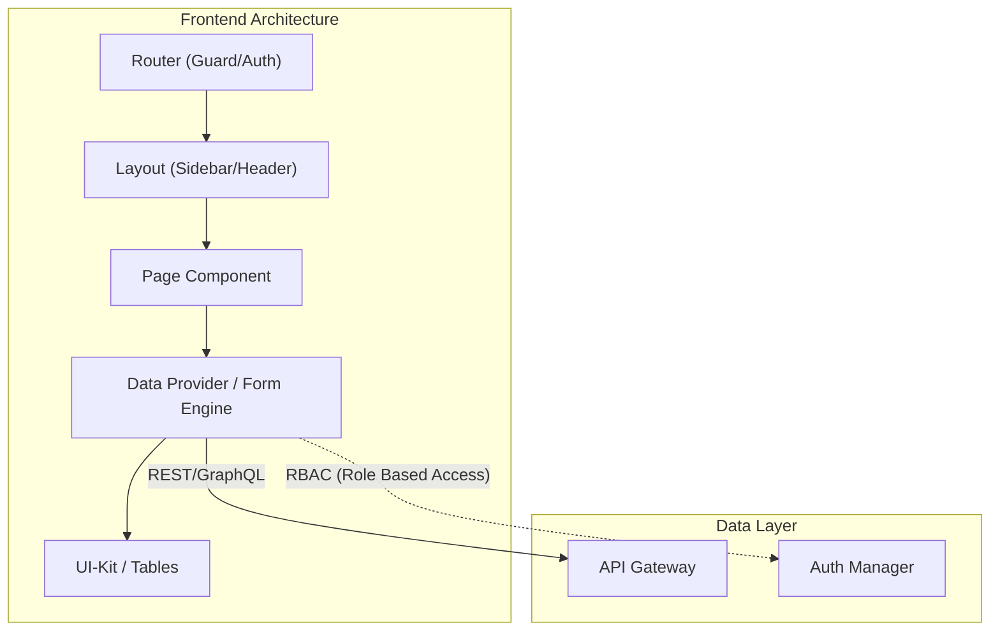

# Архитектура Админ-панели (Backoffice)

**Админ-панель (или Backoffice / ERP-система / CRM)** — это внутреннее приложение для сотрудников компании. В системном дизайне этот класс приложений радикально отличается от публичных (B2C) сайтов своими нефункциональными требованиями (NFRs).

### Какую боль мы решаем?
Если вы попытаетесь спроектировать админку так же, как проектируете B2C интернет-магазин, вы потратите деньги компании впустую. 
В админках совершенно не важны SEO (они закрыты за логином), время первой отрисовки (LCP, так как пользователи открывают их на весь день) и размер бандла. Зато здесь критически важны **скорость разработки новых форм/таблиц**, сложная ролевая модель (RBAC) и надежная обработка ошибок.

### Как это работает на практике

Архитектура админ-панели строится вокруг парадигмы **Data-Driven UI**. 



**Ключевые архитектурные решения:**
1. **Рендеринг**: Строгий CSR (Client-Side Rendering). SPA на React/Vue (например, через Vite) — идеальный выбор. Next.js (SSR) здесь будет приносить только вред (оверхед на инфраструктуру без пользы).
2. **UI-Kit**: Использование тяжелых, но полнофункциональных библиотек (Ant Design, MUI) или специализированных фреймворков для админок (React Admin, Refine, Filament). Кастомный дизайн с нуля — антипаттерн, если только админка не является публичным SaaS-продуктом.
3. **State Management**: В админках мало глобального стейта, но много серверного. Идеально подходят решения вроде React Query (TanStack Query) или RTK Query для инвалидации кэша таблиц после сабмита форм.

### Примеры (Антипаттерн vs Правильное решение)

**Антипаттерн: Верстка каждой таблицы с нуля**
Разработчик создает компонент `<UsersTable>`, пишет там `fetch`, мапит данные в теги `<table>`, `<tr>`, `<td>`, потом прикручивает самописную пагинацию. На одну страницу уходит неделя.

**Правильное решение: Data-Driven подход (Конфигурация вместо кода)**
Разработчик использует готовый Headless Table-движок (например, TanStack Table) и генераторы форм (React Hook Form + Zod).
```javascript
// Вся страница сводится к конфигу
const columns = [
  { field: 'id', header: 'ID', sortable: true },
  { field: 'email', header: 'Email', filter: true }
];

return (
  <DataTable 
    endpoint="/api/users" 
    columns={columns} 
    permissions={['read:users', 'delete:users']} 
  />
);
```

### Неочевидные нюансы: скрытые трейдоффы

1. **Vendor Lock-in в UI-китах**: Выбрав Ant Design или Material UI, вы навсегда связываете себя с их дизайн-системой. Если через год бизнес захочет "полностью переделать дизайн под брендбук", вам придется выбросить весь проект.
2. **Ролевая модель (RBAC / ABAC)**: Проверка прав должна происходить как на бэкенде (обязательно!), так и на фронтенде (чисто визуально — скрыть кнопку "Удалить", если нет прав). Поддержка синхронизации этих прав (ACL) между фронтом и бэком — одна из самых сложных архитектурных задач в админках.
3. **Обработка форм**: В админках бывают формы на 100+ полей с динамическими зависимостями (покажи поле B, если в поле A выбрано значение X). Если проектировать их на обычных `useState`, приложение начнет тормозить из-за ререндеров. Необходимы библиотеки с паттерном Uncontrolled Inputs.
