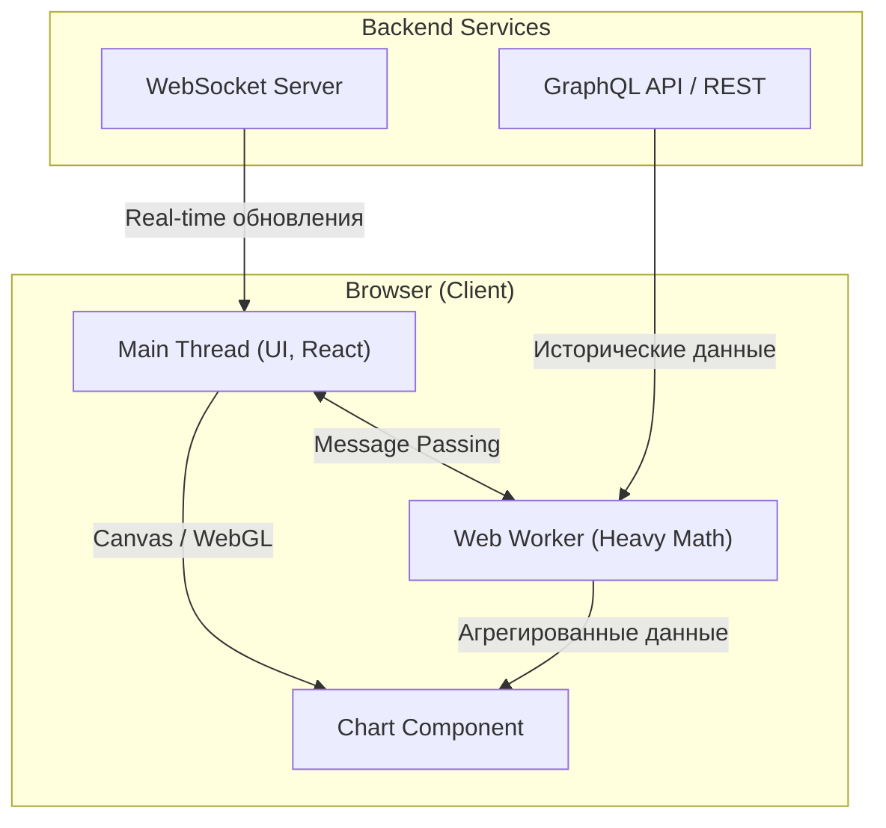

# Архитектура Дашборда (Аналитическая система)

**Дашборды (Dashboards)** — это класс приложений, чья главная цель — агрегация, визуализация и мониторинг больших объемов данных в реальном времени или в виде отчетов. Это могут быть системы для трейдинга, мониторинга серверов (Grafana) или бизнес-аналитики (Tableau, PowerBI).

### Какую боль мы решаем?
Главная боль дашбордов — **Performance (Производительность)** в браузере.
Если вы попытаетесь отрендерить график, в котором 100,000 точек (например, изменение цены акций за год по минутам) с помощью стандартного DOM (SVG или HTML-элементы), браузер зависнет "намертво" (Thread Block) на несколько секунд, так как основной поток (Main Thread) будет перегружен.

### Как это работает на практике

Архитектура дашборда требует жесткого контроля над тем, *где* происходят вычисления и *как* происходит отрисовка.



**Ключевые архитектурные решения:**
1. **Выбор технологии рендеринга (Trade-offs)**:
   - *DOM / SVG (D3.js, Recharts)*: Отлично для простых графиков (< 1000 элементов). Легко стилизовать CSS.
   - *Canvas (Chart.js)*: Средний уровень. Рисует пиксели, а не DOM-узлы. Держит до 10k-50k точек.
   - *WebGL (Three.js, ECharts с GL)*: Хардкор. Вычисления переносятся на видеокарту (GPU). Обязательно для миллионов точек (трейдинг, 3D), но очень сложно разрабатывать.
2. **Off-main-thread Architecture**: Парсинг огромных JSON от бэкенда и математические агрегации (группировка по дням, расчет скользящей средней) выносятся в **Web Workers**, чтобы интерфейс не "фризился".

### Примеры (Антипаттерн vs Правильное решение)

**Антипаттерн: Избыточный Real-time и перерисовка всего**
Бэкенд шлет по WebSocket обновления цены каждую миллисекунду. Фронтенд на каждое событие кладет данные в Redux. Redux триггерит ререндер всего дашборда с 10 графиками. Ноутбук пользователя взлетает от кулеров.

**Правильное решение: Throttling & Batching**
```javascript
// Входящий поток данных через WebSocket
const socket = new WebSocket('wss://api.exchange');

let batchedUpdates = [];

socket.onmessage = (event) => {
  batchedUpdates.push(JSON.parse(event.data));
};

// Обновляем график пакетно (Batching), синхронно с частотой кадров монитора (60 FPS)
requestAnimationFrame(function updateLoop() {
  if (batchedUpdates.length > 0) {
    chartInstance.appendData(batchedUpdates);
    batchedUpdates = []; // Очищаем буфер
  }
  requestAnimationFrame(updateLoop);
});
```

### Неочевидные нюансы: скрытые трейдоффы

1. **Downsampling (Агрегация на бэкенде)**: Если на графике шириной в 1000 пикселей вы пытаетесь нарисовать 1 миллион точек, вы физически рисуете 1000 точек в одном пикселе (Overdrawing). Это бессмысленно. Золотое правило архитектуры дашбордов: бэкенд должен агрегировать (Downsample) данные под разрешение экрана клиента, отдавая ровно столько точек, сколько нужно для визуализации.
2. **Утечки памяти (Memory Leaks)**: В SPA-дашбордах, которые открыты сутками, не отписанные WebSocket-листенеры или старые массивы с миллионами исторических записей могут забить всю оперативную память (OOM - Out of Memory) и убить вкладку.
3. **Компромисс Resize**: Перерисовка тяжелых графиков при ресайзе окна (ResizeObserver) очень дорогая. Во время "тяги" окна мыши график обычно заменяют на скриншот/плейсхолдер, а настоящую перерисовку делают по окончании (Debounce).
