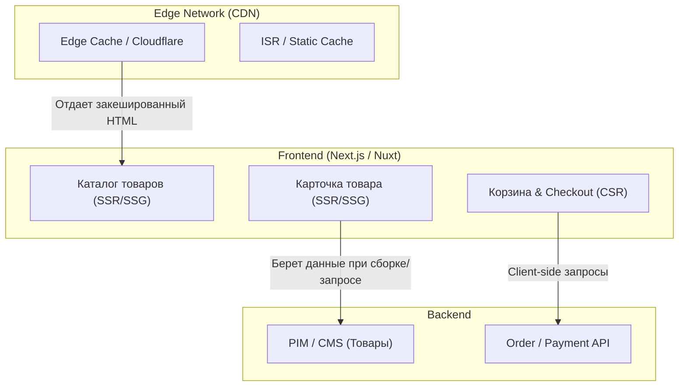

# Архитектура Интернет-магазина (E-commerce)

**Интернет-магазин (E-commerce)** — это класс публичных (B2C) приложений, где главными архитектурными драйверами являются **SEO (поисковая оптимизация)** и **Конверсия (Performance)**. Amazon доказал: каждые 100 миллисекунд задержки стоят компании 1% продаж.

### Какую боль мы решаем?
Если вы сделаете E-commerce как классическое SPA (Client-Side Rendering, например, на голом React), произойдет следующее:
1. Поисковые боты (особенно Яндекс, который плохо исполняет JS) не увидят контент и не проиндексируют карточки товаров.
2. Пользователь, перешедший по рекламе из Instagram, увидит белый экран на 3 секунды (пока качается JS бандл). За это время 50% аудитории закроет вкладку. Деньги на рекламу сгорят.

### Как это работает на практике

Современная архитектура интернет-магазина всегда **гибридная**. Она делит приложение на публичную часть (которую нужно индексировать) и динамическую часть (персонализированную).

**Ключевые архитектурные решения:**
1. **Рендеринг**: Использование фреймворков полного цикла (Next.js, Nuxt, Remix).
   - *Главная, Категории, Статьи* — генерируются статически (SSG/ISR) и раздаются с CDN за 20мс.
   - *Карточка товара* — SSR или ISR с частой ревалидацией (чтобы цена всегда была актуальной).
   - *Корзина и Чекаут* — CSR (Client-Side Rendering), так как эти данные строго приватны и их нельзя кэшировать.
2. **Управление стейтом (Cart)**: Корзина должна храниться не только в Redux, но и персистентно (в LocalStorage/IndexedDB + синхронизация с БД). Если пользователь случайно закрыл вкладку, корзина не должна пропасть.

### Примеры (Антипаттерн vs Правильное решение)

**Антипаттерн: Синхронный SSR для всего**
При каждом заходе на карточку товара (1000 RPS) сервер делает запрос в базу за ценой, рендерит весь HTML и только потом отдает клиенту. Сервера падают от нагрузки в Черную Пятницу (Black Friday).

**Правильное решение: Stale-While-Revalidate (ISR) + Hydration**
Сервер мгновенно отдает старую (закешированную в CDN) копию HTML карточки товара (очень быстро для SEO и пользователя). А уже в браузере клиентский JS (через SWR/React Query) делает быстрый "тихий" запрос за актуальной ценой и наличием на складе, обновляя UI без перезагрузки.

### Неочевидные нюансы: скрытые трейдоффы

1. **Hydration Mismatch**: При SSR сервер и браузер должны рендерить абсолютно идентичный HTML. Но в E-commerce цены или баннеры могут зависеть от куки пользователя (персонализация). Если сервер отдал HTML с ценой $10, а браузер после гидратации посчитал $9 (потому что есть кука со скидкой) — произойдет скачок UI (Layout Shift) и ошибка гидратации.
2. **Third-party Scripts Tax**: E-commerce сайты перегружены скриптами аналитики (GTM, Pixel, Hotjar). Вы можете написать идеальный код фронтенда, но маркетологи вставят 10 скриптов, и сайт начнет тормозить. Архитектор должен внедрять стратегии отложенной загрузки (Lazy load) таких скриптов — например, паттерн `Partytown` (вынос аналитики в Web Worker).
3. **Microfrontends для Чекаута**: В больших компаниях (Ozon, Wildberries) страница чекаута часто выносится в отдельное приложение (или микрофронтенд), чтобы падение каталога из-за нагрузки не мешало людям, которые уже дошли до оплаты, завершить покупку.
