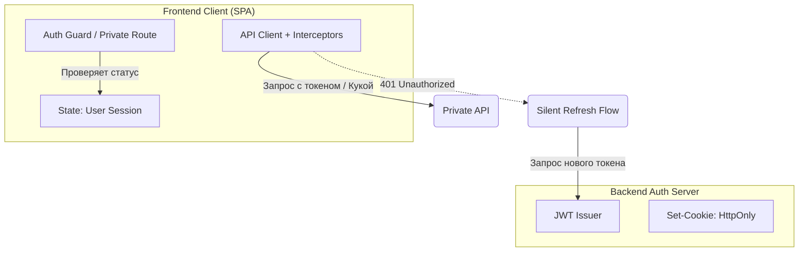

# Архитектура Личного Кабинета (Customer Portal)

**Личный кабинет** — это закрытая часть приложения (B2C или B2B), доступная только после авторизации. В отличие от публичного сайта, здесь нет необходимости индексации поисковиками (SEO), но на первый план выходят требования к **Безопасности (Security)** и **Конфиденциальности данных**.

### Какую боль мы решаем?
Часто разработчики пытаются "натянуть" архитектуру личного кабинета на тот же SSR-фреймворк (Next.js), на котором сделан маркетинговый сайт. Из-за этого возникают боли:
1. Закешированные на сервере приватные данные одного пользователя случайно отдаются другому (ужасная утечка данных).
2. XSS уязвимости позволяют украсть токены доступа из LocalStorage.
3. При нажатии кнопки "Выйти" данные остаются висеть в памяти стейт-менеджера.

### Как это работает на практике

Архитектура личного кабинета строится вокруг парадигмы **Strict CSR (Client-Side Rendering)** и продвинутых механизмов аутентификации.



**Ключевые архитектурные решения:**
1. **Токены и Auth**: Идеальный паттерн — использование **HttpOnly Secure Cookies** для хранения сессии (или Refresh-токена). Хранение JWT Access-токена в `LocalStorage` — это антипаттерн, уязвимый к XSS (Cross-Site Scripting).
2. **Изоляция бандла**: Код личного кабинета собирается в отдельный JS-чанк (Chunk). Неавторизованный пользователь не должен скачивать логику биллинга и смены паролей.
3. **Очистка стейта**: Архитектура должна гарантировать, что при действии "Logout" глобальный стейт (Redux / Apollo Cache / React Query) **полностью очищается**, чтобы данные предыдущего юзера не мелькнули при входе следующего.

### Примеры (Антипаттерн vs Правильное решение)

**Антипаттерн: Проверка прав только на UI**
```javascript
// Злоумышленник может открыть DevTools и изменить isAdmin на true
const App = () => {
  const isAdmin = localStorage.getItem("'isAdmin'");
  return isAdmin ? <AdminPanel /> : <UserProfile />;
};
```

**Правильное решение: API-driven безопасность**
Фронтенд может прятать кнопки сколько угодно, но **настоящая проверка всегда на сервере**.
```javascript
// Запрос к защищенному роуту
api.get("'/billing/cards'")
  .then("cards => renderCards(cards"))
  .catch(error => {
    // Если сервер вернул 403 Forbidden, фронт перехватывает ошибку
    if (error.status === 403) navigate("'/unauthorized'");
  });
```

### Неочевидные нюансы: скрытые трейдоффы

1. **Silent Refresh**: Если время жизни Access-токена 15 минут, вы не можете просить юзера вводить пароль так часто. Фронтенд должен реализовать логику "Silent Refresh": перехватить 401 ошибку через Axios Interceptor, приостановить все исходящие запросы в очередь, сходить за новым токеном (отправив Refresh-куку), повторить упавшие запросы из очереди. Это очень сложный асинхронный код.
2. **Рендеринг (SSR vs CSR)**: В личных кабинетах SSR нужен редко. Делать SSR защищенных страниц сложно: серверу нужно уметь читать куки, ходить в API от лица юзера, ждать ответа. CSR SPA-подход (React/Vite) здесь намного дешевле в разработке и хостинге.
3. **Пользовательские сессии**: Если вы разрешаете пользователю быть залогиненным с телефона и ноутбука одновременно, ваша архитектура (и бэкенд, и фронт) должна поддерживать список активных сессий с возможностью "Выйти со всех устройств".
