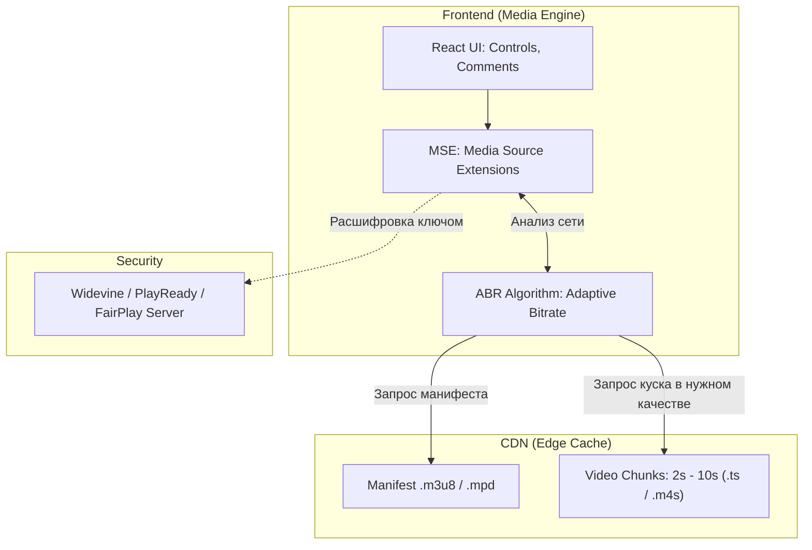

# Архитектура Медиа-платформы (Streaming / Video)

**Медиа-платформы** (аналоги YouTube, Netflix, Spotify, Twitch) — это высоконагруженные системы, где весь пользовательский опыт (UX) строится вокруг доставки и воспроизведения тяжелого контента (видео и аудио) без буферизации.

### Какую боль мы решаем?
Браузерный тег `<video src="movie.mp4">` работает только для коротких смешных роликов. Если вы попытаетесь отдать так 4K-фильм на 20 гигабайт, браузер сойдет с ума, попытавшись скачать его целиком. А если у пользователя пропадет 4G и переключится на EDGE, видео просто зависнет.

Архитектура медиа-платформы на фронтенде решает проблему **адаптивного стриминга** и управления памятью.

### Как это работает на практике

Ядром фронтенда медиа-платформы является не UI-фреймворк (React), а **Плеер (Video Player Engine)**.

**Ключевые архитектурные решения:**
1. **Протоколы HLS / DASH**: Видео не отдается целиком. Бэкенд нарезает его на кусочки (чанки) по 2-10 секунд в разном качестве (1080p, 720p, 360p). Фронтенд качает текстовый Манифест со списком ссылок на эти чанки.
2. **MSE (Media Source Extensions)**: Фронтенд (например, через библиотеку `hls.js` или `shaka-player`) скачивает чанки через обычный `fetch()`, склеивает их в памяти (Buffer) и "скармливает" тегу `<video>` на лету.
3. **ABR (Adaptive Bitrate Streaming)**: Алгоритм на фронтенде постоянно замеряет скорость скачивания чанков (Bandwidth Estimation). Если сеть падает, следующий чанк скачивается в качестве 360p, чтобы избежать буферизации.

### Примеры (Антипаттерн vs Правильное решение)

**Антипаттерн: Бэкенд решает, какое качество отдать**
Клиент шлет запрос на бэкенд "Дай видео 1080p". Бэкенд открывает TCP-сокет и льет байты. Если сеть клиента просела, TCP-буфер забивается, бэкенд блокируется, плеер виснет.

**Правильное решение: Dumb Server, Smart Client**
Сервера (CDN) — тупые. Они просто лежат и отдают статические файлы `.m4s`. Вся логика переключения качества (ABR) находится на **Фронтенде**. Именно клиент решает, какой файл запросить следующим.

### Неочевидные нюансы: скрытые трейдоффы

1. **DRM (Digital Rights Management)**: Если контент платный, студии (Disney, Sony) требуют шифрования. Фронтенду придется работать с `Encrypted Media Extensions (EME)`. Придется получать ключи расшифровки (Licenses) у серверов Google Widevine или Apple FairPlay. Это огромный пласт сложной асинхронной логики.
2. **Оптимизация DOM для Live-чатов**: В стриминговых платформах (Twitch) чат обновляется со скоростью 100 сообщений в секунду. Рендерить это через обычный React — убийство CPU. Применяется **Virtualization (Windowing)** — в DOM находится только 20 видимых сообщений, остальные удаляются.
3. **Picture-in-Picture (PiP) и Фоновое воспроизведение**: Архитектура должна учитывать жизненный цикл страницы (Page Visibility API). Если юзер свернул вкладку, нужно переключать видео на минимальное качество или оставлять только аудио-дорожку, чтобы экономить трафик и батарею.
