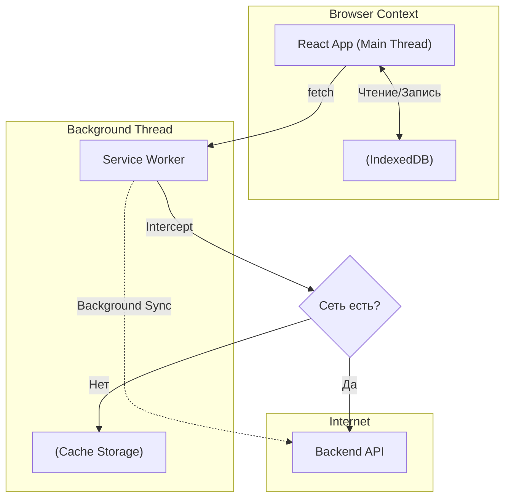

# Архитектура Офлайн-приложения (PWA)

**Офлайн-приложения (Progressive Web Apps, PWA)** — это веб-приложения, которые могут работать в условиях нестабильного интернета или его полного отсутствия, предоставляя пользовательский опыт, близкий к нативным (iOS/Android) приложениям.

### Какую боль мы решаем?
Сотрудник склада с планшетом заходит в подвал (где нет Wi-Fi), чтобы просканировать штрихкод товара. В обычном веб-приложении он увидит "Динозаврика Chrome" (No Internet). Вся работа останавливается до выхода из подвала. 

Офлайн-архитектура позволяет приложению загрузиться без сети, сохранить данные о просканированных товарах локально, а при появлении интернета — незаметно для пользователя отправить их на сервер.

### Как это работает на практике

Архитектура PWA строится на двух главных "китах": **Service Workers** (прокси между сетью и браузером) и **IndexedDB** (локальная база данных браузера).

**Ключевые архитектурные решения:**
1. **App Shell Architecture**: При первой загрузке Service Worker кэширует "скорлупу" приложения (HTML, CSS, JS, шрифты). В следующий раз, даже без интернета, приложение запустится мгновенно из кэша (Cache Storage).
2. **Local First (Optimistic UI)**: Когда юзер жмет "Сохранить", данные пишутся сначала в IndexedDB, а UI сразу показывает успех. Отправка на бэкенд происходит асинхронно.
3. **Background Sync**: Если сеть пропала, Service Worker регистрирует задачу "Синхронизация". Как только телефон поймает сеть (даже если вкладка браузера закрыта!), браузер разбудит Service Worker, и тот отправит накопленные запросы на бэкенд.

### Примеры (Антипаттерн vs Правильное решение)

**Антипаттерн: Хранение сложных данных в LocalStorage**
LocalStorage синхронен (блокирует Main Thread) и лимитирован 5 Мегабайтами. Если вы попытаетесь сохранить туда 10,000 товаров каталога для офлайн-поиска, приложение "повиснет".

**Правильное решение: IndexedDB + Workbox**
Использование асинхронной базы `IndexedDB` (через обертку `idb` или `Dexie.js`) для хранения гигабайтов JSON. И использование библиотеки `Google Workbox` для настройки стратегий кэширования (NetworkFirst, CacheFirst, StaleWhileRevalidate) вместо написания спагетти-кода в Service Worker руками.

### Неочевидные нюансы: скрытые трейдоффы

1. **Разрешение конфликтов (Conflict Resolution)**: Самая сложная проблема офлайн-архитектуры. Юзер отредактировал документ в офлайне. В это время другой юзер отредактировал его в онлайне. Когда первый поймает сеть — чья версия правильная? 
   *Решения:* CRDT алгоритмы (сложно), Last Write Wins (опасно потерей данных), или ручное разрешение конфликтов (показ диффа пользователю).
2. **Инвалидация кэша**: "В кэшировании есть только две проблемы: инвалидация кэша и нейминг". Если вы закэшировали `index.html` и забыли настроить логику обновления Service Worker'а, пользователи навсегда останутся на старой версии сайта, даже если вы выкатите 10 новых релизов.
3. **Ограничения iOS (Safari)**: Apple исторически саботирует PWA, чтобы защитить свой App Store. Background Sync в Safari на iOS не работает. Кэш Service Worker'ов может быть молча удален системой, если на телефоне мало места. Офлайн-архитектура на iOS всегда будет хромать по сравнению с Android (Chrome).
