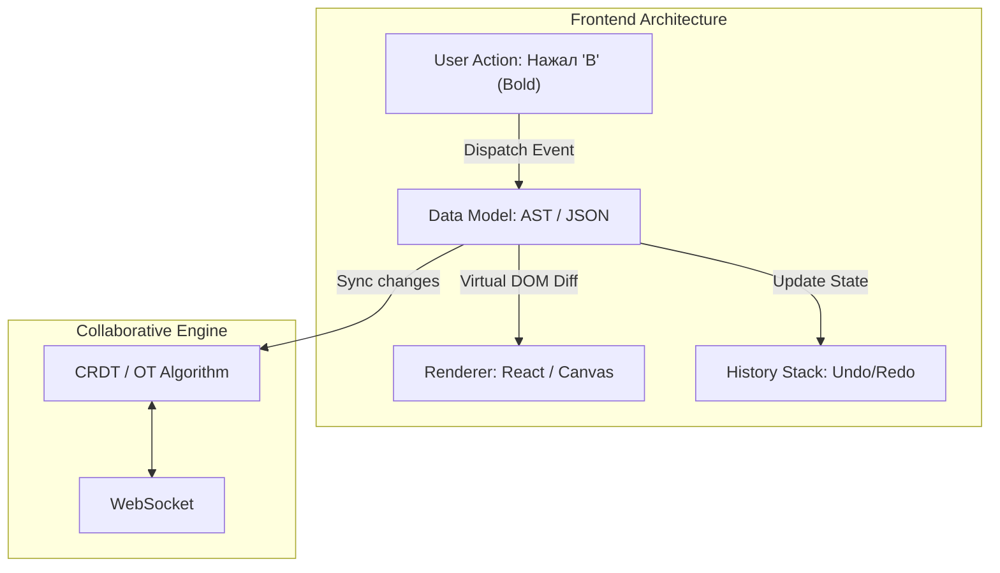

# Архитектура Текстового / Графического Редактора

**Rich Text / Графические редакторы** (аналоги Notion, Google Docs, Figma, Miro) — это вершина сложности во Frontend-разработке. Здесь не работают стандартные паттерны "сделал форму, отправил JSON на сервер". Редактор — это полноценная операционная система внутри браузера со своим движком рендеринга и управления памятью.

### Какую боль мы решаем?
Попытка сделать аналог Google Docs с помощью встроенного в браузер атрибута `contenteditable="true"` (или готовых WYSIWYG библиотек вроде Quill/TinyMCE) заканчивается крахом на этапе добавления **совместного редактирования (Collaborative Editing)**. 

Когда два пользователя одновременно пытаются сделать текст жирным в одном абзаце, DOM-дерево браузера непредсказуемо ломается. Нужна архитектура, которая отвязывает *визуальное представление (View)* от *модели данных (Model)*.

### Как это работает на практике

Современные редакторы (Lexical, Slate.js, ProseMirror) используют паттерн **MVC (Model-View-Controller)**, где "источником правды" является не HTML в браузере, а абстрактное синтаксическое дерево (AST) в оперативной памяти.



**Ключевые архитектурные решения:**
1. **Модель Данных**: Документ представляется как древовидный JSON. Любое действие пользователя (ввод буквы) — это Транзакция (Command/Action), которая мутирует этот JSON.
2. **Рендеринг**: Фреймворк (React) просто "рисует" текущее состояние JSON. Для графики (Figma) вместо DOM используется `<canvas>` или `WebGL`, так как DOM слишком медленный для рендеринга тысяч векторных объектов со скоростью 60 FPS.
3. **Совместное редактирование**: Используются математические алгоритмы — либо **OT (Operational Transformation)** (как в Google Docs, требует центрального сервера), либо **CRDT (Conflict-free Replicated Data Type)** (как в Yjs, работает P2P и без интернета).

### Примеры (Антипаттерн vs Правильное решение)

**Антипаттерн: `contenteditable` как источник правды**
```javascript
// Браузер сам решает, как обернуть текст в теги <b> или <strong>. 
// У разных пользователей (Safari vs Chrome) получится разный HTML.
document.execCommand("'bold'");
const currentHtml = document.getElementById("'editor'").innerHTML;
sendToServer("currentHtml");
```

**Правильное решение: Обновление AST (Slate.js подход)**
```javascript
// Мы обновляем только модель данных (JSON). 
// Реактивный UI сам перерисует нужный кусок.
Transforms.setNodes(
  editor,
  { bold: true },
  { match: n => Text.isText("n"), split: true }
);
```

### Неочевидные нюансы: скрытые трейдоффы

1. **Custom Selection (Кастомное выделение)**: Встроенный API браузера для выделения текста (`window.getSelection()`) работает ужасно с кастомными блоками. Сложным редакторам (Google Docs) приходится полностью отключать нативное выделение и рисовать синие прямоугольники `<div>` поверх текста, имитируя выделение. Это титанический труд.
2. **Undo/Redo**: Нельзя просто сохранять весь документ при каждом нажатии клавиши (память закончится через 5 минут). Стек отмены (History) должен хранить только *диффы* (реверсивные патчи). Если мы применили CRDT, реализация Undo/Redo усложняется в 10 раз, так как нужно "отменять" свои изменения, не затрагивая изменения соавтора.
3. **Буфер обмена (Copy-Paste)**: Вставка из Word в ваш редактор — это ад. В буфере обмена может прилететь жуткий HTML с миллионом инлайн-стилей. Архитектура редактора должна иметь жесткий **Парсер/Санитайзер**, который пропускает в модель данных только разрешенные сущности (Whitelist).
