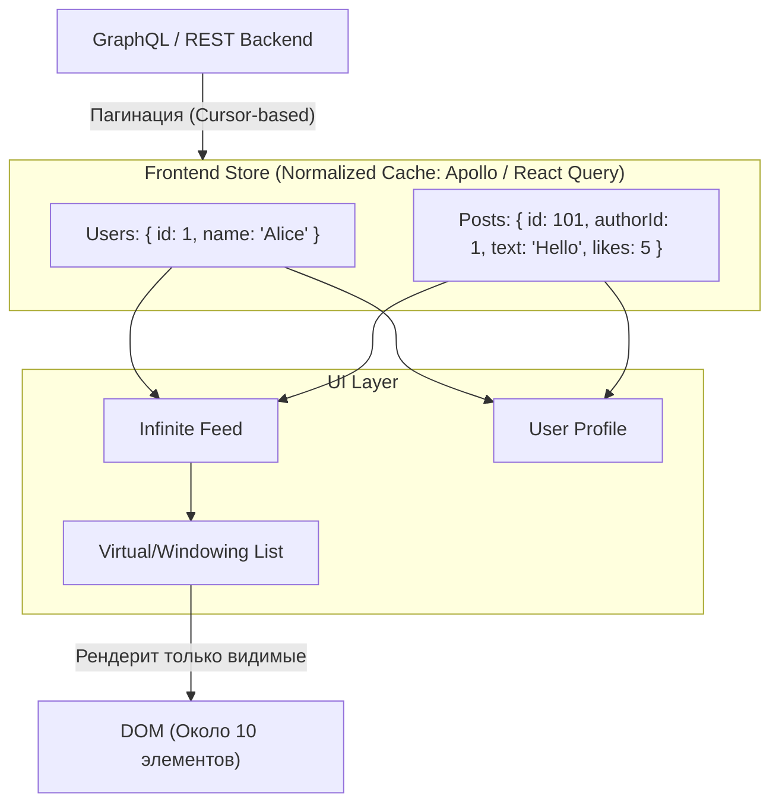

# Архитектура Социальной сети (Feed / News)

**Социальная сеть** (Twitter, Facebook, Instagram) с точки зрения фронтенда — это бесконечная лента (Feed) пользовательского контента, в которой критически важна отзывчивость интерфейса при высоких нагрузках на память браузера и нормализация данных.

### Какую боль мы решаем?
Когда пользователь скроллит ленту Instagram в браузере в течение 30 минут, он загружает тысячи постов, картинок и видео. 
Если использовать стандартные подходы (просто добавлять новые посты в массив `posts` и рендерить их все):
1. **Memory Leak (Утечка памяти)**: Браузер упадет (Out Of Memory), так как DOM-дерево станет огромным (десятки тысяч узлов).
2. **Неконсистентность стейта**: Если юзер лайкнул пост в ленте, а потом открыл профиль автора — пост там должен отображаться лайкнутым. Если данные лежат в разных массивах, интерфейс рассинхронизируется.

### Как это работает на практике

Архитектура Feed-приложений строится на трех столпах: **Виртуализация**, **Нормализация кэша** и **Оптимистичные обновления**.



**Ключевые архитектурные решения:**
1. **Virtualization (Windowing)**: Библиотеки типа `react-window` или `react-virtuoso`. В DOM всегда находится только то, что пользователь видит на экране (и пара элементов сверху/снизу). При скролле компоненты не добавляются в DOM, а переиспользуются, в них просто подставляются новые данные.
2. **Normalized Cache (Нормализация)**: Ответы от API не хранятся "как есть". Они разбиваются на плоские словари по ID. Библиотеки типа Apollo GraphQL Cache или Redux (с `normalizr`) делают это автоматически.
3. **Cursor-based Pagination**: Использование стандартных Page/Offset (`?page=5`) в соцсетях запрещено. Пока юзер читал страницу 1, кто-то добавил новый пост. При запросе страницы 2 юзер увидит дубликат поста. Всегда используется курсорная пагинация (`?after_cursor=xyz`).

### Примеры (Антипаттерн vs Правильное решение)

**Антипаттерн: Ждать сервер для лайка**
Юзер нажимает "Лайк". Фронтенд блокирует кнопку (крутится лоадер), шлет запрос POST `/likes`, ждет 300мс ответа, и только потом закрашивает сердечко красным. Приложение кажется "тормознутым".

**Правильное решение: Optimistic UI Updates**
```javascript
// 1. Мгновенно закрашиваем сердечко в UI (Оптимистично)
queryClient.setQueryData("['post', postId], old => ({ ...old, isLiked: true }"));

// 2. Отправляем запрос в фоне
api.post("`/likes/${postId}`").catch("(") => {
  // 3. Если сервер вернул 500 ошибку (упал), 
  // откатываем сердечко обратно и показываем Тост с ошибкой
  queryClient.setQueryData("['post', postId], old => ({ ...old, isLiked: false }"));
  toast.error("Не удалось поставить лайк");
});
```

### Неочевидные нюансы: скрытые трейдоффы

1. **Разрыв ленты (Feed Gap)**: Самая сложная проблема в соцсетях. Юзер открыл приложение, проскроллил 10 постов, свернул приложение на 3 часа, развернул и потянул ленту вверх (Pull to Refresh). За это время вышло 500 новых постов. Если мы загрузим их все — сожрем трафик. Нужно загрузить только 10 самых свежих постов, а между ними и старыми постами показать кнопку "Загрузить пропущенные посты" (разрыв ленты).
2. **Восстановление позиции скролла**: Если юзер кликнул на пост (перешел на страницу поста), а потом нажал кнопку "Назад", он обязан оказаться на том же месте ленты, где был. Для бесконечного скролла с виртуализацией это невероятно сложная задача (нужно кэшировать высоту каждого элемента).
3. **Prefetching**: Чтобы лента казалась бесконечной и быстрой, запрос за следующей страницей (курсором) должен отправляться не когда юзер доскроллил до низа, а когда до конца осталось 3-4 экрана (Intersection Observer с большим margin).
