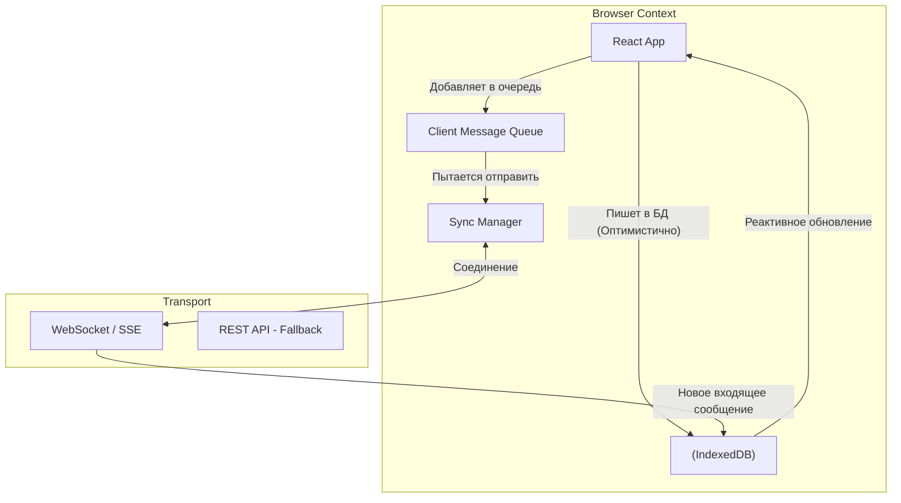

# Архитектура Чата / Мессенджера

**Чаты и Мессенджеры** (аналоги WhatsApp Web, Telegram, Slack) — это системы, где на первый план выходят требования **Real-time (реального времени)**, надежности доставки сообщений и офлайн-работоспособности (Local-First).

### Какую боль мы решаем?
Написать простой чат на сокетах (Socket.io) — задача для туториала на выходные. Боль начинается, когда:
1. Юзер заезжает в туннель, отправляет сообщение. Сеть пропадает, сокет рвется. Сообщение не должно исчезнуть, оно должно получить статус "Часики" (Pending) и отправиться само при выезде из туннеля.
2. Пока юзер был в туннеле, ему прислали 50 сообщений. При переподключении мы не должны получить их в случайном порядке.
3. У пользователя открыто 5 вкладок с чатом. Приходит сообщение, и звук уведомления звучит 5 раз одновременно (Эхо-шторм).

### Как это работает на практике

Архитектура Enterprise-чата — это гибрид Local-First хранилища, очередей сообщений на клиенте и дуплексного транспорта.

**Ключевые архитектурные решения:**
1. **Local-First (IndexedDB)**: "Источником правды" для интерфейса является не бэкенд, а локальная база данных браузера. При открытии чата мы мгновенно рисуем переписку из IndexedDB (как в Telegram), а в фоне идем к серверу запрашивать разницу (Syncing).
2. **Синхронизация по Watermark / Sequence ID**: Каждое сообщение на сервере имеет строго возрастающий `seq_id`. Когда клиент переподключается к WebSocket, он говорит: "Мое последнее сообщение было `seq_id=1050`, дай мне всё, что было после". Это решает проблему пропущенных сообщений при обрыве сети.
3. **Гарантия доставки (Message Queue)**: Исходящие сообщения складываются в очередь на клиенте. Каждому выдается локальный `uuid` (Client ID). Клиент шлет его на сервер. Сервер сохраняет и отвечает: "Принял `uuid`, вот его серверный `id` и `timestamp`". Фронтенд заменяет "часики" на "одну галочку".

### Примеры (Антипаттерн vs Правильное решение)

**Антипаттерн: Дедупликация на клиенте**
Клиент шлет сообщение по сокету. Сервер его сохраняет и тут же рассылает всем участникам чата по сокетам (включая самого отправителя). Клиент-отправитель получает свое же сообщение и рендерит его второй раз (дубликат в UI).

**Правильное решение: Идемпотентность по Client ID**
Когда сервер бродкастит сообщение, он прикладывает тот самый `uuid`, который сгенерировал фронт. Фронтенд проверяет: "Ага, в локальной БД уже есть сообщение с таким `uuid` (я сам его написал). Я не добавляю его в UI, я просто обновляю его статус с 'Pending' на 'Sent' (две галочки)".

### Неочевидные нюансы: скрытые трейдоффы

1. **WebSockets vs Server-Sent Events (SSE)**: Если вам нужен только прием сообщений (входящие), SSE намного проще в масштабировании, чем WebSockets, так как это обычный HTTP, который проходит через любые файрволы и Nginx. Отправку (исходящие) можно делать обычным POST запросом. WebSockets нужны только если исходящий трафик тоже огромен (онлайн-игры).
2. **Cross-Tab Communication (Много вкладок)**: Если открыть Web WhatsApp в 5 вкладках, он откроет 5 WebSocket-соединений, убивая ресурсы сервера. Правильная архитектура: вкладки договариваются между собой (через `BroadcastChannel API` или `SharedWorker`). Выбирается одна вкладка-"Мастер", она держит сокет и рассылает данные остальным вкладкам локально.
3. **End-to-End Encryption (E2EE)**: Встраивание шифрования (Signal Protocol) означает, что ключи шифрования (Private Keys) должны генерироваться и храниться в браузере (в IndexedDB), и никогда не покидать его. При утере кэша браузера юзер навсегда теряет доступ к старой переписке (это Trade-off за безопасность).
