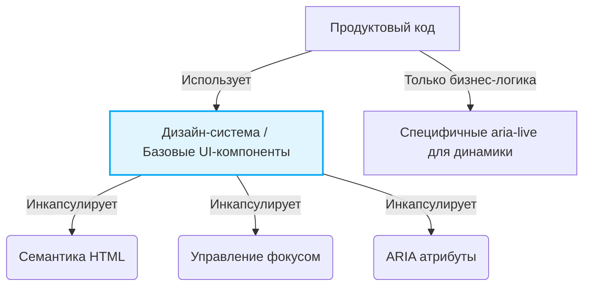

# Архитектура доступности (Accessibility Architecture)

## Боль: "Прикрутим доступность потом"

В типичном цикле разработки веб-приложения доступность (accessibility, a11y) часто оставляют на этап перед релизом или вспоминают о ней после жалоб пользователей. Это порождает классическую инженерную боль: попытка натянуть доступность поверх уже написанного "div-супа" и сложной кастомной логики UI приводит к спагетти-коду, багам фокуса и тысячам атрибутов `aria-*`, которые только запутывают скринридеры. Рефакторинг обходится дорого, а результат получается хрупким.

## Решение: A11y как архитектурный слой

Архитектура доступности — это подход, при котором требования a11y закладываются на этапе проектирования компонентов и сторибордов, а не в виде багфиксов. Это значит, что доступность становится не "фичей", а базовым системным требованием (NFR — Non-Functional Requirement), таким же, как производительность или безопасность.

### Как это работает на практике

На практике архитектура доступности реализуется через дизайн-систему. Вместо того, чтобы каждый разработчик вспоминал, как сделать доступный дропдаун, команда создает базовый набор примитивов, где инкапсулирована вся логика фокуса, ARIA-атрибутов и семантики.



**Пример: Антипаттерн (Продуктовый код решает проблемы a11y)**
```jsx
// Разработчику приходится помнить обо всем каждый раз
<div 
  onClick={toggle} 
  onKeyDown={(e) => e.key === 'Enter' && toggle()} 
  role="button" 
  tabIndex={0}
  aria-expanded={isOpen}
>
  Меню
</div>
```

**Пример: Как надо (A11y инкапсулирована)**
```jsx
// Архитектурно правильный подход: использование готовых примитивов
<AccessibleButton 
  onPress={toggle} 
  aria-expanded={isOpen}
>
  Меню
</AccessibleButton>
```

## Неочевидные нюансы и трейдоффы

1. **Оверхед на старте:** Проектирование доступных базовых компонентов (например, комбобоксов, вкладок, модалок) требует глубоких знаний WAI-ARIA и спецификаций. Это замедляет первоначальную разработку дизайн-системы (часто в разы).
2. **"Ложная" доступность:** Иногда команды, строящие архитектуру, начинают злоупотреблять ARIA, добавляя роли везде. Это нарушает Первое правило ARIA: "Не используйте ARIA, если можете использовать нативный HTML". Избыточная ARIA хуже, чем ее отсутствие.
3. **Границы применимости:** На уровне архитектуры невозможно решить 100% проблем a11y. Цветовой контраст, тексты ошибок и `alt`-тексты картинок всегда остаются на совести продуктовых команд. Архитектура может лишь предоставить API, чтобы это было легко сделать.
