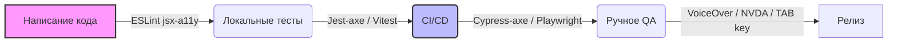

# Тестирование доступности (Accessibility Testing)

## Боль: Регрессии, которые никто не видит

Обычное функциональное тестирование проверяет, работает ли кнопка при клике мышкой. Но оно не проверяет, можно ли нажать эту кнопку с клавиатуры, прочитает ли ее скринридер и не сливается ли ее цвет с фоном. В результате, даже если команда один раз сделала приложение доступным, следующий же пулл-реквест от джуна или торопящегося мидла ломает A11y. Регрессии доступности невидимы для зрячих разработчиков, использующих мышь.

## Решение: Многоуровневое тестирование a11y

Решение кроется во внедрении проверок доступности на всех этапах пайплайна: от линтеров в IDE до E2E тестов и ручного QA со скринридерами.



### Как это работает на практике

1. **Статический анализ:** Использование `eslint-plugin-jsx-a11y` ловит очевидные ошибки: забытые `alt` у изображений или неинтерактивные элементы с событиями клика.
2. **Unit/Integration тесты:** Интеграция `axe-core` в тесты компонентов.
3. **E2E тесты:** Проверка полных пользовательских сценариев.
4. **Ручное тестирование:** Навигация исключительно с помощью клавиатуры (Tab / Shift+Tab) и прослушивание страниц с помощью экранных дикторов.

**Пример: Интеграционный тест (Как надо)**
```javascript
import { render } from '@testing-library/react';
import { axe, toHaveNoViolations } from 'jest-axe';
import MyComponent from './MyComponent';

expect.extend(toHaveNoViolations);

it('should have no accessibility violations', async () => {
  const { container } = render(<MyComponent />);
  const results = await axe(container);
  
  // Автоматически проверит контраст, семантику, ARIA-роли
  expect(results).toHaveNoViolations();
});
```

## Неочевидные нюансы и трейдоффы

1. **Границы автоматизации:** Инструменты вроде `axe` ловят только около 30-40% всех проблем доступности. Они могут проверить, что у кнопки есть `aria-label`, но они не могут понять, что текст "Кнопка 1" бессмысленен в контексте.
2. **Ложные срабатывания и шум:** Инструменты автоматизированного тестирования могут ругаться на вещи, которые команда решила игнорировать (например, контраст в задизейбленных состояниях). Приходится тратить время на настройку правил.
3. **Ручное тестирование сложно:** Тестирование со скринридером (NVDA, JAWS, VoiceOver) требует серьезного обучения. Разработчики часто не понимают, как скринридер должен себя вести в норме, и принимают стандартное поведение за баг, или наоборот.
