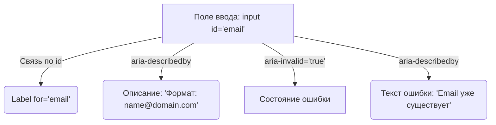

# Доступные формы (Accessible Forms)

## Боль: Угадай, что я хочу

Формы — это главный способ взаимодействия пользователя с бизнесом (регистрация, покупка, комментарии). Боль возникает, когда форма представляет собой набор полей без семантической связи. Зрячий пользователь легко соотносит текст слева с инпутом справа. Пользователь скринридера, попадая в инпут, слышит просто "Редактируемый текст", не понимая, что нужно ввести — имя, телефон или CVV код. А если произошла ошибка валидации, фокус остается на месте, и пользователь не знает, что что-то пошло не так.

## Решение: Программная связь и явные ошибки

Доступная форма строится на строгом связывании элементов. Метки (`<label>`) должны быть программно привязаны к полям (`<input>`), а подсказки и ошибки — привязаны через атрибуты `aria-describedby` или `aria-errormessage`.

### Как это работает на практике

Каждое поле должно отвечать на три вопроса для скринридера:
1. Что это за поле? (Label)
2. В каком оно состоянии? (Required, Invalid)
3. Есть ли дополнительные условия или ошибки? (Description, Error)



**Антипаттерн: Визуальная форма без семантики**
```html
<!-- Скринридер прочитает просто: "Введите email. Редактируемый текст." Связи нет. -->
<div>Введите email</div>
<input type="text" placeholder="name@domain.com" />
<div class="error" style="display: block;">Неверный формат</div>
```

**Как надо: Программно связанная форма**
```html
<div class="form-group">
  <label for="email-input">Ваш Email (обязательно)</label>
  
  <input 
    id="email-input"
    type="email" 
    required
    aria-invalid="true"
    aria-describedby="email-hint email-error"
  />
  
  <span id="email-hint" class="hint">Например: name@domain.com</span>
  <!-- aria-live обеспечит озвучивание появления ошибки без смещения фокуса -->
  <span id="email-error" class="error" aria-live="polite">Такой email уже существует.</span>
</div>
```

## Неочевидные нюансы и трейдоффы

1. **Проблема плейсхолдеров:** Дизайнеры любят заменять полноценные лейблы красивыми `placeholder` внутри инпута. Это ломает доступность: плейсхолдер исчезает при вводе (пользователь забывает, что вводит), у него плохой контраст, и не все скринридеры его корректно читают как замену лейблу.
2. **Анонсирование ошибок:** Если форма огромная, и после сабмита появляется ошибка где-то в середине, пользователь должен об этом узнать. Лучшая практика — переместить фокус на `summary` всех ошибок в начале формы, либо на первое поле с ошибкой.
3. **Оверхед на генерацию ID:** Поскольку связь строится через `id` и `for` (или `aria-describedby`), в компонентных фреймворках типа React/Vue приходится генерировать уникальные ID для каждого инстанса компонента поля (например, через `useId()`), чтобы избежать коллизий на странице.
