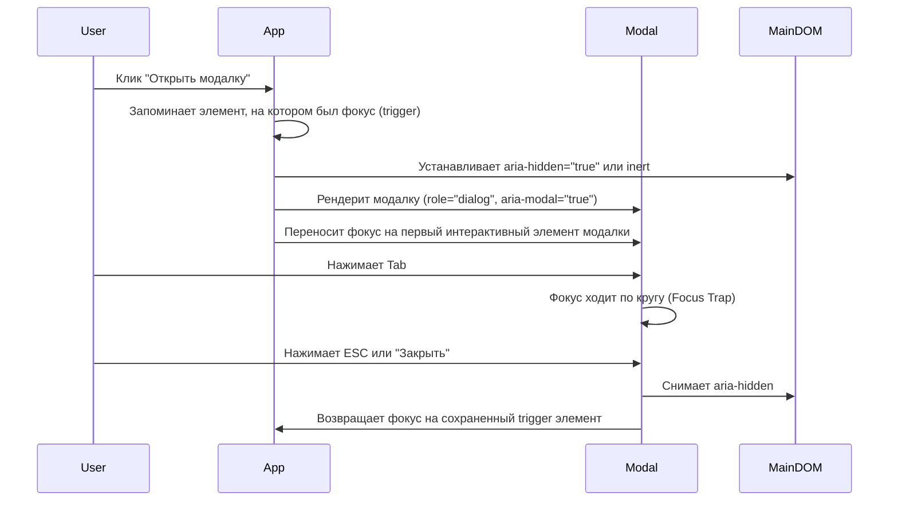

# Доступные модальные окна (Accessible Modals)

## Боль: "Призрак оперы" в DOM

Модальное окно (диалог) визуально перекрывает страницу, забирая всё внимание пользователя. Но для скринридера и клавиатуры страница никуда не исчезает. Классическая боль: модалка открыта, но при нажатии `Tab` фокус уходит на элементы позади модалки (в "тень"), или скринридер продолжает зачитывать текст с основной страницы, словно модалки вообще нет. Пользователь с клавиатуры оказывается "заперт" вне модального окна и не может его закрыть.

## Решение: Ловушка фокуса и изоляция DOM

Доступная модалка должна программно отрезать остальной мир на время своего существования. Это достигается двумя механизмами:
1. **Focus Trap (Ловушка фокуса):** Клавиатурный фокус не может выйти за пределы модалки.
2. **Aria-hidden на основном контенте:** Сокрытие всего остального дерева DOM от вспомогательных технологий.

### Как это работает на практике

Когда модальное окно открывается, происходит целая хореография событий.



**Антипаттерн: Простой div поверх экрана**
```html
<!-- Просто div с z-index. Клавиатура легко уйдет за его пределы -->
<div class="modal-overlay">
  <div class="modal-content">
    <h2>Подтверждение</h2>
    <button>Да</button>
  </div>
</div>
```

**Как надо: Правильный диалог (современный подход)**
```html
<!-- Нативная поддержка HTML5 диалогов берет часть боли на себя -->
<dialog id="my-dialog" aria-labelledby="dialog-title">
  <h2 id="dialog-title">Удалить аккаунт?</h2>
  <p>Это действие необратимо.</p>
  <button id="close-btn" autofocus>Отмена</button>
  <button>Удалить</button>
</dialog>

<script>
  const dialog = document.getElementById('my-dialog');
  const trigger = document.getElementById('open-btn');
  
  // dialog.showModal() автоматически создает ловушку фокуса 
  // и делает остальной документ "inert" (недоступным)
  trigger.addEventListener('click', () => dialog.showModal());
</script>
```

## Неочевидные нюансы и трейдоффы

1. **Возврат фокуса:** Самая частая забытая деталь. При закрытии модалки фокус *обязан* вернуться на тот элемент (например, кнопку), который ее открыл. Иначе фокус сбрасывается в начало документа (`<body>`), и пользователю скринридера придется заново "прокликивать" всю страницу, чтобы вернуться к тому месту, где он был.
2. **Вложенные модалки:** Худший кошмар a11y. Управление ловушками фокуса и `aria-hidden` при открытии модалки поверх другой модалки невероятно сложно. Инженерный совет: избегайте вложенных модалок на уровне дизайна приложения.
3. **Атрибут inert:** Исторически для скрытия фона приходилось вешать `aria-hidden="true"` на корневой `<div id="root">`, а модалку рендерить через портал на уровне `<body>`. Сейчас появился нативный атрибут `inert`, который делает элементы неинтерактивными и невидимыми для скринридеров, что сильно упрощает реализацию кастомных модалок.
