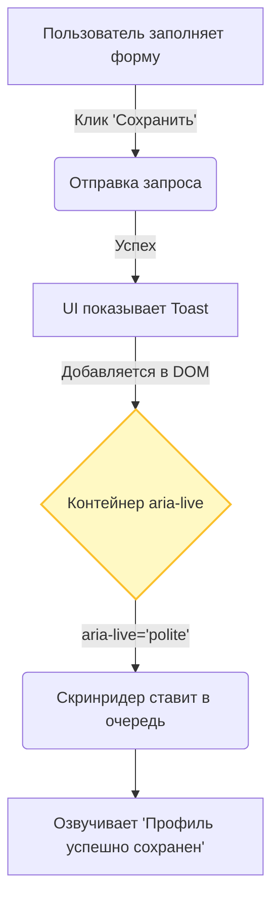

# Доступные уведомления (Accessible Notifications)

## Боль: Невидимые события

В современных SPA (Single Page Applications) интерфейс меняется без перезагрузки страницы. Появляются тосты ("Письмо отправлено"), обновляются чаты, появляются ошибки сохранения. Зрячий пользователь периферийным зрением видит, что в углу экрана выплыла зеленая плашка. Но скринридер читает только то место, где сейчас находится фокус. Динамические изменения, происходящие вне фокуса, для незрячего пользователя просто не существуют.

## Решение: Live Regions (Живые регионы)

WAI-ARIA предлагает механизм "Live Regions" (`aria-live`). Это специальные контейнеры. Когда внутри такого контейнера меняется текст или добавляются элементы, скринридер автоматически прерывается и зачитывает эти изменения, даже если фокус пользователя находится совершенно в другом месте.

### Как это работает на практике

Есть два основных уровня агрессивности уведомлений:
- `polite` (вежливый): скринридер дочитает текущую фразу, которую читает, и только потом произнесет уведомление. Подходит для тостов, изменения статуса.
- `assertive` (агрессивный): скринридер немедленно прерывает текущее чтение и зачитывает уведомление. Подходит только для критических ошибок ("Соединение разорвано", "Время сессии истекло").



**Антипаттерн: Простой тост**
```jsx
// Скринридер проигнорирует появление этого элемента
function Toast({ message }) {
  return <div className="toast-notification">{message}</div>;
}
```

**Как надо: Использование Live Region**
```jsx
// Контейнер должен присутствовать в DOM при первоначальной загрузке страницы!
<div 
  aria-live="polite" 
  aria-atomic="true" 
  className="toast-container"
>
  {/* Когда сюда попадет новый <Toast />, скринридер его прочитает */}
  {toasts.map(t => <Toast key={t.id} message={t.message} />)}
</div>

// Для критических уведомлений можно использовать role="alert" (эквивалент aria-live="assertive")
<div role="alert">
  {criticalError && <p>Ошибка сети: данные не сохранены!</p>}
</div>
```

## Неочевидные нюансы и трейдоффы

1. **Монтирование Live Region:** Самая частая ошибка разработчиков — рендерить сам контейнер `aria-live` одновременно с уведомлением (например, `if (show) return <div aria-live="polite">...</div>`). Многие скринридеры не успевают зарегистрировать регион и игнорируют его контент. Правило: контейнер `aria-live` должен быть отрендерен пустным на старте приложения, а контент должен инжектироваться *внутрь* него.
2. **Атрибут aria-atomic:** По умолчанию скринридер читает только измененный узел. Если у вас `<div>Доставлено <span>5</span> писем</div>`, и `5` меняется на `6`, скринридер может сказать просто "шесть". Добавление `aria-atomic="true"` заставляет прочитать весь контейнер целиком: "Доставлено 6 писем", что дает контекст.
3. **Чрезмерное использование:** Если сделать агрессивными слишком много элементов на странице (например, таймер, который тикает каждую секунду), пользоваться приложением станет невозможно — скринридер будет непрерывно болтать, не давая пользователю изучать страницу.
