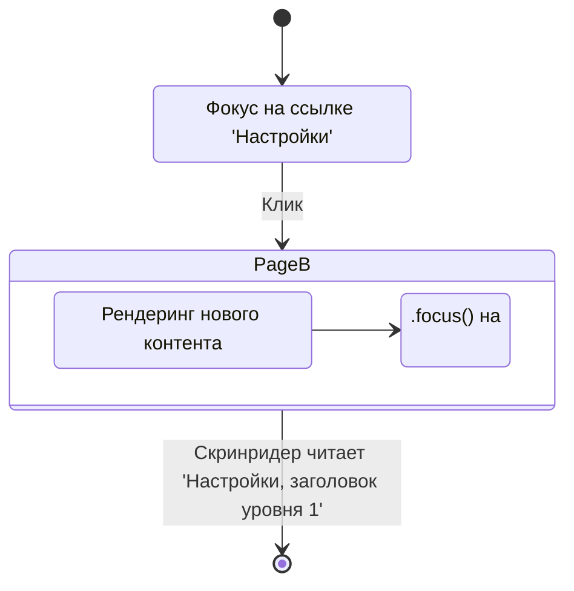

# Управление фокусом (Focus Management)

## Боль: Потерянный контекст

В традиционном многостраничном вебе (MPA) при переходе по ссылке страница полностью перезагружается, и фокус логично возвращается в самое начало документа (на `<body>` или `<title>`). В Single Page Applications (SPA) при переходе на новый роут DOM обновляется, но фокус остается там, где был — на кнопке или ссылке, которую только что нажали. Часто этот элемент исчезает из DOM, и фокус сбрасывается в `<body>`. Пользователь клавиатуры или скринридера нажимает ссылку "Профиль", страница визуально меняется, но контекст неясен: где я? что изменилось?

## Решение: Программная маршрутизация фокуса

Инженеры должны явно управлять фокусом при смене контекста (роутинг, открытие панелей, загрузка данных), направляя пользователя к новой релевантной информации, чтобы имитировать ожидаемое поведение браузера.

### Как это работает на практике

При смене роута в SPA лучшая практика — программно переносить фокус на главный заголовок (`<h1>`) новой страницы. Поскольку заголовки по умолчанию не могут получать фокус (они не интерактивны), мы используем трюк: атрибут `tabindex="-1"`.



**Антипаттерн: SPA без управления фокусом**
```jsx
// React Router по умолчанию. 
// После перехода фокус остается на <a>, которая может исчезнуть,
// сбросив фокус в <body>. Скринридер молчит о смене страницы.
<Link to="/settings">Настройки</Link>
```

**Как надо: Роутинг с управлением фокусом**
```jsx
import { useEffect, useRef } from 'react';
import { useLocation } from 'react-router-dom';

function Page({ title, children }) {
  const headerRef = useRef(null);
  const location = useLocation();

  useEffect(() => {
    // При монтировании страницы фокусируемся на заголовке
    if (headerRef.current) {
      headerRef.current.focus();
    }
  }, [location.pathname]); // Реагируем на смену роута

  return (
    <main>
      {/* tabindex="-1" позволяет сфокусироваться через JS, но не через клавишу Tab */}
      <h1 ref={headerRef} tabIndex="-1" style={{ outline: 'none' }}>
        {title}
      </h1>
      {children}
    </main>
  );
}
```

## Неочевидные нюансы и трейдоффы

1. **tabindex="0" vs tabindex="-1":** Никогда не вешайте `tabindex="0"` на неинтерактивные элементы (текст, `div`), чтобы сделать их фокусируемыми для клавиатуры — это ломает ожидания пользователя. Если вы хотите направить фокус скриптом (программно), используйте ТОЛЬКО `tabindex="-1"`.
2. **Конфликт с визуальным outline:** Когда вы программно фокусируете `<h1>`, браузер может нарисовать вокруг него рамку (outline). Это часто бесит дизайнеров. Решение: скрыть outline *только* для этого элемента (как в примере выше) или использовать современные CSS-селекторы `:focus-visible`.
3. **Гонка состояний:** Фокус можно установить только на элемент, который уже существует в DOM. Если данные для страницы грузятся асинхронно, вызов `.focus()` может упасть. Приходится управлять фокусом после завершения лоадера или фокусироваться на самом лоадере/скелетоне, чтобы сообщить пользователю "Данные загружаются".
