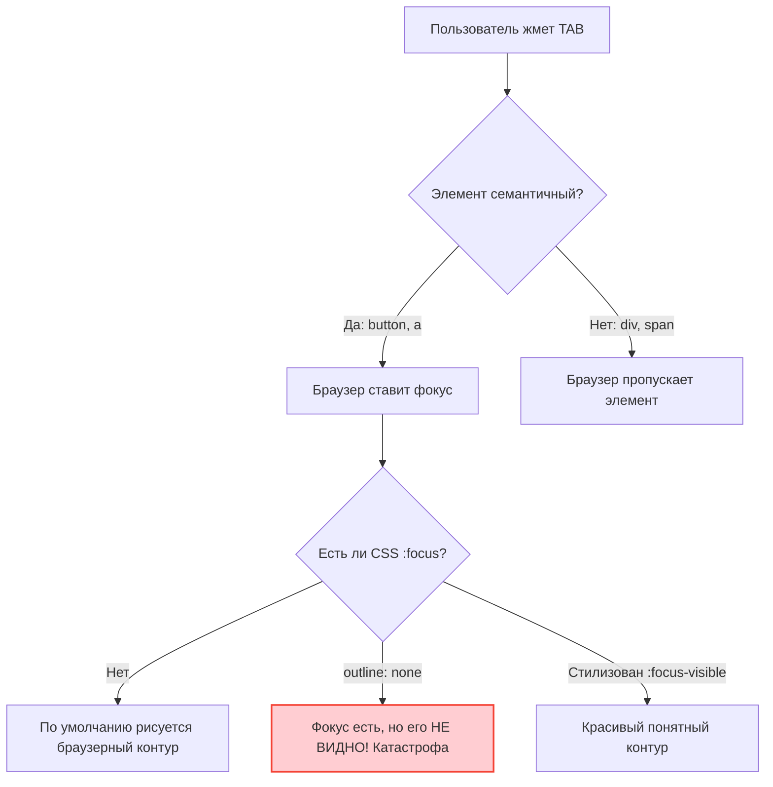

# Клавиатурная навигация (Keyboard Navigation)

## Боль: Управление вслепую

Существует огромное количество пользователей, которые не могут пользоваться мышью или трекпадом: люди с моторными нарушениями (например, болезнь Паркинсона), пользователи с временными травмами или продвинутые power-users (программисты), предпочитающие не убирать руки с клавиатуры. Главная боль — это когда элемент интерфейса визуально выглядит как кнопка, но на него невозможно перейти клавишей `Tab`, или можно перейти, но не понятно, где сейчас фокус (отсутствует индикатор).

## Решение: Семантика и видимый фокус

Каждый интерактивный элемент на странице должен быть достижим через `Tab` (для перехода вперед) и `Shift+Tab` (назад). При этом браузер должен четко визуально показывать, на каком элементе сейчас находится фокус.

### Как это работает на практике

Браузеры имеют встроенный механизм клавиатурной навигации для семантических элементов (`<a>`, `<button>`, `<input>`, `<select>`). Если использовать их, навигация "просто работает". 



**Антипаттерн: Сброс outline и "fake" кнопки**
```css
/* Грех №1 в веб-разработке: отключение стандартного кольца фокуса */
* { outline: none; }
```
```html
<!-- Клавиатура проигнорирует этот div -->
<div class="fancy-button" onClick="submit()">Отправить</div>
```

**Как надо: Использование :focus-visible**
```css
/* Используем псевдокласс :focus-visible. 
Он показывает рамку ТОЛЬКО при навигации с клавиатуры, 
но не показывает при клике мышкой, удовлетворяя и a11y, и дизайнеров */
button:focus-visible {
  outline: 2px solid #005fcc;
  outline-offset: 2px;
}
```
```html
<!-- Нативная кнопка получает фокус и обрабатывает нажатия Enter и Space -->
<button class="fancy-button" type="button" onClick="submit()">Отправить</button>
```

## Неочевидные нюансы и трейдоффы

1. **Space vs Enter:** Нативная кнопка (`<button>`) срабатывает и по нажатию `Enter`, и по нажатию Пробела (`Space`). Если вы пытаетесь сделать доступным `<div role="button" tabindex="0">`, вам придется вручную писать JS-листенеры на обе эти клавиши. Это огромный оверхед, поэтому всегда используйте нативные кнопки.
2. **Tab Trap (Клавиатурная ловушка):** Ситуация, когда пользователь попадает внутрь компонента (например, сложный редактор кода или виджет карты) и не может выйти из него с помощью клавиши `Tab`. Хорошая архитектура должна предусматривать "горячие клавиши" для выхода из таких виджетов (например, `Esc`).
3. **Порядок обхода (DOM Order):** Фокус перемещается по странице строго в том порядке, в котором элементы расположены в HTML (DOM дереве), а не как они выглядят на экране. Если вы с помощью CSS Flexbox (`order`) или CSS Grid переставили визуально футер наверх страницы, клавиатурный фокус всё равно дойдет до него в самом конце. Это создает сильный когнитивный диссонанс. Вывод: визуальный порядок должен совпадать с DOM порядком.
