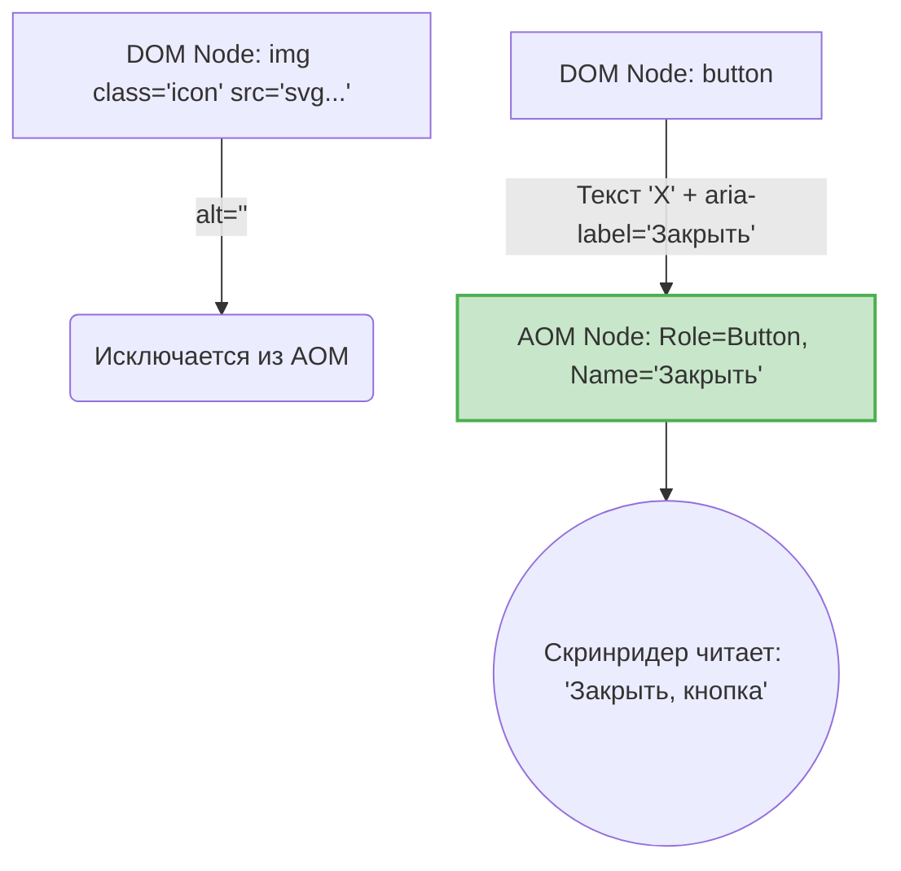

# Экранные дикторы (Screen Readers)

## Боль: Невидимый интерфейс

Незрячие или слабовидящие пользователи воспринимают веб-страницы не глазами, а ушами, используя Экранные Дикторы (Screen Readers: VoiceOver на Mac/iOS, NVDA и JAWS на Windows, TalkBack на Android). Боль разработчика заключается в том, что скринридер читает не то, что нарисовано на экране, а то, что находится в Accessibility Tree (Дереве доступности) — специальной структуре, которую браузер строит на основе DOM. Если DOM не имеет семантики или заполнен декоративным мусором, скринридер будет читать "абракадабру".

## Решение: Контроль над Accessibility Tree

Разработчик должен осознанно формировать не только визуальный интерфейс (CSS/DOM), но и звуковой интерфейс (Accessibility Tree). Для этого используются семантика, скрытие декоративных элементов и предоставление альтернативных текстов для визуальной информации (иконок, картинок).

### Как это работает на практике

Скринридеры имеют свои режимы работы. Главный из них — чтение свайпами (на мобилках) или стрелками (на десктопе). Скринридер идет линейно по каждому узлу Accessibility Tree.



**Антипаттерн: Декорации, создающие шум, и иконки без контекста**
```html
<!-- Скринридер прочитает "Смайлик сердечко, кнопка, 124" -->
<button>❤️ 124</button>

<!-- Скринридер прочитает имя файла: "icon-arrow-left-24px.svg" -->

```

**Как надо: Управление тем, что слышит пользователь**
```html
<!-- Прячем декоративную иконку (aria-hidden), добавляем скрытый для зрячих текст -->
<button>
  <span aria-hidden="true">❤️</span>
  <span class="sr-only">Нравится</span>
  <span>124</span>
</button>

<!-- Декоративное изображение с пустым alt игнорируется скринридером -->

```

*Утилита `.sr-only` (Screen-Reader Only) — золотой стандарт:*
```css
/* Прячет контент визуально, но оставляет доступным для скринридера */
.sr-only {
  position: absolute;
  width: 1px;
  height: 1px;
  padding: 0;
  margin: -1px;
  overflow: hidden;
  clip: rect(0, 0, 0, 0);
  white-space: nowrap;
  border: 0;
}
```

## Неочевидные нюансы и трейдоффы

1. **`display: none` против `.sr-only`:** Если скрыть элемент через `display: none` или `visibility: hidden`, он пропадает не только визуально, но и **удаляется из Accessibility Tree**. Скринридер его не прочтет! Поэтому для предоставления невидимого контекста нужна именно утилита `.sr-only`.
2. **Избыточность:** Скринридеры сами добавляют тип элемента к его названию. Если вы напишете `<button aria-label="Кнопка закрыть">X</button>`, диктор произнесет: "Кнопка закрыть, кнопка". Это раздражающий оверхед. Правильно: `aria-label="Закрыть"`.
3. **Разнообразие ПО:** Поведение скринридеров не стандартизировано так же жестко, как рендеринг CSS в браузерах. VoiceOver в Safari может читать один и тот же компонент немного иначе, чем NVDA в Chrome. Добиться 100% идентичного звучания везде почти невозможно — нужно ориентироваться на корректную семантику, а не на хаки под конкретный скринридер.
