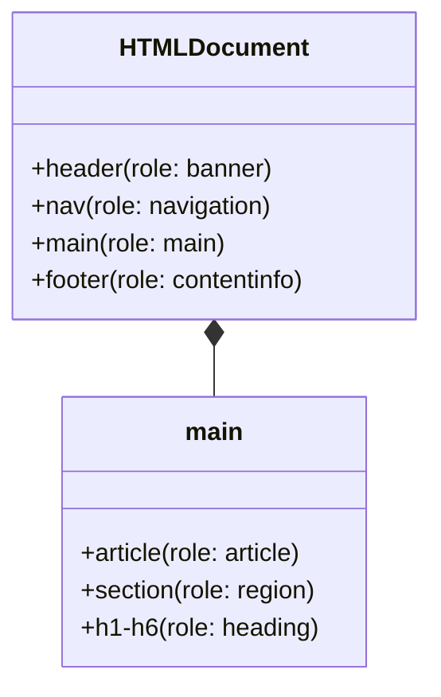

# Семантический HTML (Semantic HTML)

## Боль: "Div-суп" (Div Soup)

Исторически верстка сайтов сводилась к созданию сетки из тысяч тегов `<div>` и `<span>`, стилизованных через CSS. Для визуального рендеринга браузеру всё равно — он нарисует красивую страницу. Но для поисковых роботов (SEO) и ассистивных технологий (скринридеров) страница, состоящая из `<div>`, выглядит как однородная сплошная стена текста. В ней нет заголовков, нет навигации, нет кнопок — только абзацы. Пользователь не может быстро пропустить шапку сайта или найти основное меню.

## Решение: Использование по назначению

HTML5 предоставляет богатый набор тегов, каждый из которых имеет встроенный смысл (семантику). Использование правильных тегов — это самый дешевый и надежный способ получить базовую доступность (a11y) "из коробки" без необходимости писать сложный JavaScript или добавлять ARIA-атрибуты.

### Как это работает на практике

Семантические теги несут в себе роль (role) по умолчанию, которая передается в Accessibility Tree. Скринридеры предоставляют шорткаты: например, пользователь может нажать клавишу "H" для перехода к следующему заголовку или клавишу "M" для перехода к `<main>` контенту.



**Антипаттерн: Отсутствие структуры**
```html
<div class="header">Лого</div>
<div class="sidebar">
  <div class="link">Главная</div>
</div>
<div class="content">
  <div class="title">Заголовок статьи</div>
  <div class="text">Текст...</div>
</div>
```

**Как надо: Семантический каркас**
```html
<header>
  <!-- <header> автоматически получает роль banner -->
  
</header>

<nav aria-label="Главное меню">
  <!-- <nav> позволяет быстро перейти к меню навигации -->
  <ul>
    <li><a href="/">Главная</a></li>
  </ul>
</nav>

<main>
  <!-- <main> — важнейший тег. Скринридеры умеют перепрыгивать 
       прямо сюда, минуя 50 ссылок в шапке -->
  <article>
    <h1>Заголовок статьи</h1>
    <p>Текст...</p>
  </article>
</main>
```

## Неочевидные нюансы и трейдоффы

1. **Иерархия заголовков:** Самая частая проблема семантики — нарушенный порядок заголовков. Заголовки должны идти строго по порядку: `<h1>`, затем `<h2>`, затем `<h3>`. Прыжок от `<h2>` к `<h4>` смущает пользователя скринридера (он думает, что пропустил часть контента). Дизайнеры часто заставляют разработчиков использовать теги ради размера шрифта. *Трейдофф:* размер шрифта нужно настраивать через CSS-классы, а тег выбирать исходя из логической структуры документа (например, `<h2 class="text-xl">`).
2. **Семантика `<section>`:** Тег `<section>` имеет смысл только если внутри него есть заголовок (от `<h1>` до `<h6>`). Без заголовка он мало чем отличается от `<div>`.
3. **Кнопка vs Ссылка:** Самая грубая семантическая ошибка. 
   - `<a>` (Ссылка) — изменяет URL или переводит на другую страницу/якорь.
   - `<button>` (Кнопка) — выполняет действие на текущей странице (отправляет форму, открывает модалку). 
   Использование ссылки для открытия модалки дезориентирует пользователей.
