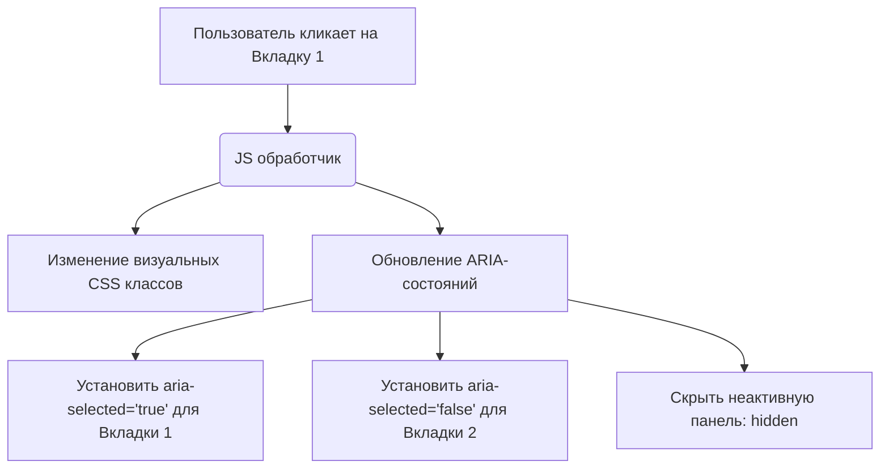

# WAI-ARIA (Web Accessibility Initiative - Accessible Rich Internet Applications)

## Боль: Ограничения нативного HTML

Нативный HTML5 отлично справляется с формами, кнопками и текстом. Но современные интерфейсы намного сложнее: автокомплиты (combobox), перетаскиваемые элементы (drag-and-drop), карусели, вкладки (tabs), древовидные списки. В HTML нет тегов `<tab>`, `<carousel>` или `<slider>`. Когда разработчик собирает эти сложные виджеты из обычных `<div>` и `<button>`, скринридер не понимает, как с ними взаимодействовать.

## Решение: ARIA как полифилл семантики

WAI-ARIA — это набор специальных HTML-атрибутов, которые "объясняют" вспомогательным технологиям (скринридерам), чем является сложный компонент и в каком состоянии он находится. ARIA не меняет внешний вид (CSS) и не добавляет поведение (JS) — она лишь модифицирует Accessibility Tree.

### Как это работает на практике

ARIA строится на трех китах:
1. **Roles (Роли):** ЧТО это за элемент? (`role="tab"`, `role="combobox"`)
2. **States (Состояния):** В каком он состоянии прямо сейчас? Меняются динамически через JS (`aria-expanded="true"`, `aria-pressed="false"`).
3. **Properties (Свойства):** Дополнительные характеристики, связывающие элементы (`aria-controls`, `aria-labelledby`).



**Антипаттерн: Кастомный чекбокс без ARIA**
```html
<!-- Скринридер прочитает "Согласен, группа". 
Он не поймет, что это чекбокс, и не узнает, включен ли он. -->
<div class="custom-checkbox" onclick="toggle()">
  <span class="icon-checked"></span>
  Согласен
</div>
```

**Как надо: Кастомный компонент с использованием ARIA**
```html
<!-- Добавляем роль чекбокса и стейт его состояния -->
<div 
  role="checkbox" 
  aria-checked="true" 
  tabindex="0" 
  class="custom-checkbox" 
  onKeyDown="..." 
  onClick="..."
>
  <span class="icon-checked" aria-hidden="true"></span>
  Согласен
</div>
```

## Неочевидные нюансы и трейдоффы

1. **Первое правило ARIA:** **Не используйте ARIA!** Если вы можете использовать нативный HTML-элемент, используйте его. `<button>` в тысячу раз лучше, чем `<div role="button" tabindex="0">`, потому что HTML-кнопка автоматически обрабатывает нажатия Enter/Space, а в варианте с `div` вам придется писать этот JS-код вручную. ARIA не чинит поведение клавиатуры.
2. **Опасность десинхронизации:** ARIA-состояния (например, `aria-expanded`) должны обновляться строго синхронно с визуальными изменениями на экране. Если вы открыли дропдаун, но забыли переключить `aria-expanded` в `true`, для незрячего пользователя интерфейс сломан (он думает, что меню всё еще закрыто).
3. **aria-hidden="true":** Это мощнейший молоток, который скрывает элемент и всех его потомков от скринридера. Если случайно повесить его слишком высоко в дереве DOM (например, на `main`), сайт станет полностью пустым и недоступным для инвалидов.
