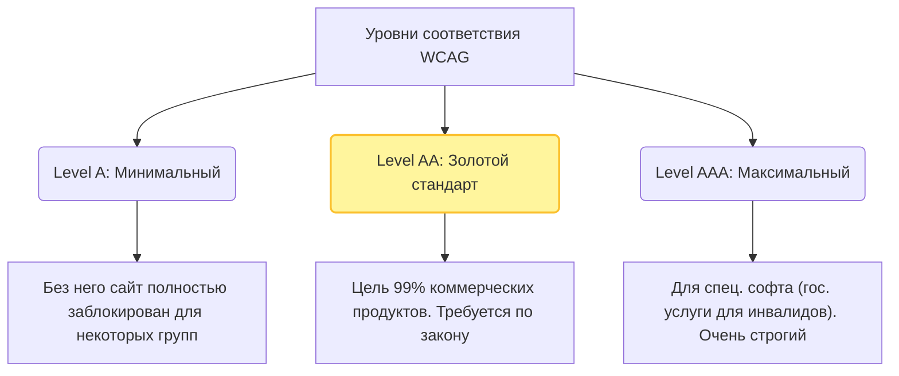

# Web Content Accessibility Guidelines (WCAG)

## Боль: Субъективность "удобства"

Когда заказчик говорит "Сделайте сайт доступным", возникает проблема метрик. Для одних доступность — это большие шрифты, для других — совместимость со старой версией JAWS, для третьих — контрастные цвета. Без единого стандарта тестирование доступности превращается во вкусовщину и бесконечные споры между дизайнером, тестировщиком и разработчиком о том, "достаточно ли контрастна эта серая кнопка".

## Решение: Международный стандарт WCAG

WCAG (Руководство по обеспечению доступности веб-контента) — это строгий, измеримый международный стандарт, разрабатываемый W3C. Он переводит абстрактные понятия вроде "удобно читать" в конкретные математические и технические критерии (например, "коэффициент контрастности текста должен быть не менее 4.5:1"). Законодательства многих стран (ADA в США, EAA в Европе) ссылаются именно на WCAG.

### Как это работает на практике

WCAG базируется на 4 принципах (POUR) и имеет 3 уровня соответствия.

**Принципы POUR:**
1. **Perceivable (Воспринимаемость):** Информацию можно воспринять (зрение, слух, осязание). *Пример: alt-текст для картинок, субтитры.*
2. **Operable (Управляемость):** Интерфейсом можно управлять (не только мышью). *Пример: навигация с клавиатуры, достаточное время на чтение.*
3. **Understandable (Понятность):** Контент ясен, интерфейс предсказуем. *Пример: язык страницы (`<html lang="ru">`), понятные ошибки.*
4. **Robust (Надежность):** Совместимость с текущими и будущими технологиями (скринридерами). *Пример: валидный HTML, правильное использование ARIA.*



**Пример: Критерий контраста (WCAG 1.4.3 - Уровень AA)**
```css
/* Антипаттерн: Серый текст на белом фоне. 
Контраст 2.8:1 - не проходит WCAG AA (нужно 4.5:1). 
Слабовидящие люди его не прочитают. */
.bad-text { color: #888; background: #fff; }

/* Как надо: Более темный текст. 
Контраст 5.7:1 - проходит WCAG AA. */
.good-text { color: #595959; background: #fff; }
```

## Неочевидные нюансы и трейдоффы

1. **Дизайн против WCAG:** Это классическая война. Дизайнеры любят светло-серые тонкие шрифты, элегантные пастельные тона и скрытые элементы (появляющиеся только по ховеру). Строгое соблюдение WCAG AA часто "утяжеляет" дизайн. Компромисс должен искаться на этапе создания дизайн-системы, а не при верстке.
2. **AAA почти недостижим:** Уровень AAA содержит экстремально строгие требования (например, контраст 7:1 или язык жестов для всех видео). Пытаться привести обычный коммерческий сайт к стандарту AAA экономически нецелесообразно, и даже сам W3C не рекомендует делать это для всего сайта целиком.
3. **Буква закона vs Дух закона:** Сайт может 100% проходить все автоматизированные проверки WCAG, но оставаться абсолютно неюзабельным для незрячего человека из-за запутанной логики интерфейса или огромного количества лишних `aria-label`. WCAG — это бейзлайн, а не гарантия идеального пользовательского опыта.
