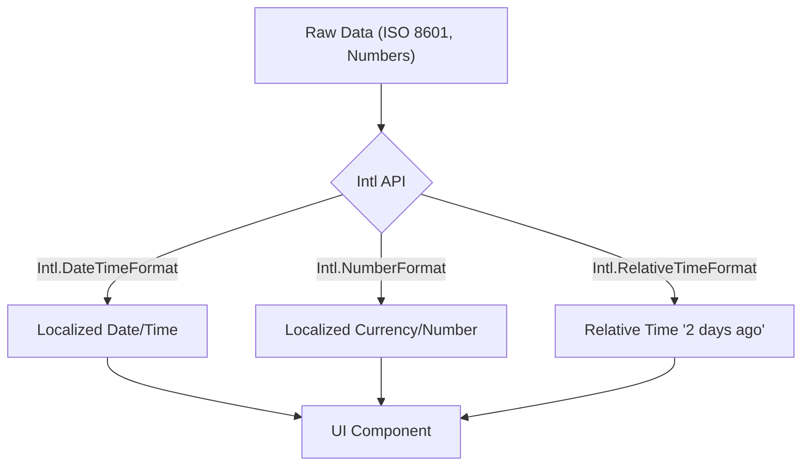

# Date, Time и Currency Formatting: Как не сойти с ума с локалями

Форматирование дат, времени и валют — это классическая инженерная боль. Пользователи в США ожидают `12/31/2023` и `$1,234.56`, в Германии — `31.12.2023` и `1.234,56 €`, а в России — `31.12.2023` и `1 234,56 ₽`. 

Исторически эту проблему решали огромными библиотеками вроде `moment.js`, которые тащили в бандл сотни килобайт локалей. Сегодня у нас есть мощный нативный инструмент — **Intl API**, который встроен в движок браузера и позволяет переложить эту работу на V8/SpiderMonkey.

## Архитектура форматирования



## Как это работает на практике

Основная идея — мы никогда не хардкодим форматы. Мы передаём локаль и опции, а браузер делает магию.

### Как надо: Использование нативного API

```javascript
// ✅ Правильно: используем Intl.NumberFormat
const price = 123456.78;

const formatCurrency = (locale, currency) => {
  return new Intl.NumberFormat(locale, {
    style: 'currency',
    currency: currency,
  }).format(price);
};

console.log(formatCurrency('ru-RU', 'RUB')); // "123 456,78 ₽"
console.log(formatCurrency('en-US', 'USD')); // "$123,456.78"
console.log(formatCurrency('de-DE', 'EUR')); // "123.456,78 €"
```

### Антипаттерн: Ручное форматирование

```javascript
// ❌ Антипаттерн: регулярки и костыли, которые сломаются на другой локали
function badFormatMoney(amount) {
  return '$' + amount.toFixed(2).replace(/\d(?=(\d{3})+\.)/g, '$&,');
}
```

## Неочевидные нюансы и трейдоффы

1. **Оверхед на инициализацию**: Создание инстансов `Intl.DateTimeFormat` или `Intl.NumberFormat` — **очень дорогая операция** (занимает миллисекунды). Если вы рендерите таблицу на 1000 строк с ценами, не создавайте форматер в каждой ячейке.
   
   *Решение*: Мемоизация (кэширование) инстансов форматера.
   ```javascript
   // Кэш форматеров
   const formatters = new Map();
   function getFormatter(locale, currency) {
     const key = `${locale}-${currency}`;
     if (!formatters.has(key)) {
       formatters.set(key, new Intl.NumberFormat(locale, { style: 'currency', currency }));
     }
     return formatters.get(key);
   }
   ```

2. **Границы применимости (Поддержка браузерами)**:
   Intl API сейчас поддерживается везде (даже IE11 частично умел), но некоторые новые фичи вроде `Intl.RelativeTimeFormat` (для форматов "3 дня назад") могут отсутствовать в старых версиях Safari. В таких случаях нужен полифилл (например, `@formatjs/intl-relativetimeformat`).

3. **Несоответствие данных на сервере и клиенте (Hydration Mismatch)**:
   При SSR (например, в Next.js) сервер может отрендерить дату в таймзоне UTC, а клиент при гидратации — в таймзоне пользователя. Это приведет к ошибке гидратации.
   *Решение*: Форматировать даты только на клиенте (после монтирования) или жестко фиксировать таймзону (например, `timeZone: 'UTC'`) при первом рендере.

## Вывод
Не тащите в проект `date-fns` или `moment` только ради форматирования. Нативный `Intl` покрывает 95% бизнес-кейсов, ничего не весит, но требует аккуратного кэширования для сохранения производительности.
