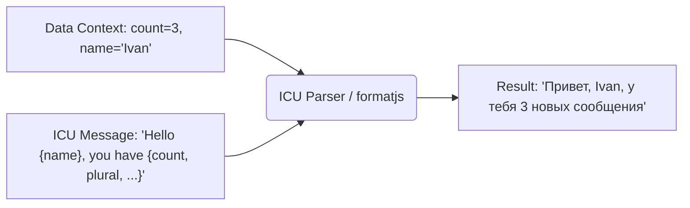

# ICU Message Format: Индустриальный стандарт локализации

Когда приложение выходит за рамки простых строк и начинает использовать динамические данные, стандартные подходы с конкатенацией ломаются. Строка "У вас 5 новых сообщений от Анны" в разных языках имеет абсолютно разную структуру, порядок слов и правила плюрализации.

**ICU Message Format** — это синтаксис (стандарт), который решает эту инженерную боль. Это DSL (Domain Specific Language) для локализации, который описывает, как подставлять переменные, как обрабатывать множественные числа и гендерные зависимости прямо внутри строки.

## Как это работает?

Вместо того чтобы хардкодить логику выбора строк в коде, мы выносим её в сами словари. Код просто передает контекст (переменные).



## Показательные примеры

### Базовая интерполяция
```icu
// Строка в словаре
welcome_msg: "Hello, {name}!"
```

### Плюрализация (самая частая боль)

В русском языке сложные правила плюрализации (1 сообщение, 2 сообщения, 5 сообщений). В ICU это описывается изящно:

```icu
// Как надо: ICU описывает все состояния
messages_count: "У вас {count, plural, 
    =0 {нет новых сообщений}
    one {# новое сообщение}
    few {# новых сообщения}
    many {# новых сообщений}
    other {# нового сообщения}
}"
```
*Здесь `#` заменяется на значение переменной `count`.*

### Select (Выбор по значению, например, гендер)

```icu
user_added_file: "{gender, select, 
    male {Он добавил файл}
    female {Она добавила файл}
    other {Пользователь добавил файл}
}"
```

### Антипаттерн: Логика в коде
```javascript
// ❌ Антипаттерн: Разрабу приходится хардкодить языковые правила
let message = '';
if (count === 1) message = `У вас 1 сообщение`;
else if (count > 1 && count < 5) message = `У вас ${count} сообщения`;
else message = `У вас ${count} сообщений`;
// Это сломается при добавлении арабского, где 6 форм множественного числа.
```

## Неочевидные нюансы и трейдоффы

1. **Оверхед на парсинг в рантайме**:
   ICU-строки не могут быть просто выведены в DOM, их нужно скомпилировать (распарсить AST). Если парсить их на клиенте на лету (например, библиотеками типа `intl-messageformat`), это бьёт по производительности при большом количестве строк (например, в длинных списках).
   *Решение*: Прекомпиляция. Библиотеки вроде `react-intl` (FormatJS) позволяют компилировать ICU строки в AST на этапе сборки (через Babel/SWC плагины), отдавая на клиент уже готовые исполняемые функции.

2. **Сложность для переводчиков**:
   Синтаксис ICU со скобочками `{}` часто ломает мозг обычным переводчикам, которые могут случайно удалить закрывающую скобку. 
   *Решение*: Использование профессиональных TMS (Translation Management Systems), таких как Lokalise или Crowdin, которые умеют валидировать ICU и скрывают синтаксис за удобным UI, отображая только текст.

3. **Вложенность**:
   ICU позволяет делать вложенные плюрализации и селекты, но это превращает строку в нечитаемую кашу. Граница применимости — 1-2 уровня вложенности. Если сложнее — лучше разбить на разные ключи.

## Вывод
ICU Message Format — это мощный инструмент, который убирает бизнес-логику языковых правил из JavaScript-кода и переносит её туда, где ей самое место — в словари. Это де-факто стандарт (поддерживается FormatJS, i18next и др.), без которого не обойтись в enterprise-продуктах.
