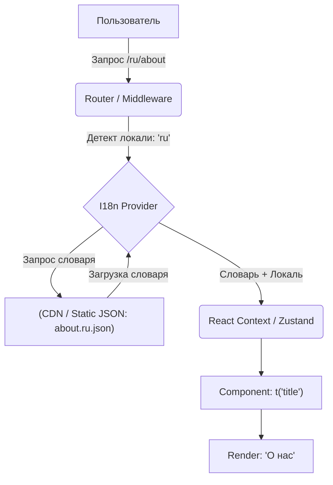

# Internationalization Architecture: Как собрать всё воедино

Интернационализация (i18n) — это не просто вызов функции `t('hello')`. В крупных приложениях это сложная архитектурная подсистема, которая затрагивает роутинг, стор, сборку, доставку бандлов и рендеринг. Боль, которую решает правильная архитектура i18n — это предотвращение разрастания размера бандла из-за словарей и избежание мигания контента при смене языка.

## Высокоуровневая архитектура i18n

Хорошая архитектура i18n состоит из трёх слоёв:

1. **Слой Резолвинга (Routing / Context)**: Определяет текущую локаль (по URL, кукам или заголовкам).
2. **Слой Доставки (Data Fetching)**: Асинхронно подгружает нужный чанк словаря (chunking), чтобы не тащить все языки в одном бандле.
3. **Слой Презентации (Formatting)**: Парсит ключи, подставляет ICU-переменные и отдает готовый текст в UI.



## Как это работает на практике

### Как надо: Разделение (Code Splitting) словарей по страницам/фичам

Мы не грузим весь `ru.json` весом 2MB. Мы разбиваем его на "неймспейсы" (namespaces) — `common`, `auth`, `profile`.

```typescript
// i18next config example
import i18n from 'i18next';
import Backend from 'i18next-http-backend';

i18n
  .use(Backend) // Асинхронная подгрузка JSON
  .init({
    lng: 'en',
    fallbackLng: 'en',
    ns: ['common'], // Грузим сразу только common
    defaultNS: 'common',
    backend: {
      loadPath: '/locales/{{lng}}/{{ns}}.json', // Шаблон путей до чанков
    }
  });

// В компоненте профиля мы лениво грузим неймспейс
function Profile() {
  const { t } = useTranslation(['profile']); 
  return <h1>{t('profile:settings')}</h1>;
}
```

### Антипаттерн: Все переводы в бандле

```javascript
// ❌ Антипаттерн: Увеличиваем размер JS-бандла на мегабайты
import ru from './locales/ru.json';
import en from './locales/en.json';

const translations = { ru, en };
```

## Неочевидные нюансы: скрытые трейдоффы

1. **FOUC (Flash of Unlocalized Content)**:
   При ленивой загрузке словарей на клиенте (CSR) пользователь может на долю секунды увидеть пустые ключи (`profile.title`) или лоадер, пока JSON не скачается.
   *Как решать*: В SSR (Next.js/Remix) мы инжектим нужный словарь прямо в initial HTML payload. На клиенте используем Suspense.

2. **Hydration Mismatch при SSR**:
   Если сервер определил язык по заголовку `Accept-Language` как `en`, а у клиента в LocalStorage сохранен `ru`, сервер отрендерит HTML на английском, а клиент при гидратации переключит на русский. Это вызовет React Hydration Error.
   *Как решать*: Единственным источником истины (Source of Truth) для языка должен быть **URL** (`/ru/profile`). URL всегда совпадает на сервере и клиенте.

3. **Оверхед на контекст**:
   Провайдер переводов обычно сидит на самом верху дерева (React Context). Если словарь обновляется целиком, это может вызвать перерендер всего приложения. Хорошие библиотеки (вроде `react-intl` или `next-intl`) оптимизируют этот процесс, чтобы компоненты подписывались только на изменения.

## Вывод
Архитектура интернационализации — это баланс между DX (удобством разработки) и UX (временем загрузки). Ключ к успеху — строгая изоляция неймспейсов, асинхронная доставка и привязка локали к роутеру (URL), а не к локальному состоянию.
