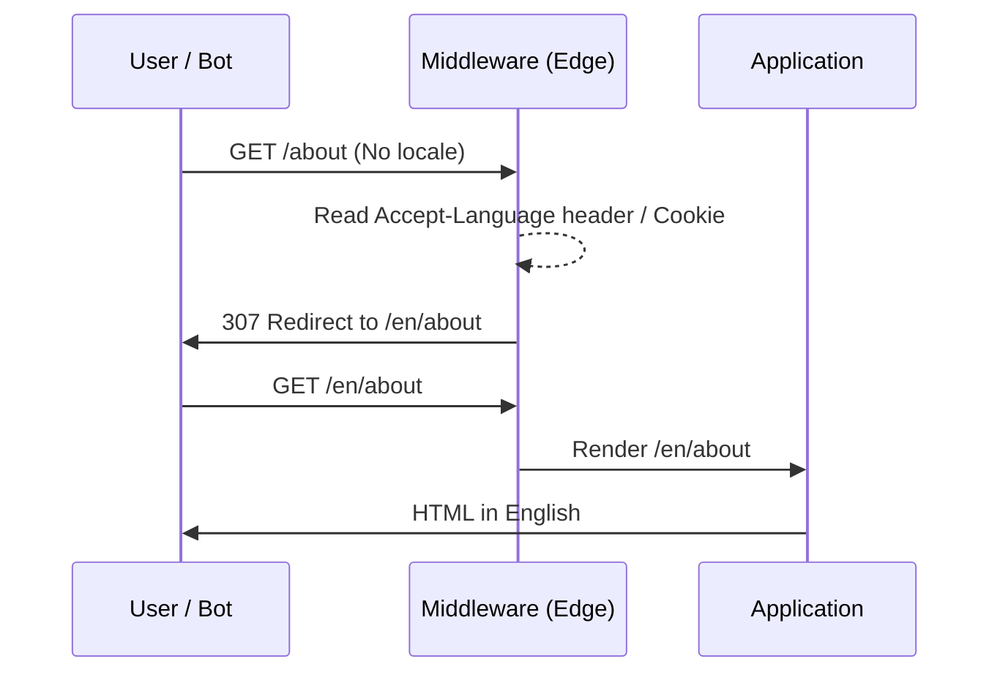

# Locale Routing: Язык как состояние URL

Locale Routing — это паттерн архитектуры, при котором текущий язык приложения детерминирован исключительно URL-адресом (например, `/en/about` или `en.example.com`). 

Боль, которую мы решаем: без привязки языка к URL невозможно поделиться ссылкой с другом на конкретном языке, ломается SEO (поисковики не исполняют JS и видят только один язык), и возникают страшные баги рассинхронизации между SSR и CSR (сервер думает, что язык один, а клиент — другой).

## Стратегии роутинга локали

Существуют два основных подхода к Locale Routing:

1. **Sub-path (Папки)**: `example.com/ru/about` (Чаще всего используется, проще в настройке, дешевле инфраструктура).
2. **Domain / Sub-domain**: `ru.example.com/about` или `example.ru/about` (Лучше для жесткого гео-таргетинга и SEO в конкретных странах, но сложнее в CI/CD).



## Как это работает на практике (Next.js Middleware)

Современный подход (например, в Next.js App Router) — использовать Middleware, перехватывать запросы на Edge-уровне и делать редиректы до того, как запрос дойдёт до рендеринга.

### Как надо: Резолвинг через Middleware

```typescript
// middleware.ts
import { NextResponse } from 'next/server';
import { match } from '@formatjs/intl-localematcher';
import Negotiator from 'negotiator';

const locales = ['en', 'ru', 'fr'];
const defaultLocale = 'en';

export function middleware(request) {
  const pathname = request.nextUrl.pathname;
  
  // Проверяем, есть ли локаль в pathname
  const pathnameIsMissingLocale = locales.every(
    (locale) => !pathname.startsWith(`/${locale}/`) && pathname !== `/${locale}`
  );

  if (pathnameIsMissingLocale) {
    // Вытаскиваем Accept-Language из заголовка
    const headers = { 'accept-language': request.headers.get('accept-language') || '' };
    const languages = new Negotiator({ headers }).languages();
    
    // Подбираем лучшую локаль (Content Negotiation)
    const locale = match(languages, locales, defaultLocale);
    
    // Редиректим на урл с локалью
    return NextResponse.redirect(new URL(`/${locale}${pathname}`, request.url));
  }
}

export const config = {
  matcher: ['/((?!api|_next/static|_next/image|favicon.ico).*)'], // Пропускаем статику
};
```

### Антипаттерн: Локаль в LocalStorage без изменения URL

```javascript
// ❌ Антипаттерн: Язык хранится только локально
function changeLanguage(lang) {
  localStorage.setItem('lang', lang);
  window.location.reload(); // Плохой UX, плохой SEO, ссылки нешарабельны
}
```

## Неочевидные нюансы и SEO-трейдоффы

1. **Hreflang теги**:
   Если вы делаете Locale Routing, вы **обязаны** указывать поисковикам, что у страницы есть альтернативные версии. Иначе Google накажет за дублирование контента.
   В `<head>` каждой страницы должны быть теги:
   ```html
   <link rel="alternate" hreflang="en" href="https://example.com/en/about" />
   <link rel="alternate" hreflang="ru" href="https://example.com/ru/about" />
   <link rel="alternate" hreflang="x-default" href="https://example.com/en/about" />
   ```

2. **Редиректы и Поисковики (Googlebot)**:
   При первом заходе мы редиректим юзера на основе `Accept-Language` или IP. **Внимание:** Googlebot обычно приходит из США без заголовка `Accept-Language`. Если вы всегда безусловно редиректите корневой `/` на `/en`, бот никогда не проиндексирует `/ru`. 
   *Граница применимости*: Не делайте жестких редиректов. Лучше позволить корню `/` рендерить дефолтный язык (с `x-default`), а переключать язык явно через UI с сохранением предпочтений в куки.

3. **Оверхед на кэширование (CDN)**:
   Если URL одинаковый (`/about`), а язык разный (из-за Cookie), вам придется настраивать `Vary: Cookie` на CDN. Это убьет Hit Ratio кэша. Использование префиксов `/en/about` решает эту проблему — CDN кэширует каждый URL независимо.

## Вывод
Locale Routing (язык в URL) — это единственный архитектурно верный способ делать мультиязычные веб-приложения. Он обеспечивает идеальное SEO, позволяет кэшировать страницы на CDN и исключает баги гидратации между сервером и клиентом.
