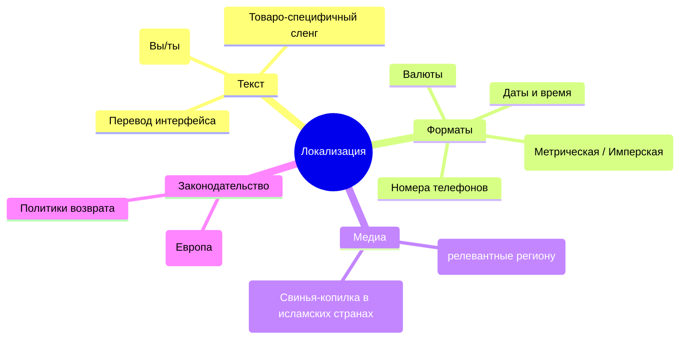

# Localization (l10n): Больше, чем просто перевод

В индустрии часто путают интернационализацию (i18n) и локализацию (l10n). 
- **i18n (Internationalization)** — это подготовка архитектуры приложения (код, роутинг, ICU), чтобы оно *могло* поддерживать разные языки. Инженерная задача.
- **l10n (Localization)** — это адаптация приложения под конкретную культуру, регион и язык. Продуктовая и культурная задача.

Боль, которую решает локализация — это предотвращение культурного отторжения продукта пользователем. Перевести "Checkout" как "Проверить" — это плохой перевод. А показать американцу формат даты `31.12.2023` или оплату в рублях — это отсутствие локализации.

## Спектр локализации



## Как это работает на практике

Хорошая локализация проникает на уровень компонентов и бизнес-логики.

### Как надо: Адаптация медиа и форматов

```tsx
// ✅ Правильно: Локализация изображений и единиц измерения
function SpeedLimit({ speedKmh, locale }) {
  // Если локаль US, переводим километры в мили
  const isImperial = locale === 'en-US';
  const displaySpeed = isImperial ? speedKmh * 0.621371 : speedKmh;
  const unit = isImperial ? 'mph' : 'km/h';

  return (
    <div className="speed-sign">
      
      <span>{displaySpeed.toFixed(0)} {unit}</span>
    </div>
  );
}
```

### Антипаттерн: Слепой перевод

```tsx
// ❌ Антипаттерн: Жестко зашитые сущности, не подходящие культуре
function ContactForm() {
  return (
    <form>
      <label>{t('First Name')}</label>
      <input type="text" />
      <label>{t('Last Name')}</label>
      <input type="text" />
      {/* Ошибка: Во многих азиатских культурах порядок имени и фамилии обратный.
          А в некоторых странах (Индонезия) у людей может быть только одно имя. */}
    </form>
  );
}
```

## Неочевидные нюансы и границы применимости

1. **Контекст и Tone of Voice (ToV)**:
   В английском языке местоимение "You" универсально. В русском, немецком, французском есть формальное "Вы" и неформальное "ты". В японском — десятки уровней вежливости. 
   *Скрытый трейдофф*: Если вы заложили неформальный ToV в дизайн-систему, при выходе на консервативный B2B рынок Германии вам придется переписывать не только словари, но и менять флоу общения (добавлять обращения Herr/Frau).

2. **Локализация изображений (Культурные табу)**:
   Иконка "палец вверх" (👍) в Иране и некоторых частях Ближнего Востока является сильным оскорблением (аналог среднего пальца). Иконка свиньи-копилки неуместна в исламских странах. Локализация требует замены ассетов (SVG/PNG) в зависимости от локали.

3. **Fallback-механизмы (Когда перевода нет)**:
   Что делать, если новая фича вышла, а испанский словарь еще не перевели?
   *Решение*: Настройка fallback-цепочек. Например: `es-AR` (Аргентина) -> `es-ES` (Испания) -> `en-US` (Английский).
   Лучше показать английский текст, чем пустую строку или технический ключ вроде `homepage.hero_title`.

## Вывод
Локализация — это эмпатия к пользователю. Она требует не только работы переводчиков, но и гибкости от разработчиков, которые должны оставлять возможность подменять логику (единицы измерения, порядок полей, картинки) в зависимости от культурного контекста.
