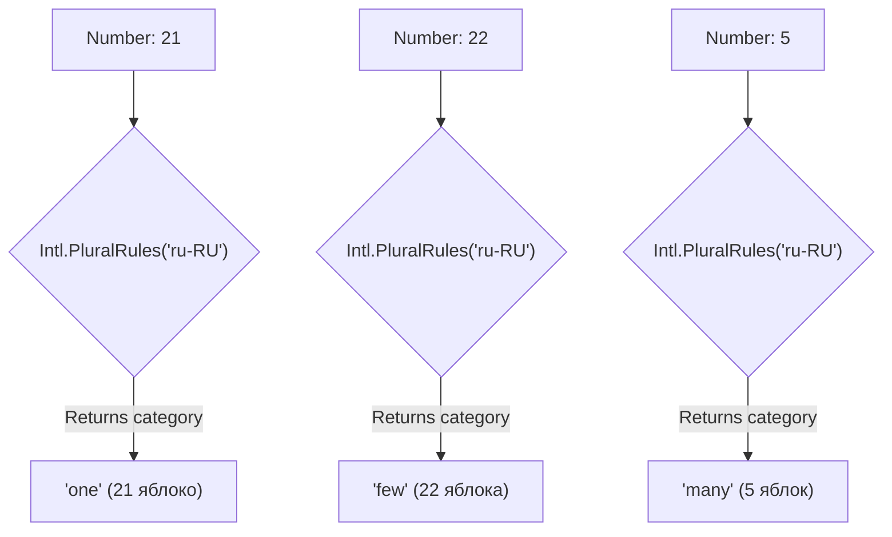

# Pluralization (Плюрализация): Искусство считать на разных языках

Проблема множественного числа — это один из самых коварных багов в разработке мультиязычных интерфейсов. Англоязычные разработчики привыкли, что есть только две формы: "1 apple" и "2 apples". 
Но реальный мир сложнее. В русском три формы (1 яблоко, 2 яблока, 5 яблок), в арабском — шесть (ноль, один, два, несколько, много, остальные). 

Попытка захардкодить `if (count === 1)` неизбежно ломается при локализации продукта на другие языки.

## Как это работает (Intl.PluralRules)

Под капотом стандарта Unicode CLDR все формы множественного числа разбиты на 6 категорий (Cardinal categories):
`zero`, `one`, `two`, `few`, `many`, `other`.

Браузерный API `Intl.PluralRules` знает правила для всех языков мира и переводит число в одну из этих категорий.



## Как это работает на практике

На практике мы редко вызываем `Intl.PluralRules` руками. Мы используем ICU Message Format, который делает это под капотом.

### Как надо: Использование ICU для плюрализации

```icu
// locale/ru.json
{
  "cart_items": "{count, plural, 
    =0 {В корзине нет товаров}
    one {В корзине # товар}
    few {В корзине # товара}
    many {В корзине # товаров}
    other {В корзине # товара}
  }"
}
```
*Символ `#` автоматически заменяется на число `count`.*
*Запись `=0` — это точное совпадение (не правило `zero`), полезно для кастомных фраз "Корзина пуста".*

### Антипаттерн: Кастомные тернарники

```javascript
// ❌ Антипаттерн: Англоцентричный код
const message = count === 1 ? '1 item' : `${count} items`;
// При переводе на русский получится: "21 items" -> "21 элементов" (ошибка, нужно "21 элемент")
```

## Неочевидные нюансы: скрытые трейдоффы

1. **Дроби (Fractions)**:
   Плюрализация для целых чисел (Cardinal) и для дробей работает по-разному. 
   В русском: `1.5 яблока` (категория `few` или `other` в зависимости от точности). `Intl.PluralRules` учитывает количество знаков после запятой!
   ```javascript
   const pr = new Intl.PluralRules('ru-RU');
   pr.select(1); // "one" (1 яблоко)
   pr.select(1.5); // "other" (1.5 яблока)
   ```

2. **Порядковые числительные (Ordinals)**:
   Кроме количественных числительных (1 яблоко), есть порядковые: 1st, 2nd, 3rd (1-й, 2-й).
   Для них используются другие правила! В ICU это описывается через `selectordinal`.
   ```javascript
   const pr = new Intl.PluralRules('en-US', { type: 'ordinal' });
   pr.select(1); // "one" (1st)
   pr.select(2); // "two" (2nd)
   pr.select(3); // "few" (3rd)
   pr.select(4); // "other" (4th)
   ```

3. **Оверхед переводчиков**:
   Разработчику легко написать 5 форм в ICU, но переводчик может забыть заполнить категорию `many`, из-за чего строка сломается в рантайме. Поэтому процесс должен строго контролироваться через TMS (Lokalise/Crowdin), которая не даст сохранить перевод, если для языка не заполнены все требуемые CLDR-категории.

## Вывод
Никогда не пытайтесь написать логику множественного числа на JavaScript. Делегируйте эту задачу ICU Message Format и нативному `Intl.PluralRules`. Думайте категориями (`one`, `few`, `many`), а не конкретными числами.
