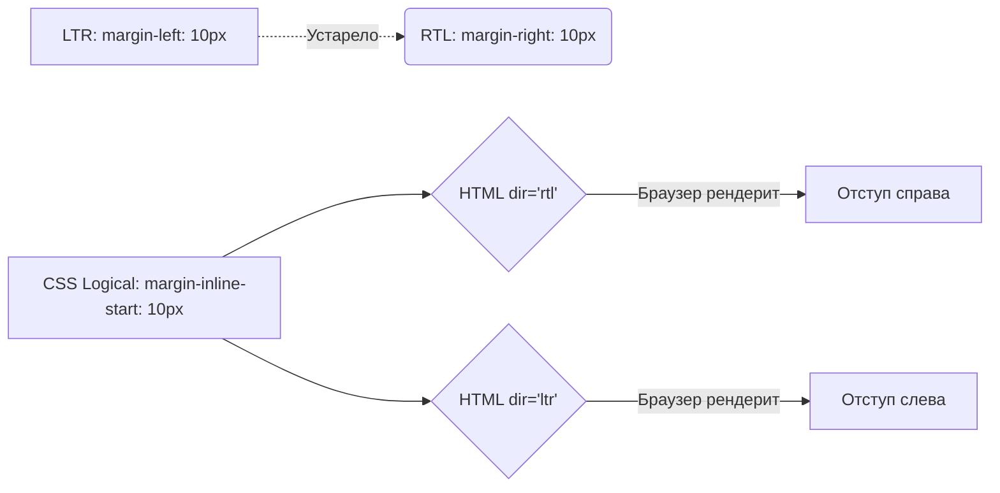

# RTL Layout: Переворачиваем интерфейс

RTL (Right-To-Left) — это адаптация верстки для языков, которые читаются справа налево (арабский, иврит, фарси). 
Боль, которую мы решаем: если просто засунуть арабский текст в английский LTR-интерфейс, текст будет прижат к неправильному краю, иконки "назад/вперед" будут указывать не туда, а отступы съедут. Интерфейс должен зеркально отразиться.

## Как это работает: Логические свойства CSS

В прошлом для RTL писали отдельные CSS-файлы (`app-rtl.css`), где `margin-left` меняли на `margin-right`. Это создавало огромный оверхед на поддержку.

Современный подход — использование **CSS Logical Properties**. Вместо физических сторон (left, right, top, bottom) мы используем логические, зависящие от направления текста (inline, block, start, end).



## Как это работает на практике

Главный триггер переворота — атрибут `dir` на теге `<html>`.
`<html dir="rtl" lang="ar">`

### Как надо: Logical Properties

```css
/* ✅ Правильно: Адаптируется автоматически под атрибут dir */
.card {
  /* Физическое padding-left / padding-right */
  padding-inline-start: 20px;
  
  /* Физическое border-right / border-left */
  border-inline-end: 1px solid #ccc;
  
  /* Выравнивание текста */
  text-align: start; 
}
```

### Антипаттерн: Физические свойства

```css
/* ❌ Антипаттерн: Сломается при RTL */
.card {
  padding-left: 20px;
  float: right; /* Хуже float только float с физическим направлением */
}
```

## Неочевидные нюансы: что НЕ надо переворачивать

Не всё в интерфейсе нужно зеркалить. Это самая частая ошибка.

1. **Цифры и номера телефонов**:
   В арабском языке цифры пишутся и читаются слева направо (LTR), даже если весь остальной текст RTL. `+1 555 123` не должно превратиться в `123 555 1+`.
   *Решение*: Оборачивать телефоны и LTR-куски в `<span dir="ltr">`.

2. **Медиаплееры**:
   Кнопка Play (▶) и ползунок прогресса всегда идут слева направо. Время всегда течет в одну сторону, независимо от языка. Плееры не зеркалятся.

3. **Иконки (Флиппинг)**:
   Иконку "стрелка назад" (←) в RTL нужно отзеркалить (→). Но иконку "поиск" (Лупа с ручкой вправо) или "галочка" (✔) зеркалить не нужно, они остаются прежними.
   *Решение*: Для направленных иконок в CSS применяют трансформацию:
   ```css
   [dir="rtl"] .icon-flip {
     transform: scaleX(-1);
   }
   ```

4. **Flexbox и Grid**:
   Flexbox и Grid по умолчанию уважают направление текста. `flex-direction: row` в RTL автоматически пустит элементы справа налево. `justify-content: flex-start` прижмет элементы к правому краю. Это значит, что если верстка изначально написана на Flex/Grid, она перевернется "бесплатно".

## Вывод
Поддержка RTL в современных браузерах решается на уровне платформы. Достаточно использовать CSS Logical Properties (`margin-inline-*`, `padding-inline-*`, `text-align: start`), флексы и атрибут `dir="rtl"`. Главная сложность — продуктовая (знать, какие иконки и данные зеркалить нельзя).
