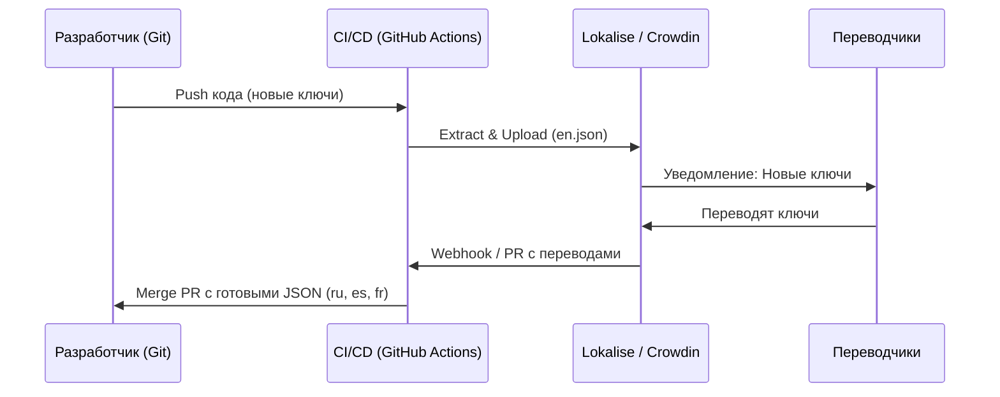

# Translation Management: Конвейер слов

Разработка мультиязычного приложения — это не только код, но и процесс. Боль, которую решает процесс Translation Management — это рассинхронизация: разработчик добавил новую кнопку, а испанский переводчик об этом не узнал; или переводчик изменил текст, а разработчик забыл обновить JSON в репозитории.

## Процесс непрерывной локализации (Continuous Localization)

Вместо того чтобы перекидываться Excel-файлами, индустрия использует TMS (Translation Management Systems) — SaaS-платформы вроде Lokalise, Crowdin, Phrase.



## Как это работает на практике

### Экстракция (Извлечение) ключей

Разработчики не должны руками создавать ключи в `ru.json`. Они пишут код, а утилита (например, `formatjs extract` или `i18next-parser`) сканирует `.tsx` файлы и автоматически генерирует базовый словарь.

```typescript
// Компонент
import { FormattedMessage } from 'react-intl';

export function Banner() {
  return (
    <FormattedMessage 
      id="homepage.banner.title"
      defaultMessage="Welcome to our app, {name}!" // Этот текст улетит в TMS
      description="Заголовок на главном баннере" // Контекст для переводчика
      values={{ name: 'Alex' }}
    />
  );
}
```

Команда в CI/CD:
`npm run extract` -> генерирует `en.json` -> отправляет через API в Lokalise.

## Стратегии нейминга: Ключи vs Натуральные строки

Есть два лагеря работы со строками. У каждого свои трейдоффы.

**1. Семантические ключи (Semantic Keys)**
`t('navbar.login_button')` -> `Login`
*Плюсы*: Идеально для одинаковых слов с разным контекстом (Слово "Free" может быть "Свободный" или "Бесплатный"). Легко менять английский текст, не меняя ключи в коде.
*Минусы*: Оверхед на придумывание имен ключей, словари сильно разрастаются и требуют чистки.

**2. Натуральные строки (Natural Strings)**
`t('Welcome back, user')` -> `С возвращением, юзер`
*Плюсы*: Не нужно придумывать ключи. Код читается как обычный текст.
*Минусы*: Если вы исправили опечатку в исходной строке в коде (`Welcome back, User!`), ключ меняется, и в TMS этот перевод пометится как "Отсутствующий", переводчикам придется делать работу заново.

## Неочевидные нюансы и трейдоффы

1. **Мертвые ключи (Orphan Keys)**:
   Разработчик удалил компонент, но ключ в TMS и JSON-файлах остался. Со временем словари распухают мегабайтами мусора.
   *Решение*: Автоматическая синхронизация. Скрипт экстракции в CI/CD должен отправлять в TMS флаг `--clean` (или аналог), который помечает старые ключи как deprecated, если их больше нет в коде.

2. **OTA (Over the Air) обновления**:
   Иногда опечатку в тексте на проде нужно исправить прямо сейчас, не дожидаясь релиза и билда фронтенда. Некоторые TMS предоставляют SDK/CDN, откуда фронтенд тянет словари при загрузке напрямую.
   *Трейдофф*: Это добавляет точку отказа. Если CDN упадет, пользователи останутся без текста. OTA-обновления переводов лучше использовать как fallback, а основные словари "запекать" в бандл на этапе сборки.

## Вывод
Процесс локализации должен быть автоматизирован так же, как деплой. Ключи извлекаются из кода утилитами, отправляются в TMS, а переводы возвращаются обратно в репозиторий через Pull Requests. Ручное редактирование JSON-файлов словарей разработчиками — это антипаттерн, ведущий к конфликтам слияния и потере переводов.
