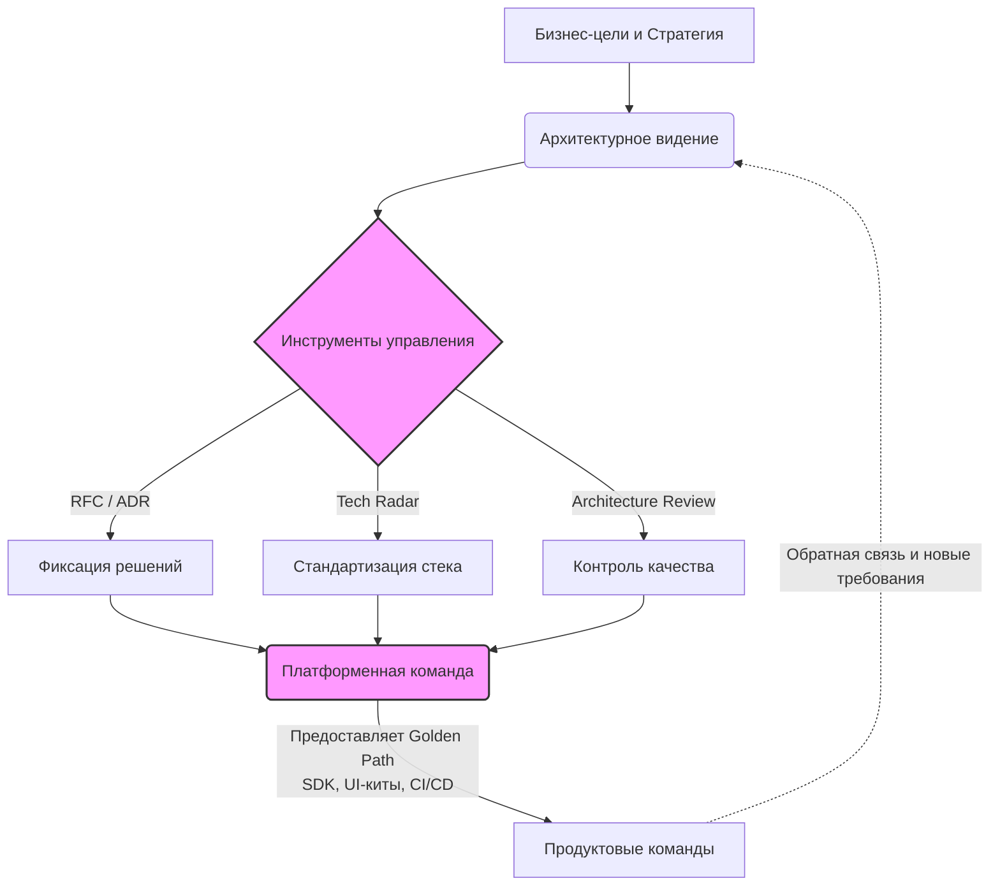

# Архитектурное управление

Архитектурное управление (Architecture Governance) во фронтенде — это набор практик, процессов и инструментов, направленных на удержание кодовой базы от скатывания в энтропию по мере роста продукта и команды. Это не про то, чтобы «стучать по рукам» и создавать бесконечную бюрократию. Это про обеспечение согласованности, предсказуемости и прозрачности технических решений.

Без архитектурного управления в компании с несколькими командами быстро начинается «зоопарк технологий»: каждая команда тащит свой стейт-менеджер, свой UI-кит и свои подходы к роутингу. В итоге компания получает раздутый бандл, невозможность переиспользования кода между командами и мучительный онбординг.

Управление решает эту боль через выстраивание «Золотого пути» (Golden Path) — ситуации, когда сделать правильно легко и удобно, а сделать «костыль» сложно и требует обоснований. Для этого используются инструменты фиксации решений (ADR, RFC), технологические радары (Tech Radar) и архитектурные ревью (Architecture Review).

## Визуализация процесса



## Как это выглядит в коде

**Антипаттерн: Децентрализация без границ (Анархия)**
Каждая команда решает фундаментальные проблемы по-своему. В одном приложении оказываются три библиотеки для HTTP-запросов и разные подходы к обработке ошибок.
```typescript
// Команда checkout использует axios и кастомные перехватчики
import axios from 'axios';
const checkoutApi = axios.create({ baseURL: '/api/checkout' });

// Команда catalog написала свой велосипед поверх fetch
import { mySuperFetch } from '../../utils/network';

// Команда profile вообще использует XMLHttpRequest из легаси-модуля
import { legacyRequest } from '@legacy/core';
```

**Правильное решение: Платформенный подход (Governance)**
Архитектурный комитет утвердил стандарт работы с сетью. Платформенная команда разработала единый пакет, в который уже вшиты логирование, метрики, ретраи и работа с токенами авторизации.
```typescript
// Разработчик просто использует стандартизированный инструмент.
// Сделать "правильно" - проще всего.
import { apiClient } from '@company/frontend-platform/network';

export const fetchUserProfile = () => {
  return apiClient.get('/api/profile', {
    retry: true,
    timeout: 5000
  });
};
```

## Неочевидные нюансы и трейдоффы

1. **Баланс между контролем и скоростью:** Главная ловушка архитектурного управления — превратиться в неповоротливое «Министерство архитектуры» (Architecture Review Board), которое месяцами согласовывает добавление новой npm-библиотеки. Управление должно быть *вспомогательным*, а не блокирующим (Enabling over Controlling).
2. **Оверхед на поддержание платформы:** Чтобы Golden Path работал, кто-то должен его создавать и поддерживать. Это требует выделения отдельной платформенной команды (Platform Engineering), что могут позволить себе не все компании.
3. **Границы применимости:** Строгие RFC и долгие ревью архитектуры избыточны для стартапов на этапе поиска Product-Market Fit. В командах до 5-7 человек управление происходит естественным образом на ежедневных синках и код-ревью. Внедрять формализованный Governance стоит только тогда, когда цена рассинхронизации между командами превышает стоимость бюрократии.
