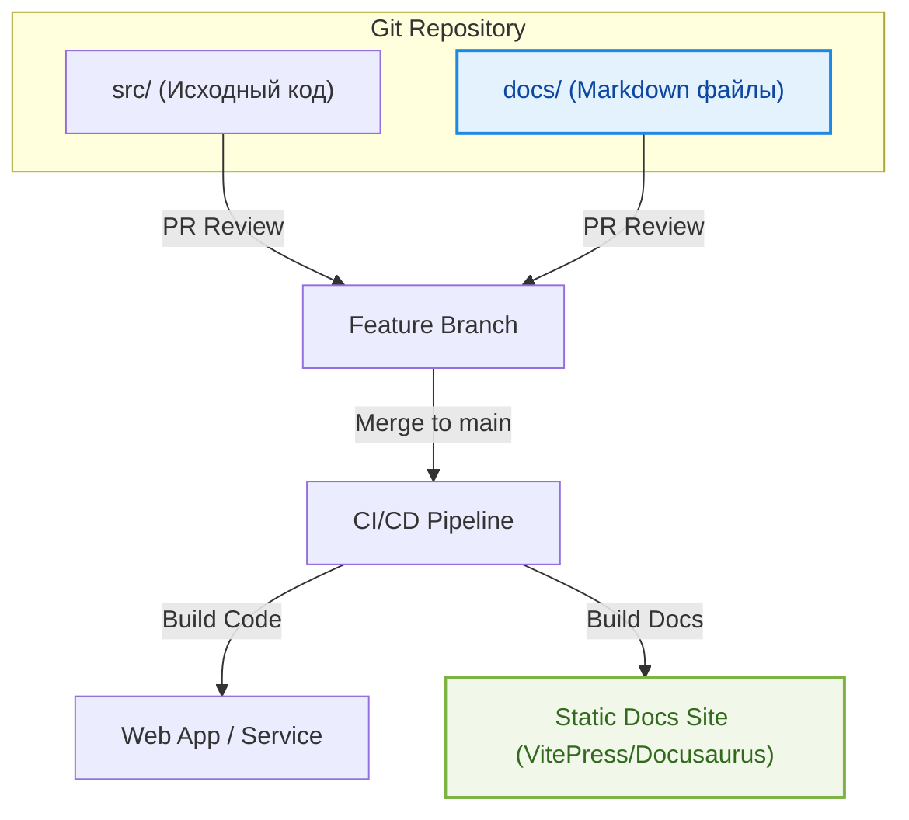

# Documentation as Code (Docs-as-Code)

Документация, которая живет отдельно от кода (в Wiki, Confluence, Notion), обречена на устаревание. Разработчики не любят выходить из IDE, чтобы обновить текст, а контекст-свитчинг убивает продуктивность. Концепция **Documentation as Code (Docs-as-Code)** переносит практики написания и поддержки кода на документацию.

## 1. Суть концепции

Docs-as-Code означает, что документация:
1. Пишется в текстовых форматах (обычно Markdown или MDX).
2. Хранится в той же системе контроля версий (Git), что и исходный код.
3. Проходит тот же процесс ревью (Pull Requests), что и код.
4. Собирается и деплоится автоматически через пайплайны CI/CD (например, с помощью Docusaurus, VitePress, Nextra или MkDocs).



## 2. Какую боль мы решаем?

* **Синхронизация.** Если вы меняете интерфейс компонента или API, вы обновляете документацию в том же Pull Request. Если документации нет — PR не мержится.
* **Доступность в IDE.** Разработчик может искать по доке через глобальный поиск в VS Code (`Cmd+Shift+F`), не открывая браузер.
* **Версионирование.** Если нужно посмотреть, как работала система в версии 1.5, вы просто откатываетесь к соответствующему тегу в Git. Документация будет соответствовать коду того времени.
* **Единый источник истины.** Отсутствие фрагментации, когда часть знаний в Jira, часть в Confluence, а часть в голове тимлида.

## 3. Практическая реализация

### Пример структуры (Docusaurus или VitePress)

```text
my-frontend-project/
├── src/
│   └── components/
│       ├── Button.tsx
│       └── Button.mdx      <-- Документация компонента рядом с кодом (Storybook/MDX)
├── docs/                   <-- Глобальная архитектурная дока
│   ├── architecture/
│   │   ├── state-management.md
│   │   └── routing.md
│   ├── adr/
│   │   └── 0001-use-react-query.md
│   └── index.md
├── package.json
└── vitepress.config.ts     <-- Конфиг сборщика статического сайта доки
```

### Использование MDX (Интерактивная дока)
Формат MDX позволяет встраивать React/Vue компоненты прямо в Markdown.

```mdx
# Компонент Button

Кнопка используется для основных действий пользователя.

import { Button } from '../../src/components/Button';

<div className="demo-box">
  <Button variant="primary" onClick={() => alert('Clicked!')}>
    Нажми меня
  </Button>
</div>

**Пропсы:**
- `variant` (primary | secondary)
```

## 4. Неочевидные нюансы и трейдоффы

**Где применимо:**
* Внутренние технические руководства команды разработчиков.
* Архитектурные решения (ADR).
* Руководства по онбордингу (Onboarding Guides).
* Документация по внутренним UI-китам и дизайн-системам (Storybook + MDX).

**Где это ломается (Антипаттерны):**
* **Продуктовая документация для не-технарей.** Если документацию должны писать или редактировать менеджеры, аналитики или саппорт, заставлять их использовать Git, Markdown и делать Pull Requests — плохая идея. Для них инструменты вроде Notion или Confluence подходят лучше.
* **Отсутствие CI/CD.** Если Markdown файлы просто лежат в репозитории, но из них не собирается красивый сайт с поиском (например, через Algolia DocSearch), читаемость сильно падает, особенно для больших проектов.
* **Рассинхрон с внешними системами.** Не пытайтесь дублировать тикеты из Jira в Git. Docs-as-Code — для долгоживущих знаний (архитектура, гайды, компоненты), а не для трекинга текущих задач.

## Резюме
Docs-as-Code делает написание документации естественной частью рабочего процесса инженера. Мы относимся к тексту так же, как к коду: пишем, ревьюим, линтим (да, markdown можно линтить, проверять ссылки) и автоматически деплоим.
