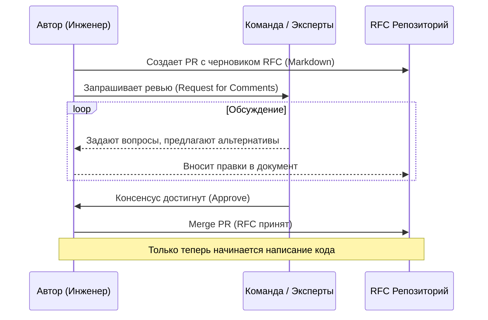

# RFC Process (Request for Comments)

В растущих инженерных командах спонтанное принятие крупных технических решений часто приводит к хаосу. Кто-то один решает перевести проект на GraphQL, начинает писать код, и только на этапе огромного Pull Request команда узнает об этом. Возникают конфликты, код выбрасывается, время теряется.

**RFC (Request for Comments)** — это формализованный процесс предложения, обсуждения и принятия значимых технических изменений.

## 1. Суть процесса RFC

Перед тем как писать код для масштабной фичи или изменения архитектуры, инженер пишет документ-спецификацию (RFC). Этот документ рассылается коллегам для сбора отзывов, поиска "слепых зон" и достижения консенсуса.

RFC отвечает на вопросы:
- Какую проблему мы решаем?
- Как именно мы предлагаем её решить?
- Какие есть альтернативы и почему мы выбрали именно этот путь?
- Как это повлияет на существующую систему?

## 2. Структура RFC документа

Хороший RFC не должен быть книгой, но должен быть достаточно подробным. Стандартная структура включает:

1. **Summary (Краткое содержание):** Один абзац, описывающий суть предложения.
2. **Motivation (Мотивация):** Почему мы должны это сделать? Какую боль или бизнес-потребность мы закрываем?
3. **Detailed Design (Детальный дизайн):** Техническая реализация. Архитектура, примеры кода, интерфейсы. Это ядро документа.
4. **Drawbacks (Недостатки / Риски):** Почему мы *не* должны этого делать? Честное описание минусов (увеличение бандла, кривая обучения, сложность миграции).
5. **Alternatives (Альтернативы):** Какие другие решения были рассмотрены и почему от них отказались.
6. **Adoption Strategy (Стратегия внедрения):** Как мы будем раскатывать изменение? Будет ли это ломающим изменением? Как обучить команду?

### Пример (Антипаттерн vs Как надо)

**Антипаттерн (Недостаток контекста):**
> *"Давайте перепишем все на Next.js, потому что React Router устарел, а SSR — это круто."*
(Такое предложение вызовет только холивар).

**Как надо (Фрагмент RFC):**
> **Мотивация:** Наш Time-to-Interactive (TTI) на мобильных устройствах составляет 4.5 секунды из-за большого размера JS-бандла и клиентского рендеринга. Бизнес требует улучшить SEO.
> **Дизайн:** Предлагается инкрементальная миграция на Next.js (App Router). Существующий SPA будет обернут...
> **Альтернативы:** Рассматривались Astro (не подходит из-за высокой интерактивности) и Remix (команда хуже знакома с экосистемой).

## 3. Отличие RFC от ADR

Оба формата документируют решения, но у них разный жизненный цикл и цель:

| Характеристика | RFC (Request for Comments) | ADR (Architecture Decision Record) |
| :--- | :--- | :--- |
| **Цель** | **Обсуждение** и проектирование будущего решения. | **Фиксация** уже принятого решения. |
| **Время жизни** | Пишется *до* начала работы. Активно меняется в процессе обсуждения. | Пишется *в момент* принятия решения. Файл неизменяем (immutable). |
| **Детализация** | Высокая (включает планы миграции, интерфейсы). | Низкая (краткая суть, контекст и последствия). |

*Часто принятый RFC в итоге порождает короткий ADR для истории.*

## 4. Границы применимости и оверхед

**Когда применять RFC:**
- Добавление новой крупной зависимости, которая повлияет на всех (например, смена стейт-менеджера или UI-библиотеки).
- Изменение процессов CI/CD, стандартов кодирования.
- Проектирование сложного межкомандного API (например, между Frontend и Backend).
- Крупные рефакторинги (изменение архитектуры на Feature Sliced Design).

**Когда RFC — это вредный оверхед:**
- **Замедление процесса (Paralysis by Analysis):** Не требуйте RFC для мелких улучшений (добавление компонента в UI-кит, рефакторинг одной страницы). Если изменение можно откатить за пару часов — RFC не нужен.
- **Бесконечные споры:** RFC должен иметь таймбокс (например, 2 недели на обсуждение). Если команда не может договориться, техлид или архитектор должен взять на себя ответственность и принять финальное решение (даже если оно непопулярно), иначе процесс заглохнет.
