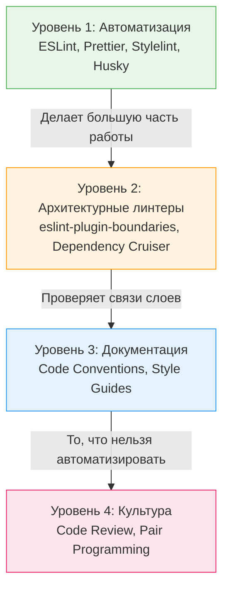

# Технические стандарты и конвенции

В любой команде, где работает больше одного человека, возникает проблема стиля и подходов. Один разработчик пишет функциональные компоненты стрелочными функциями, другой — через `function`. Один складывает утилиты в папку `helpers`, другой — в `utils`. Без единых правил кодовая база быстро превращается в лоскутное одеяло, усложняя онбординг и замедляя код-ревью.

**Технические стандарты** — это задокументированные и (по возможности) автоматизированные договоренности команды о том, как писать, структурировать и проверять код.

## 1. Зачем нужны стандарты?

Главная боль, которую решают стандарты — **снижение когнитивной нагрузки и избавление от велосипедов**.
Разработчик не должен тратить мыслетопливо на то, как назвать файл или где разместить бизнес-логику. Он должен решать задачи бизнеса.

Кроме того, стандарты избавляют от холиваров на код-ревью. Если правило прописано в стандартах, ревьюер просто оставляет ссылку на документ. Если правила нет — это повод для обсуждения, а не для блокировки PR.

## 2. Уровни стандартизации

Стандарты работают эффективно только тогда, когда они применяются на разных уровнях:



### 2.1. Строгая автоматизация (Что должно проверяться машиной)
Всё, что можно автоматизировать, **должно быть автоматизировано**.
- Форматирование (Prettier). Спор о пробелах и табах решает робот на pre-commit хуке.
- Синтаксические правила (ESLint). Запрет `any` в TypeScript, правила хуков React, неиспользуемые переменные.
- Нейминг файлов (например, `eslint-plugin-unicorn/filename-case`).

**Пример автоматизированного стандарта:**
```json
// .eslintrc.json
{
  "rules": {
    "react-hooks/rules-of-hooks": "error", // Автоматическая проверка
    "@typescript-eslint/no-explicit-any": "warn"
  }
}
```

### 2.2. Архитектурные правила (То, что проверяют люди и линтеры)
Правила организации кода и разделения слоев. 
- *Пример:* "UI-компоненты не могут импортировать напрямую Axios, они должны использовать сервисы из папки `api/`".
- *Как автоматизировать:* Использование `eslint-plugin-boundaries` или FSD-линтеров для запрета кросс-импортов между фичами.

### 2.3. Семантические конвенции (То, что описано в Markdown)
Правила, которые сложно или невозможно проверить линтером. Они фиксируются в документе (например, `frontend-style-guide.md`).
- Правила именования пропсов (например, коллбэки всегда начинаются с `on`: `onClick`, `onUserAction`).
- Структура компонента (сначала хуки, потом вспомогательные функции, потом return).
- Правила написания коммитов (Conventional Commits: `feat:`, `fix:`, `chore:`).

## 3. Как внедрять и обновлять стандарты

Стандарты — это живой организм. Спуск правил "сверху вниз" (от архитектора к разработчикам) часто вызывает отторжение.

**Хороший процесс (Эволюционный):**
1. Всплывает проблема (на ревью часто спорят о том, где хранить типы).
2. Кто-то пишет короткий RFC или предлагает решение на синк-встрече команды.
3. Команда договаривается о подходе.
4. Правило записывается в файл `conventions.md`.
5. По возможности, правило кодируется в ESLint плагин.

**Антипаттерны в стандартах:**
* **Мертвые документы.** Если в вашем `style-guide.md` 50 страниц текста, его никто никогда не прочитает. Документация должна быть лаконичной, с примерами `✅ Do` и `❌ Don't`.
* **Догматизм (Слепое следование).** Стандарты существуют для пользы. Если стандарт мешает реализовать фичу эффективно, стандарт нужно пересмотреть, а не писать костыли, чтобы угодить линтеру.
* **Отсутствие автоматизации.** Если вы договорились форматировать код определенным образом, но не настроили Prettier на CI, правило не будет работать. Люди ошибаются, роботы — нет.
