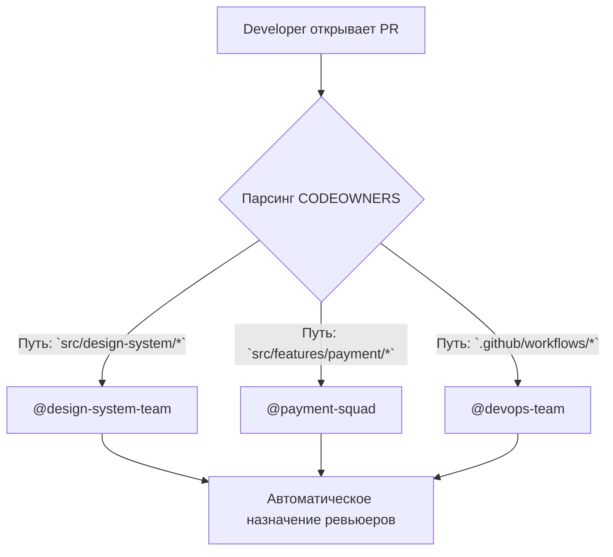

# CODEOWNERS

Когда проект достигает размера монорепозитория или над ним работают несколько команд, возникает проблема "ничейного кода". Ошибки в общих библиотеках чинятся месяцами, а Pull Requests висят без ревью, потому что непонятно, кто за это отвечает. Файл `CODEOWNERS` — это автоматизированный способ маршрутизации ответственности.

## 1. Суть концепции

`CODEOWNERS` — это текстовый файл, который лежит в корне репозитория (в `.github/`, `.gitlab/` или корнях). Он сообщает системе контроля версий, какие люди или команды являются экспертами (владельцами) определенных частей кодовой базы.

**Какую боль мы решаем?**
- **Поиск ревьюера:** Разработчику больше не нужно гадать, кого тегнуть в Pull Request. GitHub/GitLab автоматически назначит нужных людей.
- **Защита критичного кода:** Невозможно смержить изменение в ядро системы или дизайн-систему без аппрува от Core-команды.
- **Снижение bus-factor:** Зоны ответственности становятся прозрачными.

## 2. Как это работает

Формат файла предельно прост: паттерн пути к файлу и тег владельца(ев).



### Пример файла CODEOWNERS

```text
# Глобальный fallback (если никто другой не указан, пингуем лидов)
*       @frontend-leads

# Дизайн-система и UI kit — строгий контроль платформенной команды
/src/ui-kit/              @frontend-platform-team
/src/styles/              @frontend-platform-team

# Фиче-команды владеют своими модулями
/src/features/checkout/   @checkout-squad
/src/features/auth/       @auth-squad

# Инфраструктура, пайплайны и конфигурации
/.github/workflows/       @devops-team @frontend-architect
webpack.config.js         @frontend-architect
package.json              @frontend-architect
```

## 3. Неочевидные нюансы и трейдоффы

**Где это необходимо:**
* Монорепозитории (Monorepo), где лежат пакеты десятков команд.
* Проекты с высокой ценой ошибки (например, финтех), где изменения в расчетах должна подтвердить профильная команда.
* Микрофронтенды, если они лежат в одном репозитории.

**Где это ломается (Антипаттерны):**
* **Узкое горлышко (Bottleneck).** Если один человек (например, `@tech-lead`) указан владельцем 80% кода, все Pull Requests будут ждать его неделями. Владельцем должна быть *команда* (группа людей), а не один человек.
* **Строгий `require_code_owner_reviews`.** В GitHub можно запретить merge без аппрува владельца. Если владелец в отпуске или болен, разработка фичи встанет. Должен быть механизм override для экстренных ситуаций (админские права у лидов).
* **Мертвые души.** Если в CODEOWNERS указаны уволившиеся люди или расформированные команды, автоматика ломается. Файл требует регулярной актуализации.

## Резюме
`CODEOWNERS` переводит неформальные договоренности о зонах ответственности в машиночитаемый формат, ускоряя процесс Code Review и защищая критические узлы системы.
