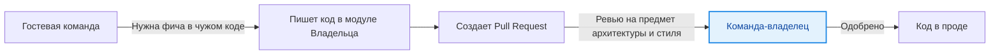

# Code Ownership (Владение кодом)

В небольших стартапах весь код принадлежит всем. Разработчик правит базу данных, правит верстку и настраивает nginx. Но когда компания растет, концепция "все отвечают за всё" превращается в "никто не отвечает ни за что". Появляются файлы на тысячи строк, покрытые толстым слоем легаси (Technical Debt), к которым все боятся притронуться, потому что "это писал Вася три года назад, а он уже уволился".

**Code Ownership** — это организационная практика закрепления ответственности за конкретными модулями, доменами или сервисами за конкретными командами.

## 1. Суть концепции: Владение — это ответственность, а не диктатура

Быть владельцем кода (Code Owner) **не означает**, что никто другой не может этот код менять.
Быть владельцем означает:
1. Вы отвечаете за качество, тестирование и производительность этого модуля.
2. Вы ревьюите архитектурные изменения в этом модуле.
3. Вы поддерживаете документацию в актуальном состоянии.
4. Вы устраняете баги, если в этом модуле что-то сломалось.

*(Эта модель взаимодействия называется "Внутренний Open Source" или InnerSource)*

## 2. Модели владения кодом

### 2.1. Строгое владение (Strong Ownership)
Код может менять только команда-владелец.
* *Плюс:* Высокое качество, предсказуемость.
* *Минус:* Бутылочное горлышко. Если другой команде нужна фича в вашем коде, они ставят задачу в ваш бэклог и ждут месяцами.
* *Где применять:* Критическая инфраструктура, платежные шлюзы, корневая архитектура.

### 2.2. Слабое владение / InnerSource (Рекомендуется)
Код принадлежит команде-владельцу, но **любой разработчик из компании может прислать Pull Request** с доработками. Владелец выступает в роли "мэйнтейнера", проверяя PR и следя за тем, чтобы код соответствовал стандартам.
* *Плюс:* Разблокирует работу команд (не нужно ждать чужого бэклога).
* *Минус:* Владельцам приходится тратить время на ревью чужого, зачастую некачественного кода.
* *Где применять:* UI-киты, продуктовые микрофронтенды, общие утилиты.

### 2.3. Коллективное владение (Collective Ownership)
Весь код принадлежит всей команде. Любой может менять любой файл.
* *Где применять:* Только внутри одной кросс-функциональной команды (до 7-9 человек). На масштабе всей компании это быстро приводит к хаосу.

## 3. Границы применимости и подводные камни

**Синдром привратника (Gatekeeping)**
Самый частый антипаттерн Code Ownership. Владелец модуля начинает отклонять полезные PR из-за мелких придирок к стилю или синдрома "не изобретено здесь" (NIH). Команды начинают ненавидеть владельцев дизайн-системы, потому что те не пропускают новые компоненты.
*Решение:* Владелец должен помогать "гостям" довести код до ума, а не просто выступать строгим контролером.

**Код-сирота (Orphaned Code)**
Частая ситуация: команда написала сервис и была расформирована. Сервис остался без владельца. Если сервис падает — чинит тот, кому больше всех надо. 
*Решение:* При расформировании команд их зоны ответственности должны быть явно переданы другим командам. В компании не должно быть кода без владельца.

## Резюме
Владение кодом — это инструмент масштабирования инженерии. Оно гарантирует, что у каждого файла в проекте есть "хозяин", который заботится о его чистоте и актуальности, при этом оставляя возможность другим командам вносить свой вклад.
